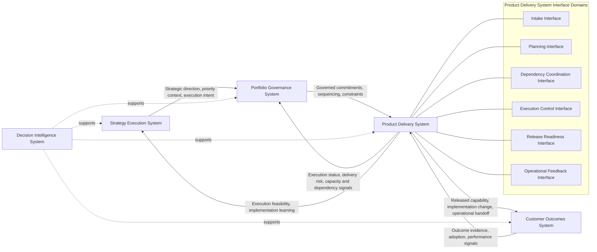
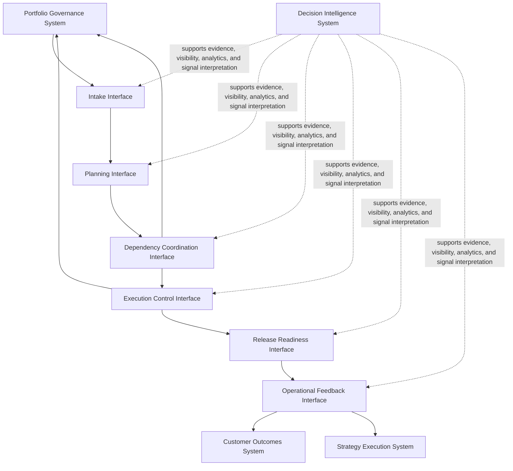

# Product Delivery System Interfaces

The **Product Delivery System Interfaces** artifact defines the canonical interface structure through which the **Product Delivery System** receives governed work, coordinates execution, exchanges delivery signals, supports release control, and connects delivered capability to outcome evaluation within the **Product Leadership Operating System (PLOS)**.

Where the **Unified Product Delivery System** defines the delivery architecture in prose, the **Product Delivery System Diagram** shows the major structural components of the delivery system, and the **Delivery Execution Flow Diagram** shows the operating flow of delivery execution, this artifact defines the **interface model** that governs how delivery interacts across boundaries.

It explains the key interaction points through which portfolio commitments become executable work, dependencies are coordinated, release decisions are supported, and delivery signals are exchanged with governance, strategy, outcomes, and decision support.

---

## Purpose

The purpose of this artifact is to define the canonical interfaces of the **Product Delivery System**.

This artifact is intended to clarify:
- how work enters the delivery system
- how execution is coordinated within and across delivery boundaries
- how delivery communicates status, risk, and dependency signals
- how release readiness is surfaced and controlled
- how delivered capability is handed into outcome observation and broader learning

It reinforces that delivery quality depends not only on internal execution discipline, but also on well-defined interfaces across the surrounding operating system.

---

## Diagram

---

## Diagram Interpretation

The **Product Delivery System Interfaces** model shows that the **Product Delivery System** is defined not only by the work it performs internally, but also by the interfaces through which it receives, transforms, coordinates, and returns work and signals across the broader operating system.

The first major interface is the **Intake Interface**. This is the point at which the **Portfolio Governance System** passes governed portfolio commitments into delivery. Through this interface, delivery receives authorized work, sequencing expectations, commitment boundaries, and relevant execution constraints. This interface ensures that delivery begins with governed work rather than unmanaged demand.

The second major interface is the **Planning Interface**. Through this interface, governed work is translated into executable planning structures, delivery sequencing, team allocation assumptions, milestone expectations, and implementation scope. This interface turns portfolio intent into delivery-ready planning logic.

The third major interface is the **Dependency Coordination Interface**. This interface manages the exchange of information required to coordinate work across teams, services, platforms, enabling functions, release dependencies, and integration points. It exists because delivery success depends on coordinated execution across boundaries rather than isolated team throughput.

The fourth major interface is the **Execution Control Interface**. Through this interface, the delivery system tracks execution progress, identifies control issues, surfaces blocking conditions, and communicates material delivery signals such as schedule risk, scope instability, operational readiness concerns, and dependency exposure. This interface helps maintain delivery control throughout execution.

The fifth major interface is the **Release Readiness Interface**. This interface connects validated delivery work to release decision logic by surfacing readiness status, unresolved risks, integration confidence, quality evidence, and operational preparedness signals. It exists to ensure that release decisions are supported by disciplined delivery evidence rather than informal optimism.

The sixth major interface is the **Operational Feedback Interface**. Through this interface, released capability is connected to implementation observation, operational feedback, usage patterns, incident signals, and delivery learning. This interface ensures that delivery does not end at release, but remains connected to what happens after deployment.

The artifact also shows cross-system interfaces surrounding delivery. Delivery receives governed commitments from the **Portfolio Governance System** and returns execution status, risk, dependency, and capacity signals back into governance. Delivery also returns feasibility and implementation learning into the **Strategy Execution System**, helping strategy remain grounded in execution reality without bypassing governance authority.

The delivery system also passes released capability and implementation change into the **Customer Outcomes System**, which evaluates whether delivery output creates the intended business, customer, or operational results. The **Customer Outcomes System** in turn provides outcome evidence and performance signals that inform future delivery learning and system improvement.

Across all of these interfaces, the **Decision Intelligence System** supports visibility, evidence quality, analytics, reporting, and signal interpretation. It strengthens interface quality but does not replace the delivery system or redefine the canonical operating loop.

---

## Operating Logic

The operating logic of this artifact is that **delivery effectiveness depends on disciplined interface control**.

First, the **Product Delivery System** must have a controlled **intake interface** so that work enters delivery through governance rather than through unmanaged channels. This preserves alignment between portfolio intent and execution capacity.

Second, delivery requires a defined **planning interface** because governed work is not automatically execution-ready. Commitments must be translated into actionable work structures, coordination plans, release assumptions, and ownership models before effective delivery can occur.

Third, delivery requires a strong **dependency coordination interface** because complex product delivery rarely occurs inside a single isolated team boundary. Dependencies must be surfaced, negotiated, sequenced, and managed through an explicit operating interface rather than through ad hoc escalation alone.

Fourth, delivery requires an **execution control interface** because leaders need structured visibility into progress, risk, blockers, quality exposure, and control exceptions. Without this interface, delivery becomes difficult to govern and hard to rebalance.

Fifth, delivery requires a **release readiness interface** because validated work must be connected to disciplined release decision-making. The system must surface whether output is actually ready for release, not merely whether teams believe work is complete.

Sixth, delivery requires an **operational feedback interface** because the delivery system does not end at deployment. Released capability generates operational signals, implementation lessons, and improvement opportunities that must feed learning back into future delivery behavior.

Taken together, these interfaces define how the **Product Delivery System** remains governable, coordinated, observable, and connected to the broader operating loop:

**Strategy → Governance → Delivery → Outcomes → Learning → Strategy**

This artifact therefore clarifies the boundary logic of the **Product Delivery System** without renaming systems, redefining the loop, or introducing new canonical systems.

---

## Supporting Diagram

---

## Why This Matters

This artifact matters because delivery systems often fail at their boundaries before they fail inside execution.

Organizations frequently focus on delivery methods, team rituals, or release mechanics while leaving the surrounding interfaces weak, ambiguous, or inconsistent. When that happens, the same recurring problems appear:
- work enters delivery without clear governance
- dependencies are discovered too late
- status signals are inconsistent or unreliable
- release decisions are made without readiness evidence
- operational lessons are not captured in time to improve future execution

By defining the canonical interfaces of the **Product Delivery System**, this artifact makes the hidden control surfaces of delivery explicit. It shows that delivery quality depends not only on how teams work, but on how the system exchanges commitments, constraints, signals, and learning across the broader operating model.

---

## How To Use This

Use this artifact when defining, reviewing, or improving the boundary logic of the **Product Delivery System**.

Use it to:
- clarify how governed work enters delivery
- define how delivery planning and coordination should be structured
- identify the formal points where dependency and execution signals must be exchanged
- explain how release readiness should be surfaced
- connect delivery activity to outcome observation and learning

This artifact is especially useful in:
- delivery architecture reviews
- product operating model design
- portfolio-to-delivery alignment work
- dependency and escalation model design
- release governance design
- documentation that explains delivery controls to executive audiences

It should be used alongside the **Unified Product Delivery System**, the **Product Delivery System Diagram**, and the **Delivery Execution Flow Diagram** rather than as a replacement for those artifacts.

---

## Relationship to the Operating System

This artifact belongs to **Pillar 4 — Product Delivery System** within the **Product Leadership Operating System (PLOS)**.

It defines the key interfaces through which the **Product Delivery System** interacts with the rest of the operating system while remaining aligned to the canonical five-system architecture:
- the **Strategy Execution System**
- the **Portfolio Governance System**
- the **Product Delivery System**
- the **Customer Outcomes System**
- the **Decision Intelligence System**

It supports interpretation of the canonical operating loop:

**Strategy → Governance → Delivery → Outcomes → Learning → Strategy**

Within that loop, this artifact clarifies how delivery receives governed commitments, coordinates execution, surfaces readiness, returns control signals, and remains connected to outcome evidence and learning.

This artifact may clarify delivery interfaces, but it may not redefine the canonical systems, change the operating loop, or separate **Learning** into an independent sixth system.

---

## Summary

The **Product Delivery System Interfaces** artifact defines the canonical interface model of the **Product Delivery System** within the **Product Leadership Operating System**.

It shows how delivery receives governed work, translates that work into executable coordination, manages dependencies and control signals, supports release readiness, and connects released capability to operational feedback and broader learning.

In doing so, it makes explicit that delivery is not only a system of execution. It is also a system of interfaces through which commitments, constraints, evidence, risks, and learning move across the broader operating architecture.

---

## License

This repository and its contents are licensed under the **MIT License**.

See the [LICENSE](../LICENSE) file for details.
    C --- F5
    C --- F6
