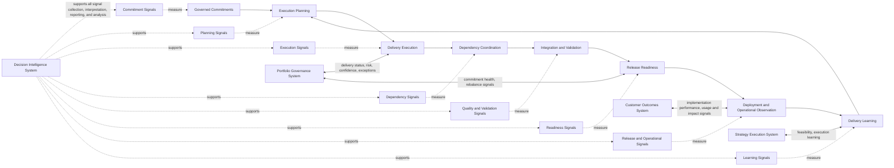
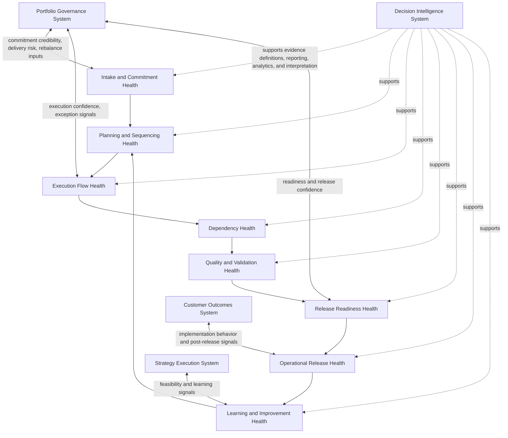

# Product Delivery System Metrics and Signals

The **Product Delivery System Metrics and Signals** artifact defines the canonical measurement and signal structure through which the **Product Delivery System** monitors execution health, dependency behavior, readiness confidence, release performance, and delivery learning within the **Product Leadership Operating System (PLOS)**.

Where the **Unified Product Delivery System** defines the delivery architecture in prose, the **Product Delivery System Interfaces** artifact defines the major delivery interfaces, and the **Delivery Execution Flow Diagram** defines the end-to-end execution flow, this artifact defines the **evidence structure** used to observe and govern delivery performance.

It explains which delivery conditions should be measured, which signals should be surfaced, how those signals should be interpreted, and how delivery evidence should support governance, execution control, release decisions, and structured learning.

---

## Purpose

The purpose of this artifact is to define the canonical metrics and signals framework for the **Product Delivery System**.

This artifact is intended to clarify:
- what delivery conditions should be observed
- which signals indicate healthy or unhealthy execution behavior
- how delivery evidence should support governance and review
- how readiness and risk should be surfaced through measurable indicators
- how delivery learning should be informed by structured operational evidence

It reinforces that delivery should not be governed through anecdote, optimism, or isolated status reporting. It should be governed through disciplined signals that support visibility, control, intervention, and learning.

---

## Diagram

---

## Diagram Interpretation

The **Product Delivery System Metrics and Signals** model shows that delivery should be observed as a controlled execution system with distinct measurement domains across the lifecycle of governed work.

The first signal domain is **Commitment Signals**. These signals indicate whether governed work has entered delivery clearly and in a controlled way. They include signals related to commitment clarity, scope stability, ownership definition, sequencing readiness, and whether work is entering delivery with the minimum conditions required for effective execution.

The second domain is **Planning Signals**. These signals indicate whether governed commitments have been translated into execution-ready plans. They include signals related to planning completeness, dependency identification, milestone confidence, capacity alignment, sequencing quality, and the degree to which delivery work is operationally ready to begin.

The third domain is **Execution Signals**. These signals indicate how work is progressing during active delivery. They include signals related to execution progress, flow health, blocker frequency, commitment confidence, throughput stability, work aging, control exceptions, and the degree to which delivery is remaining aligned to the intended plan.

The fourth domain is **Dependency Signals**. These signals indicate how well delivery dependencies are being identified, coordinated, and resolved. They include signals related to dependency aging, unresolved cross-team coordination items, dependency volatility, integration readiness, and whether external constraints are threatening delivery commitments.

The fifth domain is **Quality and Validation Signals**. These signals indicate whether execution output is converging toward releasable quality. They include signals related to defect exposure, test completion, validation status, rework patterns, integration stability, and the degree to which work is becoming operationally trustworthy.

The sixth domain is **Readiness Signals**. These signals indicate whether a delivery increment is ready to move through release control. They include signals related to unresolved risks, operational preparedness, dependency closure, rollout confidence, support readiness, release criteria attainment, and decision confidence for production movement.

The seventh domain is **Release and Operational Signals**. These signals indicate what happens once capability is deployed. They include signals related to deployment success, incident behavior, rollback frequency, environment stability, service health, adoption onset, and implementation performance under live conditions.

The eighth domain is **Learning Signals**. These signals indicate whether the organization is converting delivery evidence into process improvement, operating adjustment, and future planning quality. They include signals related to recurring failure patterns, cycle improvement, readiness improvement, issue recurrence, escalation effectiveness, and whether delivery learns faster over time.

The model also shows how delivery signals connect to the rest of the operating system. The **Portfolio Governance System** consumes delivery status, risk, and confidence signals in order to govern commitments and rebalance when necessary. The **Strategy Execution System** receives feasibility and execution learning signals so strategic intent remains grounded in delivery reality. The **Customer Outcomes System** receives implementation and live-environment signals that connect released capability to observed results. Across all signal domains, the **Decision Intelligence System** strengthens signal collection, interpretation, reporting, and analysis.

---

## Operating Logic

The operating logic of this artifact is that **delivery should be governed through signals that correspond to actual control points in the execution system**.

First, metrics must be attached to meaningful operating conditions rather than gathered as generic dashboards. The **Product Delivery System** needs evidence that helps leaders understand whether commitments are clear, whether execution is healthy, whether dependencies are under control, whether quality is converging, and whether release readiness is real.

Second, signals must be interpreted as **decision support**, not as decorative reporting. Delivery metrics are useful only when they help determine whether intervention is needed, whether risk is increasing, whether commitments remain credible, and whether release should proceed.

Third, delivery signals must span the full execution lifecycle. A narrow focus on throughput or completion rates is insufficient. Healthy delivery governance requires visibility from intake through planning, execution, validation, readiness, release, and learning.

Fourth, signal quality matters as much as signal existence. Metrics that are ambiguous, lagging, or inconsistent create false confidence. The delivery system therefore requires disciplined definitions, stable interpretation logic, and consistent reporting expectations.

Fifth, the purpose of delivery signals is not punitive surveillance. The purpose is to support better execution control, earlier intervention, clearer readiness judgment, stronger governance, and faster learning.

Sixth, delivery signals must remain connected to the canonical operating loop:

**Strategy → Governance → Delivery → Outcomes → Learning → Strategy**

Within that loop, delivery metrics and signals help the **Product Delivery System** remain observable and governable, while the **Decision Intelligence System** supports evidence quality across all stages. This artifact therefore strengthens delivery governance without creating a new canonical system or redefining the operating model.

---

## Supporting Diagram

---

## Why This Matters

This artifact matters because delivery systems often fail not only from poor execution, but from poor visibility into execution.

Organizations frequently rely on superficial status reporting, inconsistent team-level metrics, or narrative updates that do not reveal whether delivery is actually healthy. When that happens, the same recurring failures appear:
- commitments enter delivery without adequate clarity
- dependency problems are discovered too late
- progress reporting masks declining confidence
- quality issues remain hidden until readiness reviews
- releases proceed without reliable evidence
- delivery organizations repeat the same execution failures without learning

By defining the canonical metrics and signals of the **Product Delivery System**, this artifact makes delivery evidence explicit. It creates a common language for observing commitment health, execution behavior, risk emergence, readiness confidence, release performance, and improvement over time.

---

## How To Use This

Use this artifact when defining, reviewing, or improving how the **Product Delivery System** is observed and governed.

Use it to:
- define the major signal domains of delivery health
- align leadership teams on which signals matter at which execution stage
- improve review quality by grounding conversations in evidence
- connect dependency, readiness, escalation, and release control to measurable indicators
- identify where current delivery reporting is weak, late, inconsistent, or misleading

This artifact is especially useful in:
- delivery review model design
- release readiness model design
- escalation model design
- portfolio-to-delivery governance alignment
- delivery operating model improvement
- executive review environments that require clearer evidence discipline

It should be used alongside the **Product Delivery System Interfaces**, **Delivery Execution Flow Diagram**, and later derivative artifacts such as delivery reviews, release readiness, escalation, and signal-flow guidance.

---

## Relationship to the Operating System

This artifact belongs to **Pillar 4 — Product Delivery System** within the **Product Leadership Operating System (PLOS)**.

It defines the evidence structure through which the **Product Delivery System** is observed and governed while remaining aligned to the canonical five-system architecture:
- the **Strategy Execution System**
- the **Portfolio Governance System**
- the **Product Delivery System**
- the **Customer Outcomes System**
- the **Decision Intelligence System**

It supports interpretation of the canonical operating loop:

**Strategy → Governance → Delivery → Outcomes → Learning → Strategy**

Within that loop, this artifact clarifies how delivery conditions should be measured, how execution signals should be surfaced, how readiness confidence should be evaluated, and how delivery evidence should contribute to governance, outcomes interpretation, and learning.

This artifact may clarify delivery evidence and signal structure, but it may not redefine the canonical systems, create an independent measurement system outside the architecture, or separate **Learning** into an independent sixth system.

---

## Summary

The **Product Delivery System Metrics and Signals** artifact defines the canonical measurement and signal structure of the **Product Delivery System** within the **Product Leadership Operating System**.

It shows that delivery should be observed through distinct signal domains that correspond to real execution control points: commitment health, planning quality, execution flow, dependency behavior, validation progress, readiness confidence, release performance, and delivery learning.

In doing so, it reinforces that delivery governance depends on disciplined evidence. Strong delivery is not managed through intuition alone. It is managed through clear signals that support control, intervention, release judgment, and continuous improvement.

---

## License

This repository and its contents are licensed under the **MIT License**.

See the [LICENSE](../LICENSE) file for details.
