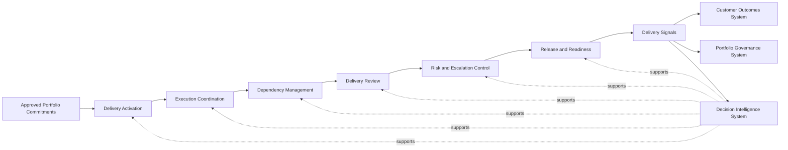
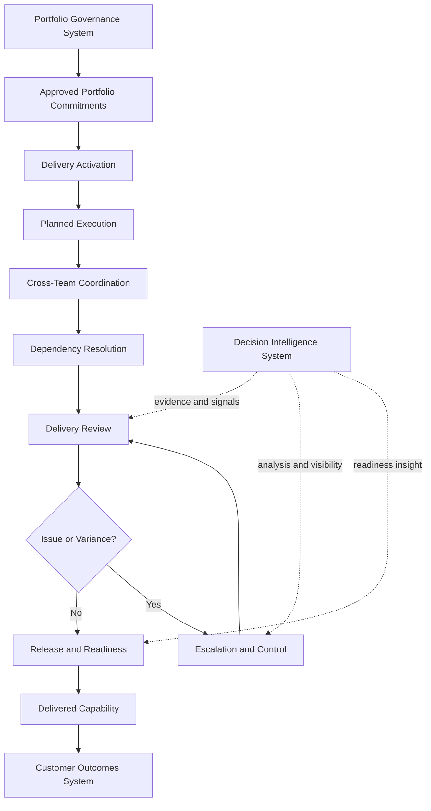

# Unified Product Delivery System

The **Unified Product Delivery System** defines the canonical delivery architecture for **Pillar 4** of the **Product Leadership Operating System (PLOS)**.

It explains how organizations translate **approved portfolio commitments** into **coordinated execution**, **managed delivery flow**, **release readiness**, and **delivery signals** that inform outcomes, learning, and future governance decisions.

Where the **Portfolio Governance System** determines what should be funded, prioritized, sequenced, and governed, the **Product Delivery System** defines how that approved work is operationalized across teams, dependencies, risks, reviews, and release movement.

This artifact is the **canonical source architecture** for the **Product Delivery System**. All supporting artifacts, diagrams, frameworks, and playbooks in this repository should conform to this model.

---

# Purpose

The purpose of the **Unified Product Delivery System** is to define the system through which approved portfolio commitments become coordinated delivery execution across modern product organizations.

It provides the canonical architecture for how delivery is activated, managed, reviewed, escalated, and translated into execution signals without collapsing delivery into governance or confusing delivery activity with customer outcomes.

This artifact exists to make delivery:

- structurally defined
- operationally governable
- cross-functionally coordinated
- visible at the system level
- reviewable through recurring mechanisms
- adaptable through feedback and learning

It is intended to describe the **delivery system itself**, not a team-level agile method, project plan, or local workflow preference.

---

# Diagram

---

# Diagram Interpretation

The diagram shows the canonical flow through which the **Product Delivery System** converts approved portfolio intent into coordinated execution and reusable delivery signals.

## Approved Portfolio Commitments

The system begins with work that has already passed through the **Portfolio Governance System** and has been approved for delivery as a portfolio commitment.

This means the delivery system does not decide what should enter the portfolio at the strategic level. It receives approved portfolio commitments and is responsible for translating them into executable delivery motion.

## Delivery Activation

Delivery activation converts approved commitments into active execution motion.

This includes establishing execution scope, preparing delivery structures, aligning accountable teams, and confirming that work is ready to enter coordinated delivery.

## Execution Coordination

Execution coordination is the core operating layer of the delivery system.

It manages how work progresses across teams, functions, and time horizons. Its role is not merely task tracking, but structured coordination of execution against approved portfolio commitments.

## Dependency Management

Modern delivery systems require active management of cross-team, cross-platform, cross-capability, and cross-release dependencies.

Dependency management ensures that delivery does not fragment into isolated local plans that fail at the system level.

## Delivery Review

Delivery review provides the recurring mechanism through which execution health, progress, variance, blockers, and readiness are assessed.

It makes delivery visible, governable, and reviewable as an operating system rather than as informal status exchange.

## Risk and Escalation Control

Delivery risk and escalation control governs how material issues are surfaced, assessed, routed, and resolved.

This prevents delivery risk from remaining hidden in team-level execution until it becomes a governance or outcome failure.

## Release and Readiness

Release and readiness define the transition from execution activity to deployable, launchable, or operationally ready output.

This ensures that delivery completion is not defined only by work movement, but by readiness for real-world use and organizational acceptance.

## Delivery Signals

The delivery system generates signals that inform the rest of the operating system.

These include progress signals, readiness signals, dependency signals, risk signals, and variance signals. These do not replace customer outcomes, but they provide the execution evidence needed to support governance, outcomes evaluation, and learning.

## Decision Intelligence Support

The **Decision Intelligence System** supports the delivery system throughout by strengthening signal quality, evidence quality, prioritization inputs, review quality, and escalation clarity.

It supports delivery decision-making, but it does not replace delivery ownership.

---

# Operating Logic

The **Product Delivery System** operates as the execution system that sits between approved portfolio commitments and realized outcomes.

Its operating logic is based on the following principles.

## 1. Delivery begins only after approved portfolio commitment

The delivery system is downstream of governance.

It should not independently redefine strategic priorities, portfolio sequencing, or funding choices that belong to the **Portfolio Governance System**.

## 2. Delivery is a system, not a collection of team methods

The delivery system exists above individual team practices.

Teams may use different local methods, but the operating system requires a coherent architecture for execution coordination, dependency control, review, escalation, and readiness.

## 3. Coordination is a first-class responsibility

Delivery success depends not only on whether teams complete local work, but on whether the organization coordinates execution across interfaces, timelines, and shared dependencies.

The system therefore treats coordination as structural rather than incidental.

## 4. Visibility must be designed, not assumed

Delivery must be visible through defined review structures, common signal patterns, and explicit escalation mechanisms.

Without this, execution becomes opaque and delivery risk accumulates outside leadership view.

## 5. Delivery signals are distinct from customer outcomes

The delivery system produces execution evidence.

The **Customer Outcomes System** determines whether delivered work produced meaningful customer or business value. These systems are linked, but they are not interchangeable.

## 6. Delivery must support learning without becoming a separate learning system

Delivery generates signals that contribute to learning across the operating loop.

However, learning remains part of the broader loop:

**Strategy → Governance → Delivery → Outcomes → Learning → Strategy**

The **Product Delivery System** supports that loop but does not redefine it.

## 7. Decision Intelligence strengthens delivery quality across the system

The **Decision Intelligence System** supports the delivery system by improving evidence quality, signal clarity, variance detection, and review quality.

It is a supporting system, not a substitute for delivery leadership.

Taken together, these principles define the **Product Delivery System** as the architecture through which approved portfolio commitments become coordinated organizational execution.

---

# Supporting Diagram

---

# Why This Matters

Many organizations invest heavily in planning, prioritization, and strategy, yet still fail to translate approved work into coordinated delivery execution.

This happens because delivery is often treated as:

- local team process
- project administration
- sprint tracking
- ad hoc escalation
- release activity without system architecture

The **Unified Product Delivery System** matters because it defines delivery as an operating system responsibility rather than an informal management habit.

It provides a canonical architecture for how organizations:

- execute approved portfolio commitments coherently
- manage dependencies intentionally
- review progress systematically
- surface risks early
- prepare work for real release readiness
- generate reliable execution signals for governance and learning

Without this system, portfolio decisions do not reliably become organizational execution.

---

# How To Use This

This artifact should be used as the governing source for **Pillar 4** repository development.

Use it to:

- anchor the structure and terminology of all **Product Delivery System** artifacts
- validate whether new diagrams and models conform to the canonical system
- distinguish delivery responsibilities from governance responsibilities
- distinguish delivery signals from customer outcomes
- guide the creation of supporting artifacts such as:
  - delivery review models
  - dependency coordination models
  - escalation models
  - release readiness models
  - maturity frameworks
  - derivative playbooks

When a later artifact conflicts with this one, this artifact takes precedence unless an explicit canonical change is approved.

---

# Relationship to the Operating System

The **Product Delivery System** is one of the five canonical systems in the **Product Leadership Systems Architecture (PLSA)** and one of the eight pillars within the broader **Product Leadership Operating System (PLOS)** portfolio.

The canonical five-system architecture is:

- **Strategy Execution System**
- **Portfolio Governance System**
- **Product Delivery System**
- **Customer Outcomes System**
- **Decision Intelligence System**

Within the operating loop:

**Strategy → Governance → Delivery → Outcomes → Learning → Strategy**

the **Product Delivery System** is the system responsible for translating approved portfolio commitments into coordinated execution.

It has the following architectural relationships:

- downstream from the **Portfolio Governance System**
- upstream from the **Customer Outcomes System**
- supported by the **Decision Intelligence System**
- linked to learning through delivery signals, but not itself a separate learning system

This means the **Product Delivery System** must remain clearly bounded. It should not absorb governance, redefine outcomes, or create an alternate operating loop.

---

# Summary

The **Unified Product Delivery System** defines the canonical architecture for how approved portfolio commitments become coordinated delivery execution within the **Product Leadership Operating System**.

It establishes that delivery is not merely team activity, but a structured operating system that includes:

- delivery activation
- execution coordination
- dependency management
- delivery review
- risk and escalation control
- release and readiness
- delivery signal generation

This artifact is the primary source for **Pillar 4** and should govern all supporting diagrams, models, frameworks, and playbooks that follow.

---

# License

This repository is intended as a professional architecture and operating model portfolio artifact.

Unless otherwise noted, the materials in this repository are shared for professional reference and discussion.
