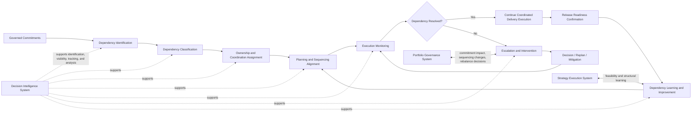
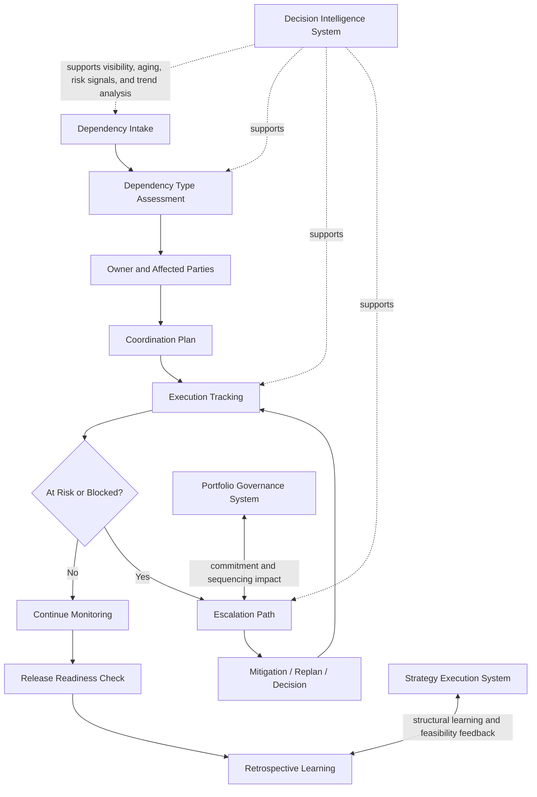

# Delivery Dependency Coordination Model

The **Delivery Dependency Coordination Model** defines the canonical coordination structure through which the **Product Delivery System** identifies, classifies, coordinates, sequences around, escalates, and resolves delivery dependencies within the **Product Leadership Operating System (PLOS)**.

Where the **Product Delivery System Interfaces** artifact defines the major interfaces through which delivery work moves across system boundaries, and the **Product Delivery System Metrics and Signals** artifact defines the evidence used to observe delivery health, this artifact defines the **operating model for dependency coordination** itself.

It explains how delivery dependencies should be surfaced early, assessed consistently, coordinated across teams and functions, monitored through execution, and escalated when they threaten governed commitments, release confidence, or delivery stability.

---

## Purpose

The purpose of this artifact is to define the canonical dependency coordination model for the **Product Delivery System**.

This artifact is intended to clarify:
- how delivery dependencies should be identified and classified
- how dependency ownership and coordination responsibility should be assigned
- how dependency risk should be monitored during execution
- how unresolved dependencies should be escalated
- how dependency learning should improve future planning and execution quality

It reinforces that dependency management is not an informal side activity within delivery. It is a core coordination discipline required to preserve execution credibility, release stability, and cross-team delivery coherence.

---

## Diagram

---

## Diagram Interpretation

The **Delivery Dependency Coordination Model** shows how delivery dependencies move from early identification into active coordination, monitoring, escalation, and learning within the **Product Delivery System**.

The model begins with **Governed Commitments**, because dependencies should be considered in the context of authorized delivery work rather than as isolated technical issues. Once work is accepted into delivery, the first coordination responsibility is **Dependency Identification**. This is the point at which cross-team, cross-function, platform, service, approval, enablement, integration, and release dependencies are surfaced as part of making work execution-ready.

After identification, dependencies move into **Dependency Classification**. This stage determines the nature of the dependency, such as whether it is upstream or downstream, internal or external, planned or emergent, structural or temporary, technical or operational. Classification matters because different dependency types require different coordination patterns, escalation paths, and risk responses.

Once classified, dependencies move into **Ownership and Coordination Assignment**. This stage defines who owns the dependency, who must coordinate its resolution, what teams or functions are involved, what delivery commitments it affects, and what resolution expectations apply. Without explicit ownership, dependencies tend to remain visible but unresolved.

From there, dependencies move into **Planning and Sequencing Alignment**, where the dependency is incorporated into delivery planning, milestone assumptions, coordination cadences, and execution timing. This is the point at which dependency logic becomes part of real delivery control rather than a separate tracking exercise.

During active execution, dependencies are governed through **Execution Monitoring**. This stage tracks dependency status, aging, volatility, blockers, coordination effectiveness, and whether the dependency is threatening schedule confidence, scope stability, integration quality, or release readiness.

The model then reaches a control decision: **Dependency Resolved?** If the dependency has been resolved sufficiently, delivery continues through the normal execution path. If it has not, the work moves into **Escalation and Intervention**, where leaders or designated operating forums intervene to address the unresolved dependency before it creates larger execution or release failure.

Escalated dependencies then enter **Decision / Replan / Mitigation**, where the organization determines whether to remove blockers, adjust sequencing, change scope, alter commitments, introduce mitigation actions, or rebalance delivery assumptions. Those decisions then feed back into active monitoring until the dependency condition is stable.

Resolved dependencies ultimately flow into **Release Readiness Confirmation**, because dependency closure is a required condition of credible release confidence. Dependencies that remain unresolved at release time represent a direct threat to delivery quality and operational stability.

Finally, the model ends in **Dependency Learning and Improvement**, where recurring coordination failures, structural bottlenecks, ownership ambiguity, and sequencing breakdowns are converted into better planning, stronger interface clarity, and improved future delivery behavior.

The diagram also shows that unresolved dependencies may require interaction with the **Portfolio Governance System** when they materially affect commitments, sequencing, or rebalance decisions. The **Strategy Execution System** receives structural learning when dependency patterns reveal broader execution constraints. Across the entire model, the **Decision Intelligence System** supports identification, visibility, tracking, and analysis.

---

## Operating Logic

The operating logic of this artifact is that **dependencies must be managed as governed coordination objects, not as informal blockers discovered late in execution**.

First, dependencies must be identified early enough to shape planning and sequencing. If they are discovered only during active execution or release preparation, the organization loses control over delivery confidence and often shifts into reactive escalation.

Second, dependencies must be classified in a disciplined way. Not all dependencies are alike, and different forms of dependency require different coordination approaches, response times, owners, and escalation paths.

Third, dependency coordination requires explicit ownership. Dependencies do not resolve themselves merely because they are visible. They require named responsibility, expected actions, and clear coordination authority across involved teams or functions.

Fourth, dependency logic must be integrated into planning and monitoring. A dependency record that sits outside the real execution system has little value. Dependencies must influence sequencing, commitment confidence, readiness assessment, and delivery review behavior.

Fifth, unresolved dependencies must trigger intervention before they destabilize delivery. Escalation is not a sign of process failure by itself. It is a normal operating mechanism for preserving cross-team execution integrity when coordination cannot be resolved at the local level.

Sixth, dependency management must contribute to learning. Repeated dependency failures often indicate weak interfaces, unrealistic sequencing, poor commitment shaping, or structural delivery issues. The model therefore includes explicit learning so the system improves rather than repeatedly rediscovering the same coordination problems.

This logic keeps dependency coordination aligned to the canonical operating loop:

**Strategy → Governance → Delivery → Outcomes → Learning → Strategy**

Within that loop, this artifact clarifies how dependencies are governed inside the **Product Delivery System** while remaining connected to governance, learning, and decision support. It does not create a new canonical system or redefine the broader architecture.

---

## Supporting Diagram

---

## Why This Matters

This artifact matters because delivery systems frequently fail at the points where work depends on something outside immediate team control.

Organizations often assume that delivery problems are caused primarily by weak execution inside teams. In practice, many of the most damaging failures come from unmanaged dependencies:
- cross-team work arriving out of sequence
- critical approvals delayed without escalation
- shared platforms becoming bottlenecks
- integration assumptions proving false too late
- releases slipping because dependency closure was never truly confirmed

Without a canonical coordination model, dependencies are often tracked inconsistently, owned ambiguously, escalated too late, and learned from poorly. That creates avoidable delivery instability even when individual teams appear to be performing well.

By defining the **Delivery Dependency Coordination Model**, this artifact makes dependency control explicit as part of the **Product Delivery System** rather than leaving it to improvisation.

---

## How To Use This

Use this artifact when defining, reviewing, or improving how delivery dependencies are coordinated across teams, functions, platforms, and release paths.

Use it to:
- clarify the lifecycle of a delivery dependency from identification through resolution
- define how dependency ownership and coordination responsibility should work
- align dependency tracking with delivery planning and review structures
- determine when local coordination is sufficient and when escalation is required
- improve how dependency learning feeds future planning and sequencing quality

This artifact is especially useful in:
- delivery operating model design
- cross-team execution reviews
- dependency and escalation process design
- release readiness preparation
- portfolio-to-delivery coordination discussions
- executive reviews where recurring delivery friction is driven by handoff and coordination failure

It should be used alongside the **Product Delivery System Interfaces** and **Product Delivery System Metrics and Signals** artifacts, and it should serve as an upstream source for later derivative playbooks and review models.

---

## Relationship to the Operating System

This artifact belongs to **Pillar 4 — Product Delivery System** within the **Product Leadership Operating System (PLOS)**.

It defines how dependencies should be coordinated inside the **Product Delivery System** while remaining aligned to the canonical five-system architecture:
- the **Strategy Execution System**
- the **Portfolio Governance System**
- the **Product Delivery System**
- the **Customer Outcomes System**
- the **Decision Intelligence System**

It supports interpretation of the canonical operating loop:

**Strategy → Governance → Delivery → Outcomes → Learning → Strategy**

Within that loop, this artifact clarifies how dependencies affect delivery planning, execution control, release confidence, and learning. It also shows when unresolved dependencies must surface into governance and when repeated dependency patterns should inform strategic feasibility understanding.

This artifact may define dependency coordination logic, but it may not redefine canonical systems, bypass governance authority, or create a separate dependency system outside the existing architecture.

---

## Summary

The **Delivery Dependency Coordination Model** defines the canonical coordination structure through which delivery dependencies are identified, classified, assigned, monitored, escalated, resolved, and learned from within the **Product Delivery System**.

It shows that dependency management is not an optional tracking exercise. It is a core delivery control mechanism that protects sequencing quality, execution confidence, release readiness, and system-level coordination.

In doing so, it reinforces that strong delivery depends not only on team execution, but on disciplined coordination across the boundaries where work, commitments, services, and decisions intersect.

---

## License

This repository and its contents are licensed under the **MIT License**.

See the [LICENSE](../LICENSE) file for details.
