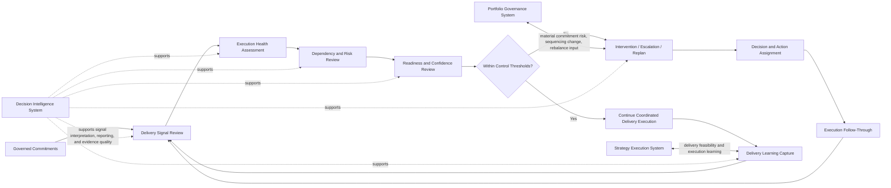
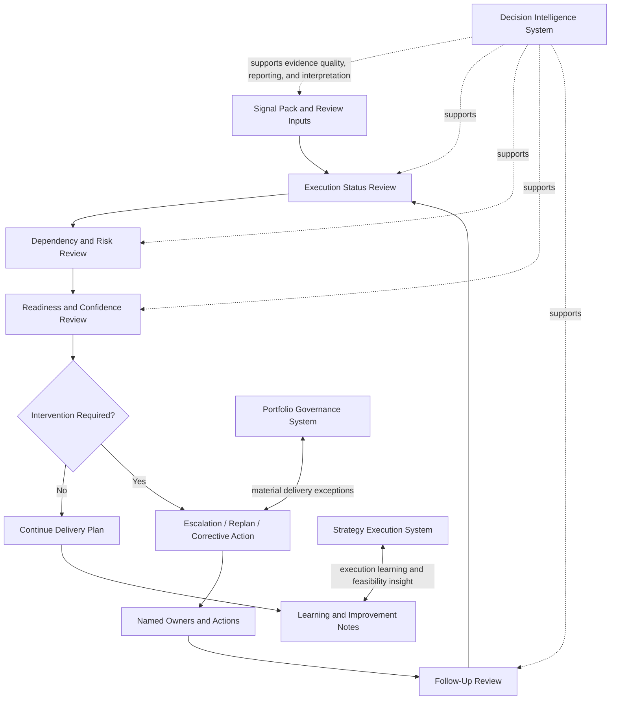

# Delivery Review Model

The **Delivery Review Model** defines the canonical review structure through which the **Product Delivery System** monitors execution health, assesses delivery confidence, governs exceptions, evaluates readiness conditions, and drives coordinated intervention within the **Product Leadership Operating System (PLOS)**.

Where the **Product Delivery System Metrics and Signals** artifact defines the evidence structure used to observe delivery performance, and the **Delivery Dependency Coordination Model** defines the coordination logic through which dependencies are surfaced and resolved, this artifact defines the **recurring delivery review model** through which that evidence is interpreted and acted on.

It explains how delivery reviews should function as disciplined operating forums for execution control, dependency resolution, risk escalation, readiness assessment, and delivery learning rather than as passive status meetings.

---

## Purpose

The purpose of this artifact is to define the canonical delivery review model for the **Product Delivery System**.

This artifact is intended to clarify:
- what a delivery review is designed to govern
- which signals and conditions should be reviewed
- how delivery confidence, risk, dependencies, and readiness should be assessed
- when intervention, escalation, or replanning should occur
- how delivery reviews support learning and stronger future execution

It reinforces that delivery reviews are not presentation rituals. They are control mechanisms through which leaders maintain execution integrity, preserve governed commitments, and respond to emerging delivery conditions before they become release or portfolio failures.

---

## Diagram

---

## Diagram Interpretation

The **Delivery Review Model** shows how the **Product Delivery System** uses recurring reviews to convert delivery evidence into assessment, intervention, and improved execution control.

The model begins with **Governed Commitments**, because delivery reviews should evaluate work in the context of what the organization has actually authorized, sequenced, and committed to deliver. A delivery review is not a generic team update. It is a forum for assessing whether governed work remains executable, credible, and under control.

The first stage of the review is **Delivery Signal Review**. This is where the evidence base is assembled and interpreted. Delivery signals include execution health, dependency status, aging issues, blocker patterns, scope stability, integration quality, readiness confidence, release conditions, and other material indicators defined in the delivery signal structure. This stage establishes whether the review is grounded in evidence rather than anecdote.

From there, the review moves into **Execution Health Assessment**. This stage examines whether work is progressing as expected, whether flow is stable, whether confidence is holding, and whether active commitments remain credible. It focuses on actual delivery health rather than on superficial progress reporting.

The review then moves into **Dependency and Risk Review**. At this point, unresolved dependencies, cross-team coordination issues, blockers, risk concentrations, and exception conditions are examined to determine whether delivery remains governable within the current plan. This stage ensures that delivery risk is surfaced before it becomes invisible technical debt or last-minute release failure.

Next, the review enters **Readiness and Confidence Review**. This stage determines whether the current state of execution supports continuing delivery as planned, whether readiness conditions are converging, and whether leaders should retain, adjust, or challenge current delivery assumptions. It is where review logic moves from observation into judgment.

That leads to a decision point: **Within Control Thresholds?** If delivery remains within acceptable thresholds for confidence, risk, dependency health, and readiness trajectory, work continues through coordinated execution. If not, the review triggers **Intervention / Escalation / Replan**.

When intervention is required, the review does not stop at issue visibility. It moves into **Decision and Action Assignment**, where ownership is established for corrective actions, mitigation steps, escalation paths, sequencing changes, or replanning decisions. This is critical because a review without accountable action is only descriptive, not operational.

Those actions then move into **Execution Follow-Through**, where teams and leaders carry out the agreed interventions and return to the next review cycle with updated evidence. This creates a closed-loop control structure rather than a one-time status checkpoint.

When delivery remains within thresholds, or when interventions have stabilized the situation, the review also produces **Delivery Learning Capture**. This stage converts recurring patterns, control failures, assessment errors, and successful interventions into improved future review quality, stronger execution planning, and better delivery operating discipline.

The diagram also shows that material delivery conditions may need to surface into the **Portfolio Governance System** when commitment credibility, sequencing, or rebalance decisions are affected. The **Strategy Execution System** receives delivery feasibility and execution learning so broader strategic assumptions remain grounded in delivery reality. Across the model, the **Decision Intelligence System** strengthens signal interpretation, evidence quality, and review discipline.

---

## Operating Logic

The operating logic of this artifact is that **delivery reviews must function as execution control forums, not as narrative reporting meetings**.

First, delivery reviews must begin from governed commitments and defined evidence. Without that grounding, reviews drift into informal storytelling, local reporting habits, or unstructured escalation. The review model therefore begins by anchoring delivery assessment to authorized work and observable signals.

Second, reviews must assess the actual health of execution rather than merely reporting activity. The goal is to understand whether commitments remain credible, whether dependencies are manageable, whether risk is increasing, and whether readiness is converging.

Third, delivery reviews must explicitly examine dependencies and risk. Delivery problems often emerge first as coordination strain, blocked work, or weakening confidence. A review model that looks only at output progress will miss the conditions that most often destabilize execution.

Fourth, the review must include a control decision. A useful review does not merely surface issues. It determines whether delivery remains within acceptable operating thresholds or whether intervention is required. This preserves the review as a decision-bearing mechanism rather than a passive checkpoint.

Fifth, when intervention is required, the review must produce accountable action. Escalation, mitigation, replanning, and sequencing adjustment must be assigned clearly so the system can act on what it has learned.

Sixth, the review must close the loop through follow-through and learning. Delivery reviews should improve future execution, not simply observe current problems. Repeated review patterns should strengthen forecasting, planning quality, risk response, and operating discipline over time.

This logic keeps the review model aligned to the canonical operating loop:

**Strategy → Governance → Delivery → Outcomes → Learning → Strategy**

Within that loop, the **Delivery Review Model** clarifies how the **Product Delivery System** governs active execution while remaining connected to governance, learning, and decision support. It does not create a new canonical system or redefine the operating architecture.

---

## Supporting Diagram

---

## Why This Matters

This artifact matters because many organizations conduct delivery reviews without a real control model.

What they call a review is often just a meeting where teams report progress, leaders ask for updates, and unresolved issues accumulate without clear decisions. When that happens, the same recurring problems appear:
- deteriorating confidence hidden behind progress language
- dependencies discussed but not governed
- risks surfaced too late to prevent disruption
- readiness assumptions left unchallenged
- escalation triggered only after commitments are already unstable
- repeated delivery issues observed across multiple cycles without learning

Without a canonical review model, delivery forums become inconsistent, reactive, and weakly connected to real execution control. That reduces their value precisely when delivery conditions become difficult.

By defining the **Delivery Review Model**, this artifact makes review discipline explicit as part of the **Product Delivery System**. It ensures that delivery reviews function as operating mechanisms for control, intervention, and learning.

---

## How To Use This

Use this artifact when designing, reviewing, or improving recurring delivery review forums within the **Product Delivery System**.

Use it to:
- define the purpose and structure of delivery reviews
- align review conversations to signals, dependencies, risk, and readiness
- determine when a review should trigger intervention or escalation
- clarify how actions should be assigned and followed through
- improve consistency across delivery leadership, execution oversight, and cross-team coordination forums

This artifact is especially useful in:
- delivery operating model design
- recurring execution review design
- delivery governance improvement
- dependency and escalation integration
- release readiness preparation
- executive delivery oversight environments where narrative reporting must be replaced with evidence-based control

It should be used alongside the **Product Delivery System Metrics and Signals** and **Delivery Dependency Coordination Model** artifacts, and it should serve as an upstream source for the **Delivery Review Playbook**.

---

## Relationship to the Operating System

This artifact belongs to **Pillar 4 — Product Delivery System** within the **Product Leadership Operating System (PLOS)**.

It defines how recurring delivery reviews should function inside the **Product Delivery System** while remaining aligned to the canonical five-system architecture:
- the **Strategy Execution System**
- the **Portfolio Governance System**
- the **Product Delivery System**
- the **Customer Outcomes System**
- the **Decision Intelligence System**

It supports interpretation of the canonical operating loop:

**Strategy → Governance → Delivery → Outcomes → Learning → Strategy**

Within that loop, this artifact clarifies how delivery evidence is reviewed, how control judgments are made, how intervention is triggered, and how execution learning is captured. It also shows when delivery review conditions must surface into governance and how delivery learning informs broader strategic understanding.

This artifact may define delivery review logic, but it may not redefine canonical systems, replace portfolio governance authority, or create a separate review system outside the existing architecture.

---

## Summary

The **Delivery Review Model** defines the canonical review structure through which the **Product Delivery System** interprets delivery evidence, assesses execution health, governs dependencies and risk, evaluates readiness confidence, and triggers intervention when required.

It shows that delivery reviews are not status rituals. They are recurring control forums that keep execution observable, governable, and correctable while delivery is still in motion.

In doing so, it reinforces that strong delivery depends not only on planning and execution, but also on disciplined review mechanisms that convert signals into decisions, actions, and learning.

---

## License

This repository and its contents are licensed under the **MIT License**.

See the [LICENSE](../LICENSE) file for details.
