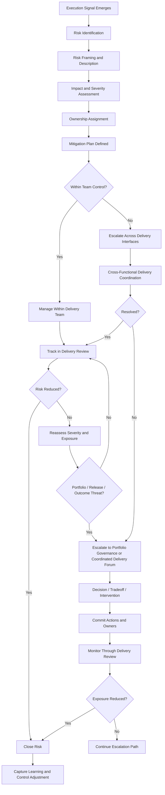
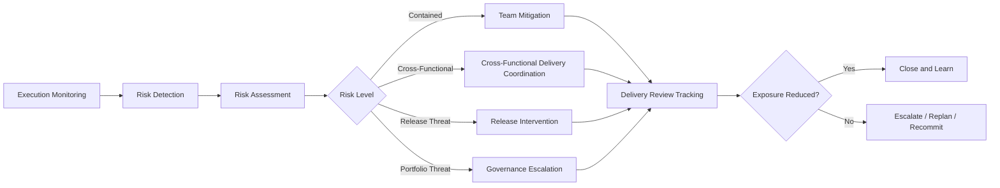

# Delivery Risk and Escalation Model

The **Delivery Risk and Escalation Model** defines the canonical mechanism through which the **Product Delivery System** identifies, assesses, governs, escalates, and resolves delivery risks that threaten execution confidence, delivery continuity, dependency coordination, release integrity, or committed portfolio outcomes within the **Product Leadership Operating System (PLOS)**.

Where the **Unified Product Delivery System** defines the overall structure of execution, and the **Delivery Review Model** defines the recurring review mechanism through which execution health is assessed, this artifact defines the specific model used to determine how delivery risks are surfaced, assessed, escalated, governed, and driven to resolution.

It explains how product organizations manage delivery risk as a structured operating discipline rather than as an ad hoc exception process, informal status narrative, or reactive leadership intervention model.

---

## Purpose

The purpose of this artifact is to define the canonical **Delivery Risk and Escalation Model** for the **Product Delivery System**.

This model exists to ensure that delivery risk is:

- identified early rather than discovered late
- assessed consistently rather than interpreted subjectively
- escalated through clear thresholds rather than personal judgment alone
- governed through explicit ownership rather than diffuse accountability
- resolved through coordinated action rather than unmanaged exception handling
- connected back to delivery confidence, dependency health, release readiness, and portfolio impact

Within the **Product Leadership Operating System**, delivery risk management is not separate from execution. It is part of the normal control structure through which leadership teams maintain delivery reliability while preserving speed, transparency, and cross-functional coordination.

This artifact establishes the delivery risk discipline required to support the broader operating loop:

**Strategy → Governance → Delivery → Outcomes → Learning → Strategy**

---

## Diagram

---

## Diagram Interpretation

The **Delivery Risk and Escalation Model** begins when execution signals indicate that normal delivery conditions may be deteriorating. These signals may emerge through milestone slippage, dependency instability, quality decline, unresolved decisions, resource disruption, scope churn, or declining confidence in the current execution path.

The first responsibility of the model is not escalation, but **risk identification and framing**. This matters because delivery organizations often talk about risk in vague or inconsistent terms. In this model, a risk must be made explicit before it can be governed. That means the issue must be described clearly enough to establish what is threatened, what is causing the exposure, what evidence supports the concern, and what part of delivery is now at risk.

Once the risk is framed, the model requires **impact and severity assessment**. This prevents escalation from becoming emotional, personality-driven, or overly dependent on local interpretation. Risks should be assessed in terms of how materially they threaten execution continuity, release confidence, dependency stability, delivery commitments, or expected outcomes.

After assessment, a **named owner** must be assigned and a mitigation path defined. Ownership is a mandatory control in this model. Risks without explicit ownership do not remain “visible”; they become unmanaged. Ownership ensures that every material risk has someone responsible for progressing mitigation, coordinating action, reporting status, and determining whether escalation thresholds have been crossed.

The model then separates risks into two major categories:

- risks that remain **within team control**
- risks that exceed team control and require **cross-boundary escalation**

If the risk can be contained and resolved within the delivery team, it remains inside normal execution control and is tracked through recurring delivery reviews. If it cannot be resolved locally, affects multiple teams, threatens release integrity, or requires broader tradeoff decisions, it moves into escalation.

The escalation path is designed to move risks to the **lowest effective decision level first**. This preserves local accountability while ensuring that broader issues reach the right coordination or governance forum before they become execution failures. Escalation is therefore not treated as failure, but as a normal operating mechanism for handling risks whose resolution exceeds local authority or control.

Once escalated, the risk moves through **cross-functional resolution**, leadership intervention, or governance decision-making, depending on its breadth and severity. The purpose of escalation is not simply to increase visibility. It is to secure decisions, remove blockers, reassign ownership, rebalance scope, intervene in dependencies, or reset commitments when needed.

The model ends only when exposure has been materially reduced, removed, accepted through explicit decision, or incorporated into an updated plan with clear ownership and recommitted expectations. Resolved risks should then generate learning that improves future execution controls, escalation discipline, or review practices.

In this way, the diagram shows that the **Delivery Risk and Escalation Model** is not a side process. It is a structured control mechanism embedded directly within the **Product Delivery System**.

---

## Operating Logic

### Risk Identification

Delivery risk begins with execution evidence rather than abstract concern. The operating model assumes that risks are first surfaced through observable signals in delivery performance, execution coordination, quality health, or release confidence.

Typical signals include:

- milestone slippage
- repeated carryover across review cycles
- unstable dependencies
- unresolved cross-functional blockers
- scope churn affecting execution confidence
- degraded quality or defect accumulation
- decision latency
- capacity disruption
- release-readiness deterioration
- loss of delivery confidence despite nominal progress reporting

The model requires these signals to be translated into explicit risk statements. A risk should be defined clearly enough to explain:

- what is at risk
- what is causing the exposure
- what evidence supports the concern
- what timeline is relevant
- what commitments, interfaces, releases, or outcomes may be affected

Without explicit framing, delivery risk remains too ambiguous to govern consistently.

### Risk Assessment

Once identified, risks must be assessed using a consistent delivery-oriented structure. The purpose is not theoretical scoring sophistication, but comparable operational judgment.

Canonical assessment dimensions include:

- **impact** — what part of delivery is affected
- **severity** — how serious the consequence becomes if the risk materializes
- **proximity** — how soon the risk may create consequences
- **controllability** — whether the team can resolve it directly
- **breadth** — whether the issue remains local or crosses teams, releases, or portfolio commitments
- **confidence effect** — whether the risk materially degrades belief in the current delivery plan

This model does not require a rigid numerical risk formula, but it does require structured evaluation so that escalation is based on operating conditions rather than narrative preference.

### Ownership and Mitigation

Every material risk must have:

- a named owner
- a current status
- a mitigation path
- a next review point
- a clear escalation trigger if mitigation fails

The owner is accountable for driving the risk toward resolution. That accountability includes clarifying the issue, coordinating responses, reporting current exposure, and determining whether escalation conditions have been reached.

Mitigation may take forms such as:

- resequencing work
- reducing or deferring scope
- resolving dependency handoffs
- accelerating blocked decisions
- reallocating resources
- introducing quality containment actions
- changing release controls
- elevating the issue for leadership attention
- recommending governance tradeoffs

Mitigation must be action-oriented. Passive awareness is not an acceptable substitute for active risk management.

### Escalation Thresholds

Escalation occurs when delivery risk exceeds normal team control. This model requires threshold-based escalation rather than personality-based escalation.

Canonical escalation triggers include:

- the team lacks authority to resolve the issue
- the issue affects multiple teams or execution interfaces
- the issue threatens committed milestones or release integrity
- the issue requires cross-functional intervention beyond local control
- the issue materially reduces delivery confidence
- the issue threatens portfolio commitments or expected outcomes
- mitigation has stalled or failed
- unresolved decisions are now creating execution blockage

These thresholds ensure that escalation is disciplined, timely, and tied to actual execution exposure.

### Escalation Progression

The escalation path should move upward only as far as needed to secure effective resolution.

The canonical progression is:

1. **team-level management**
2. **cross-functional delivery coordination**
3. **delivery review escalation**
4. **leadership or portfolio forum review**
5. **explicit governance intervention**

This progression preserves the principle that risks should be handled at the lowest level capable of resolving them, while ensuring that material threats do not remain trapped below the level required for intervention.

### Resolution Logic

A delivery risk is resolved only when exposure has been meaningfully reduced, removed, accepted through explicit decision, or incorporated into an updated plan.

Valid resolution outcomes include:

- risk removed
- risk reduced to acceptable range
- blocker cleared
- dependency agreement secured
- release path changed
- scope or sequencing adjusted
- decision made and execution unlocked
- commitment reset through governance

If none of these conditions are true, the risk remains active even if it has been discussed extensively.

### Review Integration

The **Delivery Risk and Escalation Model** is integrated into normal delivery governance rather than operating as an isolated exception process.

This means:

- risks should surface through routine execution monitoring
- risks should be reviewed through the **Delivery Review Model**
- dependency-related risks should connect to dependency coordination mechanisms
- release-threatening risks should connect to release readiness control
- broader tradeoff risks should connect to governance forums when required

This integration keeps risk management embedded within the operating discipline of the **Product Delivery System**.

### Relationship to the Five-System Architecture

Within the canonical five-system architecture:

- the **Strategy Execution System** establishes the commitments and directional priorities that delivery may place at risk
- the **Portfolio Governance System** governs tradeoffs, priority decisions, sequencing changes, and investment-level resets when delivery risks exceed delivery authority
- the **Product Delivery System** owns the operating discipline of risk detection, assessment, mitigation, escalation, and resolution
- the **Customer Outcomes System** reflects whether delivery disruption may threaten value realization
- the **Decision Intelligence System** provides supporting signals, evidence, metrics, and visibility but does not govern escalation decisions

This preserves the architectural principle that **Decision Intelligence supports — it does not control**.

---

## Supporting Diagram

---

## Why This Matters

Delivery organizations do not fail only because plans are weak. They also fail because risks remain invisible too long, are interpreted inconsistently, are discussed without ownership, or are escalated too late to protect commitments.

Without a defined **Delivery Risk and Escalation Model**:

- teams normalize instability rather than confronting it
- execution issues remain buried in status reporting
- cross-functional blockers linger without coordinated intervention
- release threats surface too late
- leadership receives fragmented signals rather than governed escalation
- portfolio commitments drift away from delivery reality
- avoidable delivery failures become visible only after impact is already occurring

The **Delivery Risk and Escalation Model** matters because it converts uncertainty into governed action.

It creates a disciplined mechanism through which delivery organizations can:

- detect risk before failure occurs
- assess exposure consistently
- assign clear accountability
- escalate based on thresholds rather than personalities
- intervene at the right level
- preserve delivery confidence while protecting speed and execution continuity

This model also protects the **Product Delivery System** from two common breakdowns.

The first is **under-escalation**, where material risks remain within local teams too long even when they clearly exceed team control. The second is **over-escalation**, where normal delivery friction is pushed upward prematurely, weakening accountability and creating unnecessary management overhead.

A strong delivery system does not remove uncertainty from execution. It makes uncertainty visible, governable, and actionable before it becomes delivery disruption or commitment failure.

---

## How To Use This

Use this artifact as the canonical reference for how delivery risk is identified, assessed, escalated, and resolved within the **Product Delivery System**.

It should be used when:

- defining delivery risk management practices
- designing escalation criteria for execution teams
- building delivery review structures
- clarifying ownership for delivery issues and execution blockers
- distinguishing local issue management from cross-functional escalation
- determining when risks should move from delivery control into governance attention
- developing supporting operating artifacts such as playbooks, templates, trackers, or review mechanisms

This artifact should guide the design of supporting delivery controls, including:

- delivery review forums
- risk registers
- dependency escalation mechanisms
- release readiness assessments
- exception handling practices
- leadership intervention paths

Supporting artifacts may operationalize this model in more detailed or implementation-specific ways, but they must not redefine the canonical logic established here.

This artifact is most effective when used together with related **Pillar 4** artifacts, especially those governing:

- delivery reviews
- dependency coordination
- execution health signals
- release readiness
- interface management across delivery boundaries

In practice, this model should be used to ensure that delivery risk becomes a managed operating discipline rather than an informal reporting habit.

---

## Relationship to the Operating System

This artifact belongs to **Pillar 4 — Product Delivery System** within the **Product Leadership Operating System (PLOS)**.

It supports the canonical operating loop:

**Strategy → Governance → Delivery → Outcomes → Learning → Strategy**

Its primary role is to define how the **Product Delivery System** manages execution risk while remaining properly connected to adjacent systems in the wider architecture.

Its architectural relationship to the broader operating system is as follows:

- it strengthens execution control within **Delivery**
- it provides a disciplined path for issues that must move from **Delivery** into **Governance**
- it helps protect the conditions required for successful **Outcomes**
- it creates learning that can improve future planning, coordination, review discipline, and delivery control

Within the canonical five-system architecture:

- the **Strategy Execution System** establishes the commitments and directional priorities that delivery execution must support
- the **Portfolio Governance System** receives escalated issues when delivery risks require tradeoffs, reprioritization, commitment resets, or formal intervention beyond delivery authority
- the **Product Delivery System** owns the operating mechanisms for risk detection, mitigation, escalation, and resolution
- the **Customer Outcomes System** reflects whether delivery disruption may jeopardize expected value realization
- the **Decision Intelligence System** provides signals, metrics, and evidence that support risk visibility and judgment, but it does not control escalation decisions

This artifact does not introduce a new system, alter the five-system architecture, or redefine the operating loop. It exists to strengthen delivery reliability and escalation discipline within the established PLOS structure.

---

## Summary

The **Delivery Risk and Escalation Model** defines the canonical mechanism through which the **Product Delivery System** identifies, assesses, governs, escalates, and resolves risks that threaten execution continuity, release integrity, delivery confidence, cross-functional coordination, or committed outcomes.

It ensures that delivery risks are:

- made visible early
- framed explicitly
- assessed consistently
- assigned clear ownership
- escalated through defined thresholds
- connected to the correct level of intervention
- driven toward actual resolution

This model reinforces the principle that escalation is not a failure state. It is a governed operating mechanism used when delivery risk exceeds local control and requires broader coordination, decision-making, or commitment adjustment.

Within the **Product Leadership Operating System**, this artifact serves as a foundational control structure for reliable product delivery at scale. It helps ensure that execution risk is managed as part of normal delivery governance rather than as an ad hoc exception process.

---

## License

This project is licensed under the MIT License. See the [LICENSE](LICENSE) file for details.
