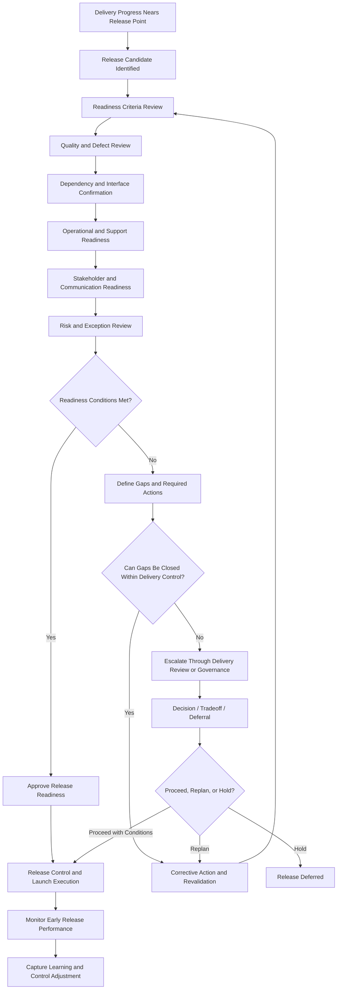
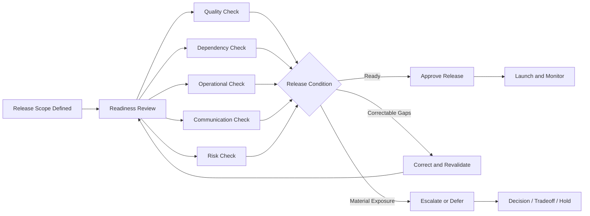

# Release Readiness Model

The **Release Readiness Model** defines the canonical mechanism through which the **Product Delivery System** determines whether work is ready to move from active delivery into controlled release with sufficient execution confidence, operational preparedness, dependency alignment, quality integrity, and stakeholder readiness within the **Product Leadership Operating System (PLOS)**.

Where the **Unified Product Delivery System** defines the overall structure of execution, the **Delivery Review Model** governs recurring execution assessment, and the **Delivery Risk and Escalation Model** governs the treatment of delivery risk, this artifact defines the specific model used to assess whether a release candidate is sufficiently ready to proceed into release, whether release conditions require intervention, or whether release should be deferred pending corrective action.

It explains how product organizations determine release readiness as a governed operating discipline rather than as an informal judgment call, calendar event, or last-minute coordination exercise.

---

## Purpose

The purpose of this artifact is to define the canonical **Release Readiness Model** for the **Product Delivery System**.

This model exists to ensure that release decisions are:

- based on explicit readiness conditions rather than optimism
- governed through structured assessment rather than informal consensus
- supported by evidence rather than status narrative
- connected to delivery confidence, quality integrity, dependency alignment, and operational preparedness
- capable of triggering intervention, deferral, or escalation when readiness conditions are not met
- integrated into the broader delivery control structure rather than treated as a stand-alone ceremony

Within the **Product Leadership Operating System**, release readiness is not synonymous with feature completion. It is the governed determination that the relevant work, dependencies, controls, communications, and operational conditions are sufficiently prepared to support a responsible release decision.

This artifact establishes the release discipline required to support the broader operating loop:

**Strategy → Governance → Delivery → Outcomes → Learning → Strategy**

---

## Diagram

---

## Diagram Interpretation

The **Release Readiness Model** begins when delivery reaches a point at which a release candidate can be evaluated. This does not mean that all work is necessarily complete in the abstract. It means that the organization has reached a point where a governed readiness decision must be made regarding whether the current release scope, quality condition, dependency state, and operational posture are sufficient to support release.

The model begins by identifying the release candidate and then assessing it against a structured set of readiness conditions. These conditions are intentionally broader than development completion alone. Readiness requires coordinated review of quality, unresolved defects, dependency health, interface stability, operational preparedness, support readiness, stakeholder communication, and outstanding risks or exceptions.

This ensures that release readiness is treated as a system-level delivery judgment rather than a narrow engineering completion signal.

If readiness conditions are met, the release is approved to proceed through controlled launch execution. Approval in this model is not an act of optimism. It is a governed conclusion that known conditions fall within acceptable bounds for release. Once approved, the model continues into early-release monitoring so that release performance is observed rather than assumed, and so that learning can be captured back into future release controls.

If readiness conditions are not met, the model does not immediately assume failure. Instead, it requires explicit identification of the readiness gaps and a determination of whether those gaps can be closed within normal delivery control. If they can, corrective action is taken and the release candidate is revalidated. If they cannot, the issue moves into delivery review escalation or governance intervention, depending on the severity and nature of the gap.

This preserves the principle that release decisions should be made at the lowest effective level possible while ensuring that unresolved issues with broader impact do not remain trapped within local delivery judgment.

The model therefore distinguishes between three outcomes:

- release approval because readiness conditions are met
- corrective rework and revalidation because readiness is incomplete but recoverable within delivery control
- escalation, tradeoff, or deferral because readiness gaps exceed normal delivery authority or acceptable release risk

In this way, the **Release Readiness Model** functions as a formal control mechanism inside the **Product Delivery System**. It protects release integrity without introducing a parallel system, and it ensures that delivery-to-release transition remains disciplined, evidence-based, and governable.

---

## Operating Logic

### Release Candidate Identification

The model begins when work approaches a release point and a candidate release scope can be identified.

A release candidate is not simply a collection of completed work. It is a proposed release package whose readiness must be assessed against explicit operating conditions.

This means release candidate identification should establish:

- what scope is intended for release
- what dependencies are included or relied upon
- what environments, controls, or operational conditions apply
- what stakeholders are affected
- what release timing or sequencing assumptions are in effect
- what known exceptions or open items remain

Without clear release candidate definition, readiness assessment becomes ambiguous and unreliable.

### Readiness Criteria Review

Release readiness requires assessment against defined criteria rather than intuition.

Canonical readiness dimensions include:

- scope completeness relative to intended release
- quality condition and unresolved defect status
- dependency and interface readiness
- operational preparedness
- support readiness
- communication and stakeholder alignment
- risk and exception posture
- decision clarity regarding any controlled limitations or conditions

The purpose of the criteria review is not to create bureaucracy. It is to ensure that the release decision reflects the actual release condition rather than a partial view of progress.

### Quality and Defect Review

A release is not ready simply because planned work is nominally complete. It must also be in an acceptable quality state.

Quality review should assess:

- unresolved defects
- severity and concentration of defects
- regression exposure
- stability of core workflows
- confidence in testing completion
- known limitations accepted for release
- any quality conditions that materially affect release confidence

This model does not require zero defects. It requires that known defects, risks, and limitations fall within explicitly acceptable release bounds.

### Dependency and Interface Confirmation

Release readiness depends on more than the focal team. It also depends on whether required dependencies, interfaces, environments, and upstream or downstream coordination points are sufficiently stable to support release.

Dependency confirmation should assess:

- external team commitments
- service or platform readiness
- interface stability
- configuration alignment
- data dependencies
- release sequencing constraints
- external coordination risks

This ensures that release decisions are not made in isolation from the delivery network required to support them.

### Operational and Support Readiness

A release may be technically complete while still being operationally unready.

Operational readiness review should assess:

- deployment preparedness
- rollback or recovery preparedness
- monitoring and alerting readiness
- operational runbook completeness
- support team awareness
- incident response preparedness
- internal enablement for launch support

This protects the organization from releasing work that can be deployed but cannot be responsibly operated.

### Stakeholder and Communication Readiness

Readiness also requires that the relevant people know what is changing, when it is changing, and how to respond.

Stakeholder and communication readiness should assess:

- internal communication plans
- external communication plans where relevant
- customer-impact awareness
- partner or cross-functional alignment
- training or enablement needs
- go-live ownership clarity

This ensures that release execution is coordinated beyond the immediate delivery team.

### Risk and Exception Review

The readiness decision must account for remaining risks, open exceptions, and any conditions under which release may proceed.

This review should determine:

- what risks remain open
- whether those risks are acceptable within release bounds
- what exceptions are being consciously accepted
- what mitigations are in place
- what thresholds would require deferral or escalation
- whether the release posture materially changes delivery confidence or outcome risk

This keeps release readiness connected to the broader **Delivery Risk and Escalation Model** rather than allowing readiness decisions to bypass risk controls.

### Readiness Decision Logic

After readiness conditions are reviewed, the release candidate should resolve into one of three canonical states:

- **ready to release**
- **not yet ready but correctable within delivery control**
- **not ready and requires escalation, tradeoff, or deferral**

A release should be approved only when readiness conditions are sufficiently met and remaining exceptions are explicitly acceptable.

A release should return for corrective action when the remaining gaps are real but manageable within normal delivery authority and timing.

A release should be escalated or deferred when:

- unresolved issues exceed local authority
- dependency conditions are materially unstable
- quality or operational risk exceeds acceptable bounds
- release timing now requires a broader tradeoff decision
- proceeding would threaten release integrity, delivery confidence, or expected outcomes

This ensures that release approval remains a governed decision rather than a default outcome.

### Early Release Monitoring

Readiness approval does not end the model. After launch, early release performance should be monitored to validate that the release behaves as expected in live conditions.

Early monitoring may include:

- deployment stability
- defect emergence
- operational incident signals
- support volume
- customer-impact indicators
- rollback triggers
- performance of controlled release conditions

This closes the gap between pre-release readiness judgment and post-release operating reality.

### Learning and Control Adjustment

Every release should create learning for future delivery and release discipline.

Learning may include:

- refinement of readiness criteria
- improvement of quality thresholds
- stronger dependency validation
- improved communication timing
- better operational preparation
- earlier risk surfacing
- sharper decision thresholds for approval, conditional release, or deferral

This ensures that release readiness strengthens the operating system over time rather than remaining a static checklist activity.

### Relationship to the Five-System Architecture

Within the canonical five-system architecture:

- the **Strategy Execution System** defines the commitments and strategic priorities that releases are intended to advance
- the **Portfolio Governance System** receives escalation when release timing, scope, risk, or tradeoff conditions exceed normal delivery authority
- the **Product Delivery System** owns readiness assessment, release control, corrective action, and release decision support
- the **Customer Outcomes System** reflects whether released work produces intended customer or business results
- the **Decision Intelligence System** supports readiness through evidence, signals, metrics, and visibility, but it does not make the release decision

This preserves the architectural principle that **Decision Intelligence supports — it does not control**.

---

## Supporting Diagram

---

## Why This Matters

Delivery organizations often treat release readiness as a calendar event that occurs near the end of delivery. That pattern creates avoidable failure because the release decision becomes compressed into a final coordination moment rather than governed through explicit readiness conditions.

Without a defined **Release Readiness Model**:

- feature completion is mistaken for release readiness
- quality risks remain hidden until late in the cycle
- dependencies are assumed rather than confirmed
- operational readiness is checked too late
- communications are fragmented
- unresolved exceptions are normalized without explicit acceptance
- release decisions become personality-driven, deadline-driven, or optimism-driven

The **Release Readiness Model** matters because it converts release from a hopeful transition into a governed control point.

It protects the **Product Delivery System** from two common breakdowns:

- releasing work that is not sufficiently ready because schedule pressure overrides control discipline
- delaying release unnecessarily because readiness is vague, subjective, or inconsistently assessed

A strong delivery system does not assume that completed work is releasable. It determines release readiness explicitly, with evidence, ownership, and clear decision thresholds.

This model therefore protects release integrity, reduces avoidable launch instability, and strengthens confidence that the transition from delivery into release is operationally responsible.

---

## How To Use This

Use this artifact as the canonical reference for how release readiness should be assessed, governed, and decided within the **Product Delivery System**.

It should be used when:

- defining release readiness review practices
- designing readiness criteria and evidence requirements
- clarifying release approval thresholds
- distinguishing delivery completion from release approval
- aligning teams on quality, dependency, operational, and communication expectations before release
- determining when release gaps can be corrected locally and when they require escalation or deferral
- developing supporting operating artifacts such as release checklists, review forums, approval templates, or launch controls

This artifact should guide the design of supporting delivery controls, including:

- readiness review forums
- release checklists
- launch approval mechanisms
- operational readiness controls
- release communication plans
- exception logging and acceptance controls
- post-release monitoring practices

Supporting artifacts may operationalize this model in more detailed or implementation-specific ways, but they must not redefine the canonical logic established here.

This artifact is most effective when used together with related **Pillar 4** artifacts, especially those governing:

- delivery reviews
- delivery risk and escalation
- dependency coordination
- execution health signals
- release control practices

In practice, this model should be used to ensure that release readiness is governed as part of normal delivery control rather than treated as a final-stage formality.

---

## Relationship to the Operating System

This artifact belongs to **Pillar 4 — Product Delivery System** within the **Product Leadership Operating System (PLOS)**.

It supports the canonical operating loop:

**Strategy → Governance → Delivery → Outcomes → Learning → Strategy**

Its primary role is to define how the **Product Delivery System** determines whether work is ready to move from delivery into release under acceptable quality, dependency, operational, and risk conditions.

Its architectural relationship to the broader operating system is as follows:

- it strengthens execution control within **Delivery**
- it creates a governed transition point between active delivery and controlled release
- it provides a structured mechanism for moving unresolved release issues into **Governance** when tradeoffs exceed delivery authority
- it helps protect the conditions required for successful **Outcomes**
- it produces learning that improves future delivery, release, and control discipline

Within the canonical five-system architecture:

- the **Strategy Execution System** establishes the commitments and priorities that releases are intended to advance
- the **Portfolio Governance System** receives escalated release issues when readiness conditions create priority, timing, scope, or risk tradeoffs beyond delivery authority
- the **Product Delivery System** owns readiness review, release control, corrective action, and release decision support
- the **Customer Outcomes System** reflects whether released work creates the intended value once in market or in operation
- the **Decision Intelligence System** provides supporting signals, readiness evidence, and monitoring visibility, but it does not control the release decision

This artifact does not introduce a new system, alter the five-system architecture, or redefine the operating loop. It exists to strengthen the delivery-to-release control discipline within the established PLOS structure.

---

## Summary

The **Release Readiness Model** defines the canonical mechanism through which the **Product Delivery System** determines whether a release candidate is sufficiently ready to proceed into controlled release.

It ensures that release decisions are:

- grounded in explicit readiness conditions
- broader than feature completion alone
- supported by evidence and ownership
- connected to quality, dependency, operational, communication, and risk posture
- capable of triggering corrective action, escalation, or deferral when needed

This model reinforces the principle that release approval is not a ceremonial milestone. It is a governed determination that the current release condition is acceptable within defined bounds.

Within the **Product Leadership Operating System**, this artifact serves as a foundational control structure for protecting release integrity and ensuring that the movement from delivery into release remains disciplined, evidence-based, and operationally responsible.

---

## License

This project is licensed under the MIT License. See the [LICENSE](LICENSE) file for details.
    T --> U[Re-entry Through Readiness Review]
    U --> C
