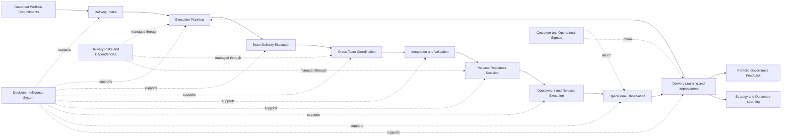
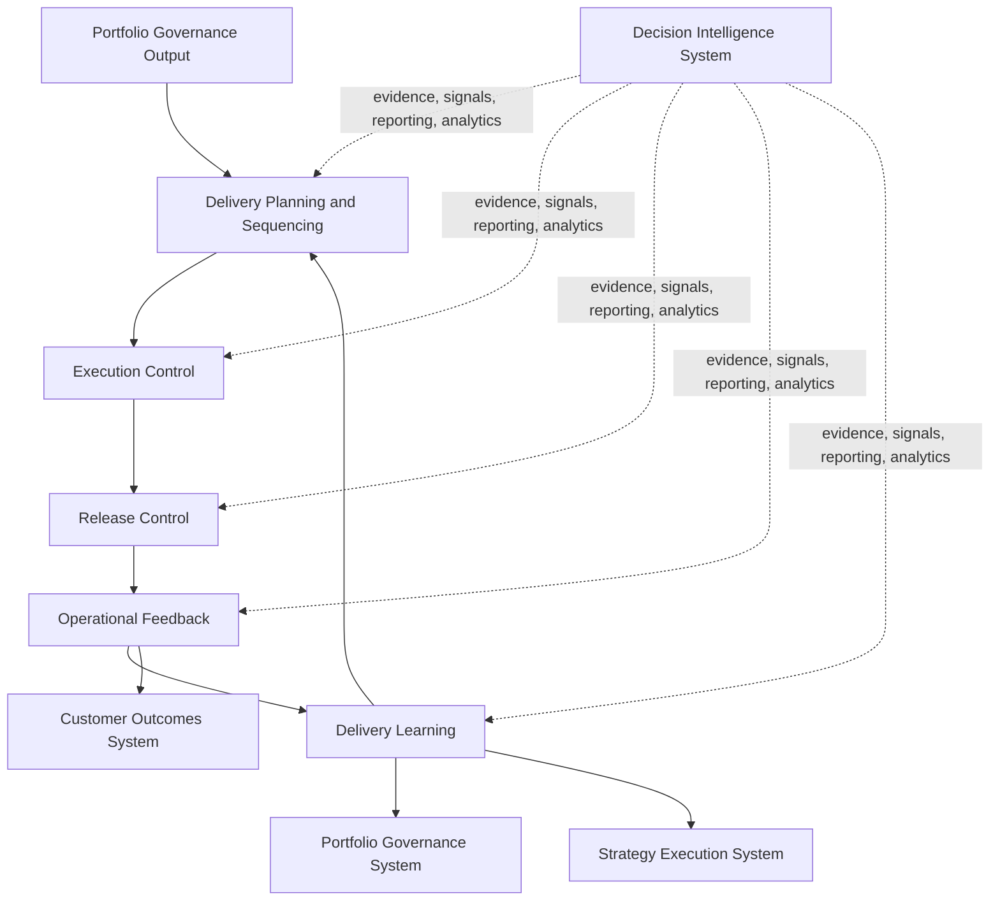

# Delivery Execution Flow Diagram

The **Delivery Execution Flow Diagram** defines the canonical end-to-end execution flow through which the **Product Delivery System** converts governed portfolio commitments into coordinated delivery work, release execution, operational feedback, and structured learning.

Where the **Product Delivery System Diagram** shows the major components of the delivery system and their relationships, and the **Unified Product Delivery System** defines the delivery architecture in prose, this artifact visualizes the **operating flow of delivery execution** itself.

It explains how delivery work moves from portfolio commitment into planning, execution, integration, release, operational observation, and learning rather than being managed as disconnected team activity.

---

## Purpose

The purpose of this artifact is to define the canonical execution flow of the **Product Delivery System** within the **Product Leadership Operating System (PLOS)**.

This diagram is intended to show how governed work becomes executable work, how execution is coordinated across teams and dependencies, how releases are prepared and deployed, and how operational learning is captured and returned into the broader operating loop.

It reinforces that delivery is not merely task completion. It is the disciplined conversion of governed intent into working capability under conditions of cross-functional coordination, execution control, risk management, and continuous learning.

---

## Diagram

---

## Diagram Interpretation

The **Delivery Execution Flow Diagram** shows how governed work moves through the **Product Delivery System** from approved portfolio commitment into coordinated execution, controlled release, operational observation, and structured delivery learning.

The flow begins with **Governed Portfolio Commitments**, which represent work that has already passed through portfolio governance and has been authorized for execution. This is important because delivery does not begin with arbitrary intake or informal team demand. It begins with governed work entering the delivery system through legitimate portfolio decisions.

That work moves into **Delivery Intake**, where the commitment is translated into execution-ready work. At this stage, scope boundaries, ownership, delivery expectations, and execution entry conditions are clarified so the work can be managed as a real delivery obligation rather than as an abstract strategic intention.

From intake, work advances into **Execution Planning**, where sequencing, dependency mapping, team coordination, milestones, release assumptions, and execution controls are defined. This stage converts governed work into an operational plan that can be executed in a disciplined way across teams and delivery units.

Planned work then enters **Team Delivery Execution**, where product, engineering, design, data, and supporting functions perform the work required to build, configure, test, and prepare the intended capability. This is the primary production stage of the delivery system, but it is not sufficient on its own.

Execution then passes through **Cross-Team Coordination**, because most meaningful delivery requires orchestration across shared services, upstream and downstream dependencies, enabling teams, integration surfaces, and cross-functional commitments. This stage ensures that delivery succeeds at the system level rather than only within isolated team boundaries.

Coordinated work then moves into **Integration and Validation**, where outputs are assembled, verified, and tested for completeness, quality, interoperability, and operational fitness. This is the point where the organization confirms that work is not merely completed, but actually releasable.

Validated work reaches the **Release Readiness Decision**, which acts as the formal delivery control point. Here, leaders and responsible delivery actors determine whether the work is ready for controlled deployment based on execution quality, dependency closure, operational preparedness, and release confidence.

If approved, work proceeds into **Deployment and Release Execution**, where the capability is released into production or another operational environment through disciplined release procedures rather than informal handoff.

Once released, the system moves into **Operational Observation**, where implementation signals, technical performance, release health, service stability, and early usage patterns are monitored. This ensures that delivery performance is evaluated in the live environment rather than assumed at release time.

Those observations then feed into **Delivery Learning and Improvement**, where the organization identifies what should be improved in planning, execution control, coordination, release management, and broader delivery operations. This learning loops back into future delivery planning and also informs both governance feedback and broader strategic learning.

Throughout the flow, the **Decision Intelligence System** supports all major stages by improving evidence quality, visibility, risk awareness, coordination clarity, and learning precision. It supports the delivery flow but does not replace the **Product Delivery System** as a canonical system.

---

## Operating Logic

The operating logic of this artifact is that **delivery execution is a governed, coordinated, controlled, and learning-enabled flow** rather than a simple linear progression from assigned work to shipped output.

First, the delivery system operates on **governed commitments**, not on uncontrolled demand. This preserves alignment between the **Portfolio Governance System** and the **Product Delivery System** and prevents delivery capacity from being consumed by ungoverned work.

Second, delivery work must be made **execution-ready** before meaningful execution can occur. Delivery intake and planning are therefore essential operating mechanisms, not administrative overhead. They convert governed intent into executable structures, ownership, coordination paths, and operational plans.

Third, execution is not only a matter of team productivity. It is also a matter of **system coordination**. Even strong teams can fail to deliver effectively when cross-team dependencies, sequencing constraints, and integration interlocks are poorly managed. The flow therefore explicitly includes coordination as part of delivery execution.

Fourth, completed work is not automatically releasable. The system requires **integration and validation** before release readiness can be established. This preserves quality, reduces release risk, and ensures that output can operate as intended in the live environment.

Fifth, the release decision is a real **control point** within delivery execution. It exists to determine whether the work is operationally ready, not merely whether effort has been expended. This helps distinguish delivery completion from delivery readiness.

Sixth, release is not the end of delivery. Delivery continues through **operational observation**, where the organization verifies actual release behavior, operational stability, and delivery performance under real conditions.

Seventh, the system is intentionally designed to produce **learning**. Delivery insight is fed back into future planning and improvement, while also informing governance and strategy. This preserves the broader PLOS operating loop:

**Strategy → Governance → Delivery → Outcomes → Learning → Strategy**

Within that loop, this artifact specifically defines how the **Delivery** stage behaves without redefining **Learning** as a sixth canonical system. Learning remains part of the operating loop, while the **Decision Intelligence System** supports every stage with evidence, visibility, and analysis.

---

## Supporting Diagram

---

## Why This Matters

This artifact matters because many organizations treat delivery execution as though it begins when teams start building and ends when something is released. That view is incomplete and usually creates execution fragility.

In reality, strong delivery depends on a controlled flow that begins with governed commitments, translates those commitments into executable plans, manages coordination across teams and dependencies, validates readiness before release, observes live performance after deployment, and captures learning for future improvement.

Without this operating flow, organizations commonly experience the same recurring problems:
- uncontrolled work entering delivery
- weak dependency management
- poor sequencing discipline
- release instability
- low operational visibility after deployment
- repeated execution failure across planning cycles

This diagram makes explicit that delivery is not simply team activity. It is a system of execution control, release discipline, operational feedback, and structured learning inside the broader operating system.

---

## How To Use This

Use this artifact when explaining how the **Product Delivery System** converts governed portfolio commitments into coordinated execution, controlled release, and delivery learning.

Use it to:
- align leadership teams on the actual stages of delivery execution
- clarify where delivery controls and decision points should exist
- distinguish planning, execution, coordination, validation, release, and learning
- diagnose where delivery breakdowns are occurring across the flow
- explain how delivery connects back to governance, strategy, and outcomes

This artifact is especially useful in:
- delivery architecture reviews
- operating model discussions
- portfolio-to-execution alignment work
- release and execution governance design
- executive conversations about delivery reliability and execution maturity

It should be used alongside the **Unified Product Delivery System** and the **Product Delivery System Diagram** rather than as a standalone replacement for those artifacts.

---

## Relationship to the Operating System

This artifact belongs to **Pillar 4 — Product Delivery System** within the **Product Leadership Operating System (PLOS)**.

It defines the canonical execution flow of the **Delivery** stage within the operating loop:

**Strategy → Governance → Delivery → Outcomes → Learning → Strategy**

Within that loop:
- the **Strategy Execution System** defines direction and strategic intent
- the **Portfolio Governance System** converts direction into governed investment commitments
- the **Product Delivery System** converts those commitments into coordinated execution and controlled release
- the **Customer Outcomes System** evaluates whether delivered capability creates the intended results
- the **Decision Intelligence System** supports each stage with evidence, visibility, and learning support

This artifact must remain aligned to the canonical five-system model. It may clarify the execution flow of delivery, but it may not redefine the operating loop, create new canonical systems, or separate **Learning** into an independent sixth system.

---

## Summary

The **Delivery Execution Flow Diagram** defines how governed work moves through the **Product Delivery System** as a disciplined execution flow.

It shows that delivery begins with governed commitment, becomes operational through intake and planning, advances through coordinated team execution and dependency management, passes through validation and release control, and continues into operational observation and delivery learning.

In doing so, it reinforces that delivery is not just the completion of work. It is the controlled conversion of governed intent into released capability under conditions of coordination, quality control, operational visibility, and continuous improvement.

This preserves the integrity of the **Product Leadership Operating System** by showing how the **Delivery** stage functions within the canonical operating loop without redefining the underlying architecture.

---

## License

This repository and its contents are licensed under the **MIT License**.

See the [LICENSE](../LICENSE) file for details.
