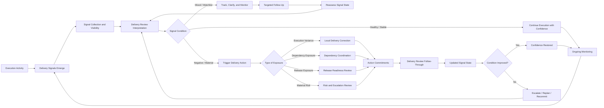
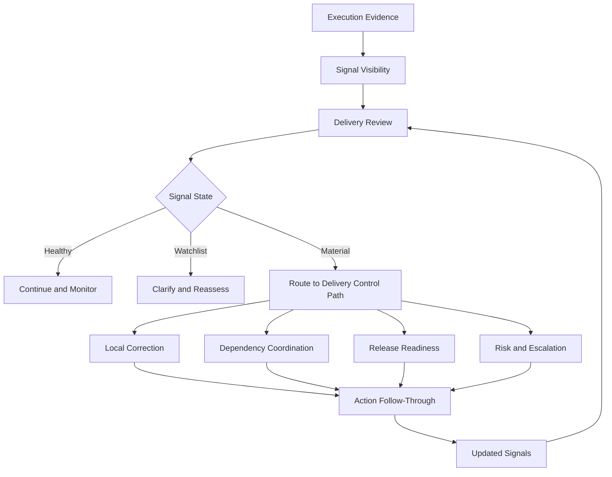

# Delivery Signal Flow Diagram

The **Delivery Signal Flow Diagram** defines the canonical signal flow through which the **Product Delivery System** converts execution activity into observable delivery signals, interprets those signals through structured review, and translates them into managed delivery action within the **Product Leadership Operating System (PLOS)**.

Where the **Unified Product Delivery System** defines the overall structure of delivery execution, the **Metrics and Signals** artifact defines the signal categories and signal intent, the **Delivery Review Model** defines the recurring review mechanism through which execution health is assessed, and the **Delivery Risk and Escalation Model** defines how delivery threats are governed when signals indicate material exposure, this artifact provides the end-to-end diagram that shows how delivery signals move through the operating system in practice.

It explains how execution evidence becomes visibility, how visibility becomes interpretation, and how interpretation becomes intervention, adjustment, escalation, or confidence reinforcement rather than remaining fragmented, passive, or purely informational.

---

## Purpose

The purpose of this artifact is to define the canonical **Delivery Signal Flow Diagram** for the **Product Delivery System**.

This diagram exists to show how delivery signals should move through the system so that execution conditions are:

- made visible through structured signal generation
- interpreted through recurring delivery review rather than isolated observation
- connected to risk identification, dependency coordination, and release readiness where needed
- translated into decisions, interventions, and follow-through actions rather than passive reporting
- captured as part of the normal delivery control loop rather than treated as disconnected status data

Within the **Product Leadership Operating System**, delivery signals are not an end in themselves. They are an operating mechanism used to determine whether delivery is stable, whether confidence is rising or degrading, whether risk is emerging, and whether intervention is required to preserve execution integrity.

This artifact establishes the signal-flow logic required to support the broader operating loop:

**Strategy → Governance → Delivery → Outcomes → Learning → Strategy**

---

## Diagram

---

## Diagram Interpretation

The **Delivery Signal Flow Diagram** begins with execution activity itself. Work being delivered produces observable evidence through delivery progress, milestone movement, dependency behavior, quality patterns, execution stability, decision velocity, release posture, and other operational signals. These signals do not need to be invented after the fact. They emerge naturally from the normal functioning of the **Product Delivery System** when the system is instrumented and reviewed properly.

The first control point in the diagram is the movement from raw execution activity into **signal collection and visibility**. This step matters because execution evidence only becomes operationally useful when it is made visible in structured form. Signals that remain buried inside local tools, disconnected status notes, or isolated team judgment cannot support disciplined delivery control.

Once visible, signals move into **Delivery Review interpretation**. This is a critical architectural feature of the diagram. Signals are not meant to operate as self-executing controls. They require interpretation inside the recurring review mechanism of the delivery system so that leadership and teams can determine whether current conditions indicate stable execution, emerging concern, or material exposure.

The model then separates signal conditions into three broad states:

- **healthy or stable**, where current evidence supports continued execution confidence
- **mixed or watchlist**, where signal movement requires closer monitoring, clarification, or targeted follow-up
- **negative or material**, where current signal patterns indicate the need for intervention or control action

This prevents delivery signals from collapsing into a simplistic green/red reporting pattern. Some signals confirm that execution remains on track. Some indicate ambiguity or emerging instability. Others indicate meaningful delivery risk that requires direct action.

When signal conditions are mixed, the correct response is not immediate escalation. Instead, the diagram routes those conditions into **targeted follow-up** and reassessment. This preserves proportionality and prevents overreaction while still ensuring that signal ambiguity does not disappear into passive observation.

When signal conditions are materially negative, the signal flow moves into **type-of-exposure routing**. This is the point at which the delivery system determines what kind of operating response is required. Some signals point to local execution variance that can be corrected within the delivery team. Others indicate dependency issues, release threats, or broader delivery risks that require different control mechanisms. This routing is essential because not all delivery problems should be handled through the same path.

From there, the flow connects signals to action through four canonical response paths:

- local delivery correction
- dependency coordination
- release readiness review
- risk and escalation review

These paths preserve the internal coherence of Pillar 4 by ensuring that signals activate the correct existing delivery control artifact rather than creating a parallel intervention structure.

All of these paths produce **action commitments**, which are then carried into **delivery review follow-through**. This means signal interpretation is not the end of the control loop. The system must also confirm whether agreed interventions actually changed execution conditions.

The diagram then closes the loop through **updated signal state** and a reassessment of whether conditions improved. If signal conditions improve, confidence is restored and execution continues under ongoing monitoring. If conditions do not improve, the system moves toward escalation, replanning, or recommitment, after which signal interpretation resumes.

In this way, the diagram shows that the **Product Delivery System** is not simply collecting delivery data. It is using signals as an operating mechanism to maintain execution control, direct intervention, restore confidence, and strengthen disciplined delivery governance.

---

## Operating Logic

### Signal Origination

Delivery signals originate from execution itself. They are not separate from delivery activity, and they are not meant to be manufactured through reporting rituals alone.

Canonical signal sources include:

- milestone progression and slippage
- plan variance
- work carryover patterns
- dependency performance
- defect and quality trends
- execution throughput and flow
- decision latency
- capacity stress
- release-readiness indicators
- delivery confidence movement

The point of signal origination is to ensure that the delivery system remains anchored in operational evidence rather than narrative preference.

### Signal Collection and Visibility

Signals must be collected and made visible in a form that supports structured review.

This means signals should be:

- observable
- comparable over time
- interpretable in delivery context
- connected to current commitments and execution conditions
- visible enough to support review, not just local team awareness

This model does not prescribe a single tooling implementation. It prescribes the operating requirement that delivery signals become reviewable evidence rather than remaining fragmented across disconnected sources.

### Signal Interpretation

Signals become useful only when interpreted in context.

Interpretation occurs through the **Delivery Review Model**, where delivery teams and leadership evaluate whether signal patterns indicate:

- normal execution stability
- localized variance that should be watched
- emerging instability that requires action
- material exposure that threatens delivery confidence, release integrity, or committed work

Signal interpretation is therefore a judgment process supported by evidence, not a purely automated status mechanism.

### Signal States

The canonical signal states in this diagram are:

- **healthy / stable**
- **mixed / watchlist**
- **negative / material**

These states are intended to provide sufficient control resolution without overcomplicating the model.

A healthy signal state indicates that execution conditions are within acceptable bounds and that current commitments remain credible.

A mixed or watchlist state indicates that some evidence suggests possible degradation, ambiguity, or early instability, but not yet at a level that justifies material intervention.

A negative or material state indicates that signal conditions now justify explicit corrective action, deeper review, or escalation through the appropriate delivery control path.

### Response Routing

When material exposure is present, the system must determine what kind of issue the signals represent.

The canonical routing options are:

- **local delivery correction** when the issue is contained within the team’s delivery control
- **dependency coordination** when the issue crosses delivery interfaces or relies on external commitments
- **release readiness review** when signals indicate the transition from delivery into release may be compromised
- **risk and escalation review** when the exposure materially threatens commitments, confidence, or execution stability beyond normal delivery control

This routing structure prevents the delivery system from treating every problem as either a local issue or an escalation. It allows the response to match the nature of the exposure.

### Action Commitment and Follow-Through

Signals are useful only when they produce follow-through.

Every material response path should generate:

- explicit actions
- named owners
- expected timing
- revalidation points
- criteria for determining whether intervention succeeded

These action commitments then return into the recurring delivery review process so that signal movement can be reassessed against the intended corrective actions.

### Confidence Restoration or Escalation

The model assumes that interventions should change future signal conditions.

If updated signals indicate that execution conditions improved, delivery confidence can be restored and normal execution continues under ongoing monitoring.

If signals do not improve, the system should not remain in passive observation. It should move toward:

- escalation
- replanning
- recommitment
- broader delivery or governance intervention

This ensures that delivery signal flow remains tied to actual control action rather than repeated observation without consequence.

### Relationship to the Five-System Architecture

Within the canonical five-system architecture:

- the **Strategy Execution System** establishes the commitments against which delivery signal credibility is interpreted
- the **Portfolio Governance System** receives issues when signal deterioration reveals tradeoffs, commitment risk, or intervention needs beyond delivery authority
- the **Product Delivery System** owns signal interpretation, delivery action routing, follow-through, and confidence management
- the **Customer Outcomes System** ultimately reflects whether stable or unstable delivery conditions affect realized value
- the **Decision Intelligence System** supports delivery signal visibility, evidence quality, and pattern detection, but it does not control delivery interpretation or action decisions

This preserves the architectural principle that **Decision Intelligence supports — it does not control**.

---

## Supporting Diagram

---

## Why This Diagram Matters

Delivery systems often collect more data than they can meaningfully use. Without a clear signal flow model, execution evidence becomes fragmented across dashboards, status updates, team tools, and meeting narratives without producing coherent operating control.

Without a defined **Delivery Signal Flow Diagram**:

- delivery signals remain informational rather than actionable
- teams observe variance without converting it into intervention
- weak signals are ignored until they become material issues
- negative signals trigger inconsistent responses
- different types of exposure are routed through the wrong control paths
- delivery reviews become descriptive rather than decision-oriented
- leadership visibility increases without improving delivery control

The **Delivery Signal Flow Diagram** matters because it converts signal visibility into operating discipline.

It ensures that delivery signals do not stop at reporting. Instead, they move through a governed flow that:

- makes execution conditions visible
- interprets them in recurring review
- routes them to the correct delivery control mechanism
- produces action commitments
- confirms whether interventions changed the condition

This diagram therefore protects the **Product Delivery System** from both underreaction and overreaction. It helps teams avoid ignoring meaningful deterioration while also avoiding premature escalation when closer monitoring or local correction is sufficient.

A strong delivery system does not merely display signals. It knows what signal movement means, what response path it should trigger, and how to determine whether action restored delivery confidence.

---

## How To Use This Diagram

Use this artifact as the canonical diagram for how delivery signals should flow through the **Product Delivery System**.

It should be used when:

- explaining how delivery evidence becomes action
- designing delivery review workflows
- aligning signal interpretation with response mechanisms
- clarifying how watchlist conditions differ from material exposure
- connecting metrics and signals to risk, dependency, and release controls
- building supporting dashboards, review templates, or intervention workflows

This diagram should guide the design of supporting delivery artifacts such as:

- delivery signal dashboards
- delivery review templates
- watchlist tracking structures
- intervention follow-through mechanisms
- escalation triggers
- readiness monitoring structures

Supporting artifacts may operationalize the signal flow in more detail, but they must not redefine the canonical control path shown here.

This artifact is most effective when used together with related **Pillar 4** artifacts, especially those governing:

- metrics and signals
- delivery reviews
- dependency coordination
- delivery risk and escalation
- release readiness

In practice, this diagram should be used to ensure that delivery signal management remains a governed operating mechanism rather than a passive reporting exercise.

---

## Relationship to the Broader Product Leadership Operating System

This artifact belongs to **Pillar 4 — Product Delivery System** within the **Product Leadership Operating System (PLOS)**.

It supports the canonical operating loop:

**Strategy → Governance → Delivery → Outcomes → Learning → Strategy**

Its primary role is to show how the **Product Delivery System** transforms execution evidence into delivery signal visibility, structured interpretation, and governed response.

Its architectural relationship to the broader operating system is as follows:

- it strengthens execution control within **Delivery**
- it provides a mechanism for converting evidence into intervention before delivery degradation becomes failure
- it connects signal deterioration to **Governance** only when delivery conditions exceed normal delivery authority
- it helps preserve the delivery conditions required to support successful **Outcomes**
- it generates learning about signal quality, control timing, and intervention effectiveness that can strengthen future delivery practice

Within the canonical five-system architecture:

- the **Strategy Execution System** establishes the commitments against which delivery health is interpreted
- the **Portfolio Governance System** receives escalated issues when signal deterioration creates tradeoff conditions or commitment risk beyond delivery authority
- the **Product Delivery System** owns signal flow, review interpretation, action routing, and follow-through
- the **Customer Outcomes System** reflects whether delivery conditions sustain or disrupt expected value realization
- the **Decision Intelligence System** supports signal evidence and visibility, but it does not control the operating response

This artifact does not introduce a new system, alter the operating loop, or redefine adjacent control models. It exists to clarify how signals move through the established delivery architecture.

---

## Summary

The **Delivery Signal Flow Diagram** defines the canonical signal flow through which the **Product Delivery System** converts execution evidence into visibility, interpretation, intervention, and updated delivery confidence.

It shows that delivery signals must:

- originate from execution reality
- become visible in structured form
- be interpreted through delivery review
- route into the correct delivery control path
- produce follow-through actions
- be reassessed based on updated conditions

This diagram reinforces the principle that signals are not passive indicators. They are part of the operating control structure through which delivery organizations detect instability, direct intervention, preserve confidence, and strengthen execution discipline.

Within the **Product Leadership Operating System**, this artifact serves as a foundational diagram for explaining how delivery evidence becomes governed action inside the **Product Delivery System**.

---

## License

This project is licensed under the MIT License. See the [LICENSE](LICENSE) file for details.
