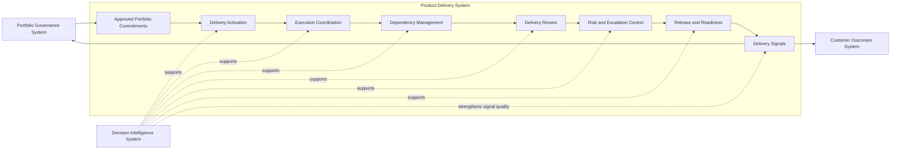
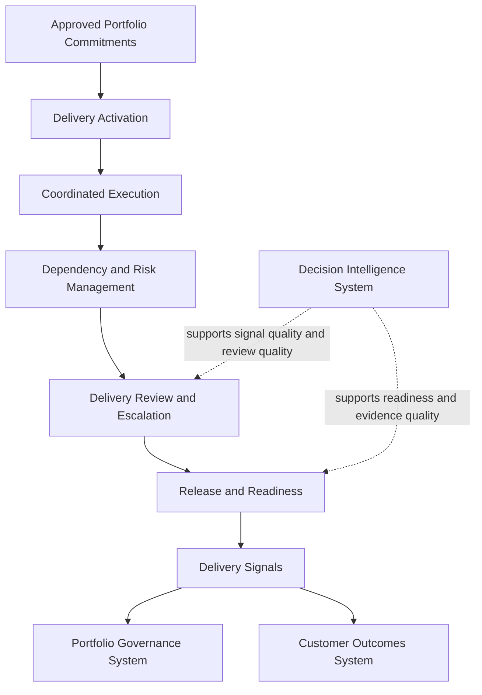

# Product Delivery System Diagram

The **Product Delivery System Diagram** defines the canonical system-level visual representation of the **Product Delivery System** within the **Product Leadership Operating System (PLOS)**.

Where the **Unified Product Delivery System** defines the canonical delivery architecture in prose, this artifact provides the primary diagram that shows the major delivery-system components, their relationships, and the position of the delivery system between governance and outcomes.

It explains how delivery operates as a coherent system of activation, coordination, dependency management, review, escalation, readiness, and signal generation rather than as disconnected execution activity.

---

# Purpose

The purpose of this artifact is to provide the canonical visual model for the **Product Delivery System**.

It is intended to make the delivery architecture easier to understand, reference, explain, and reuse across the repository while preserving alignment with the governing source artifact.

This diagram should help readers see:

- where the delivery system sits in the broader operating system
- what internal components make up the delivery system
- how approved portfolio commitments become coordinated execution
- how delivery signals connect to governance, outcomes, and decision intelligence
- how delivery remains distinct from both portfolio governance and customer outcomes

This artifact is a visual companion to the canonical source architecture. It clarifies the model, but it does not replace it.

---

# Diagram

---

# Diagram Interpretation

The diagram shows the **Product Delivery System** as the canonical execution system that sits between approved portfolio commitments and realized outcomes.

It begins with approved portfolio commitments entering from the **Portfolio Governance System**, moves through the core internal delivery components, and generates delivery signals that feed both downstream and upstream operating-system activity.

## Portfolio Governance System

The delivery system starts downstream of the **Portfolio Governance System**.

This makes clear that delivery does not own strategic prioritization, funding decisions, or portfolio approval. Those decisions are made in governance and then translated into delivery execution once approved.

## Approved Portfolio Commitments

Approved portfolio commitments represent work that has already passed through governance and is ready to enter the delivery system.

This creates a clean architectural boundary between deciding what should be done and coordinating how it will be executed.

## Delivery Activation

Delivery activation is the entry point into the execution system.

It converts approved commitments into active execution motion by establishing scope, accountable teams, execution structures, and readiness for coordinated delivery.

## Execution Coordination

Execution coordination is the core system activity through which delivery work is managed across teams, timelines, and interfaces.

It ensures execution is organized at the system level rather than left entirely to local team process.

## Dependency Management

Dependency management governs the coordination of cross-team, cross-platform, cross-capability, and cross-release dependencies.

This ensures the delivery system can manage the realities of multi-team execution without fragmenting into isolated local plans.

## Delivery Review

Delivery review provides the recurring leadership and operating mechanism through which progress, variance, blockers, and readiness are assessed.

It makes delivery visible and reviewable as an operating system rather than as informal status reporting.

## Risk and Escalation Control

Risk and escalation control governs how material delivery issues are surfaced, routed, and resolved.

This ensures that execution risk is managed explicitly before it becomes a broader governance or outcome problem.

## Release and Readiness

Release and readiness define the point at which coordinated work becomes ready for deployment, launch, adoption, or operational use.

This prevents delivery completion from being reduced to work movement alone.

## Delivery Signals

Delivery signals are the execution outputs that inform the rest of the operating system.

These signals include progress, readiness, dependency, risk, and variance information. They support governance, outcomes evaluation, and learning, but they do not replace customer outcomes themselves.

## Customer Outcomes System

The **Customer Outcomes System** sits downstream from the delivery system.

This preserves the distinction between delivering capability and determining whether that capability produced meaningful customer or business impact.

## Decision Intelligence System

The **Decision Intelligence System** supports the delivery system across activation, coordination, review, escalation, readiness, and signal quality.

It strengthens the quality of delivery evidence and decisions, but it does not replace delivery ownership.

---

# Operating Logic

The operating logic of the diagram is straightforward:

1. the **Portfolio Governance System** approves work as portfolio commitments
2. the **Product Delivery System** activates and coordinates that work for execution
3. delivery components manage dependencies, reviews, risks, and readiness
4. the system generates delivery signals that inform outcomes, governance, and learning
5. the **Decision Intelligence System** strengthens the quality of execution decisions across the flow

This operating logic preserves several architectural boundaries.

## Governance remains upstream

The diagram does not allow delivery to redefine portfolio priorities or funding decisions.

## Delivery remains a system

The diagram treats delivery as an integrated operating system with defined internal components, not as a loose collection of team activities.

## Outcomes remain downstream

The diagram does not confuse execution progress with customer value realization.

## Decision Intelligence remains supportive

The diagram shows decision intelligence as strengthening delivery quality without turning it into a substitute authority.

Taken together, the diagram reinforces that the **Product Delivery System** is the structured system through which approved portfolio commitments become coordinated organizational execution.

---

# Supporting Diagram

---

# Why This Matters

Many organizations attempt to improve delivery by optimizing local team process while leaving the broader delivery system undefined.

As a result, approved portfolio commitments often enter execution without clear coordination structures, dependency control, escalation mechanisms, or readiness discipline.

This diagram matters because it gives the **Product Delivery System** a canonical visual structure.

It helps make clear that delivery is:

- not just sprint activity
- not just project administration
- not just status reporting
- not just release motion
- but a system-level capability that converts approved portfolio commitments into coordinated organizational execution

Without a system view, delivery becomes fragmented, opaque, and difficult to govern.

---

# How To Use This

Use this artifact as the canonical visual reference for the **Product Delivery System**.

It should be used to:

- orient readers to the structure of Pillar 4
- validate whether supporting diagrams align to the canonical model
- explain the boundary between governance, delivery, and outcomes
- support the creation of delivery review, dependency, escalation, and readiness artifacts
- maintain consistent terminology across frameworks, diagrams, and playbooks

This diagram should remain aligned to the **Unified Product Delivery System** artifact. If a later visual or supporting model conflicts with the canonical source architecture, the canonical source architecture takes precedence.

---

# Relationship to the Operating System

The **Product Delivery System** is one of the five canonical systems within the **Product Leadership Systems Architecture (PLSA)** and one of the eight pillars of the broader **Product Leadership Operating System (PLOS)** portfolio.

The canonical five-system architecture is:

- **Strategy Execution System**
- **Portfolio Governance System**
- **Product Delivery System**
- **Customer Outcomes System**
- **Decision Intelligence System**

Within the operating loop:

**Strategy → Governance → Delivery → Outcomes → Learning → Strategy**

the **Product Delivery System** is the system responsible for translating approved portfolio commitments into coordinated execution.

This diagram reinforces that relationship by showing:

- governance as the upstream source of approved commitments
- delivery as the execution system
- outcomes as the downstream evaluation system
- decision intelligence as a supporting system across the flow

This keeps Pillar 4 aligned to the broader operating system without redefining the canonical architecture.

---

# Summary

The **Product Delivery System Diagram** provides the canonical visual representation of how the **Product Delivery System** operates within the **Product Leadership Operating System**.

It shows that delivery is a structured system composed of:

- delivery activation
- execution coordination
- dependency management
- delivery review
- risk and escalation control
- release and readiness
- delivery signal generation

It also shows how delivery connects upstream to governance, downstream to outcomes, and laterally to decision intelligence support.

This artifact should serve as the primary reusable diagram for Pillar 4 and should remain aligned to the governing source architecture.

---

# License

This repository is intended as a professional architecture and operating model portfolio artifact.

Unless otherwise noted, the materials in this repository are shared for professional reference and discussion.
