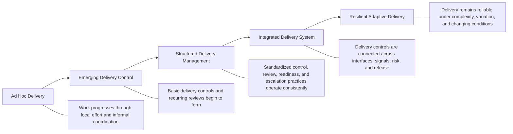
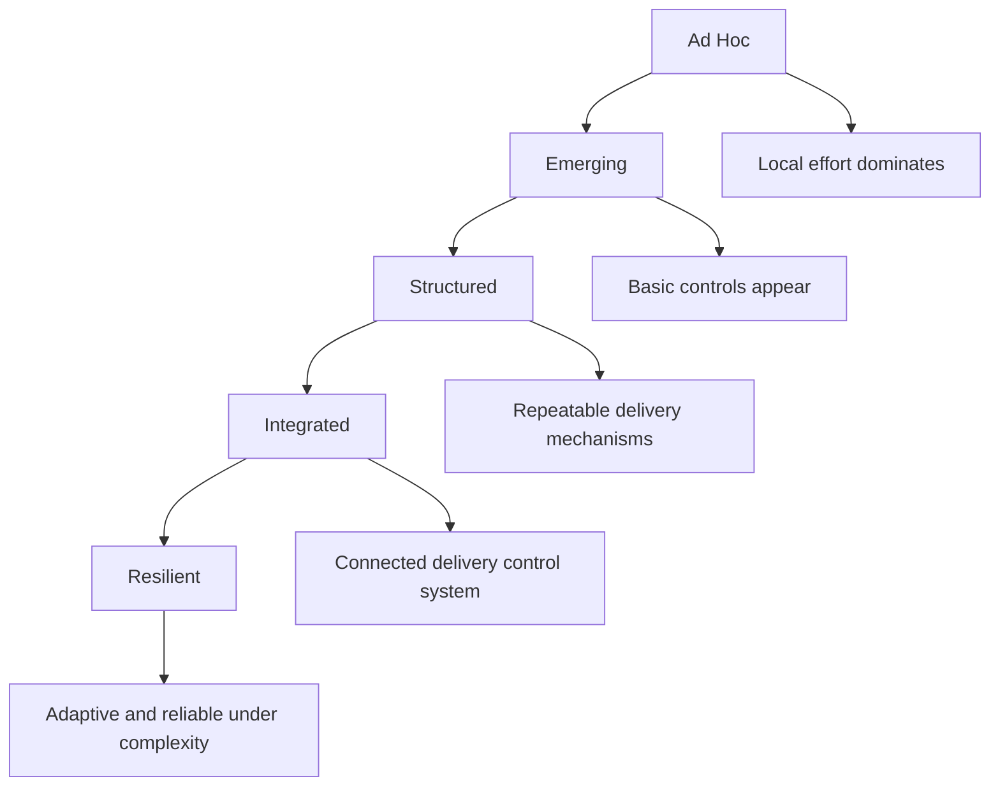

# Delivery System Maturity Model

The **Delivery System Maturity Model** defines the canonical maturity progression through which the **Product Delivery System** evolves from fragmented execution activity into disciplined, coordinated, signal-driven, and resilient delivery performance within the **Product Leadership Operating System (PLOS)**.

Where the **Unified Product Delivery System** defines the canonical structure of delivery, the **Delivery Review Model** defines the recurring review mechanism through which execution health is assessed, the **Delivery Risk and Escalation Model** governs the treatment of delivery risk, the **Release Readiness Model** governs the transition from delivery into release, and the **Delivery Signal Flow Diagram** shows how execution evidence becomes managed action, this artifact defines the maturity path through which those delivery capabilities become increasingly integrated, reliable, and scalable over time.

It explains how delivery maturity should be understood not as the accumulation of process for its own sake, but as the progressive strengthening of execution control, coordination quality, review discipline, signal interpretation, release confidence, and adaptive delivery capability.

---

## Purpose

The purpose of this artifact is to define the canonical **Delivery System Maturity Model** for the **Product Delivery System**.

This model exists to ensure that delivery maturity is:

- evaluated as a system capability rather than as isolated team performance
- understood as progressive improvement in execution control rather than simple process volume
- tied to delivery reliability, coordination quality, risk discipline, and release confidence
- grounded in operating evidence rather than maturity rhetoric
- usable as a diagnostic and improvement framework for strengthening the **Product Delivery System**

Within the **Product Leadership Operating System**, delivery maturity is not defined by how many ceremonies, tools, templates, or governance layers exist. It is defined by how effectively the delivery system turns commitments into coordinated execution, interprets signals, manages risk, governs readiness, and improves under changing conditions.

This artifact establishes the maturity logic required to support the broader operating loop:

**Strategy → Governance → Delivery → Outcomes → Learning → Strategy**

---

## Diagram

---

## Diagram Interpretation

The **Delivery System Maturity Model** defines a five-stage progression through which delivery capability becomes increasingly reliable, coordinated, visible, and governable.

The model begins with **Ad Hoc Delivery**, where execution depends primarily on individual effort, local heroics, and informal coordination rather than on a coherent delivery system. At this stage, delivery may still succeed, but success is inconsistent and difficult to scale because execution control is weak and signal interpretation is limited.

From there, the model moves into **Emerging Delivery Control**, where teams begin introducing recurring reviews, clearer commitments, basic escalation paths, and more visible execution tracking. Delivery is still uneven, but the organization is beginning to replace reactive management with structured control.

The third stage, **Structured Delivery Management**, marks the point at which delivery practices become repeatable and intentionally designed. Reviews are recurring, signals are more interpretable, release readiness is more explicit, risk is managed with clearer thresholds, and dependency coordination becomes more formal rather than improvised.

The fourth stage, **Integrated Delivery System**, represents a more advanced delivery condition in which the core delivery mechanisms no longer operate as disconnected controls. Reviews, signals, dependencies, risks, escalation paths, and release decisions begin to function as parts of a coherent system. This materially improves delivery predictability, intervention quality, and confidence in execution.

The fifth stage, **Resilient Adaptive Delivery**, reflects a delivery system that not only operates with discipline, but continues to perform reliably under scale, complexity, uncertainty, and change. At this stage, the organization is capable of interpreting signal movement early, adjusting execution conditions quickly, preserving release integrity under pressure, and using learning to improve delivery controls over time.

The purpose of the progression is not to imply that all teams move uniformly or that maturity is permanent once achieved. Rather, the model shows the dominant operating condition of the **Product Delivery System** and helps identify what kinds of improvements are required to strengthen delivery as a system.

In this way, the diagram shows that delivery maturity is not a measure of procedural density. It is a measure of whether the delivery system can convert commitments into reliable, coordinated, reviewable, risk-aware, and release-ready execution.

---

## Operating Logic

### Maturity Principle

The maturity model evaluates the **Product Delivery System** as an operating system capability, not as a collection of isolated delivery practices.

This means maturity should be assessed through system characteristics such as:

- execution clarity
- coordination reliability
- review discipline
- signal visibility and interpretation
- dependency management
- risk identification and escalation
- release readiness control
- learning-based improvement

A delivery organization is not mature because it has more process. It is mature when its delivery system can maintain execution confidence with increasing consistency, transparency, and control.

### Stage 1 — Ad Hoc Delivery

At the **Ad Hoc Delivery** stage, work is delivered primarily through local effort, experience, and interpersonal coordination.

Typical characteristics include:

- commitments are loosely defined or frequently reinterpreted
- execution visibility is inconsistent
- delivery reviews are informal or absent
- risks are noticed late and managed reactively
- dependencies are handled through personal follow-up rather than structured coordination
- release decisions are often deadline-driven or confidence-based rather than readiness-based
- delivery success depends heavily on specific individuals

At this stage, delivery may appear fast in isolated cases, but the system is fragile. Variability is high, predictability is low, and issues are often detected only after impact is already visible.

### Stage 2 — Emerging Delivery Control

At the **Emerging Delivery Control** stage, basic delivery controls begin to take shape.

Typical characteristics include:

- recurring delivery reviews begin to form
- delivery status becomes more visible
- basic milestones and commitments are tracked
- teams begin surfacing risks earlier
- some escalation behavior exists, though inconsistently
- dependencies are recognized more explicitly
- release readiness starts to become a visible discussion topic

At this stage, the organization is moving away from pure reactivity, but controls are still uneven. Different teams may operate with different standards, and delivery performance may still depend too heavily on local discipline rather than system design.

### Stage 3 — Structured Delivery Management

At the **Structured Delivery Management** stage, delivery controls become intentional, repeatable, and more consistently applied.

Typical characteristics include:

- recurring delivery reviews operate with defined expectations
- delivery signals are interpreted through structured review
- risk identification and escalation follow clearer thresholds
- dependency coordination is more formalized
- release readiness is assessed against defined criteria
- action follow-through is tracked more reliably
- execution variance is more likely to trigger timely intervention

At this stage, delivery performance becomes more predictable because the organization has moved beyond isolated good practice and into repeatable system behavior.

### Stage 4 — Integrated Delivery System

At the **Integrated Delivery System** stage, the major delivery controls begin operating as a coherent system rather than as adjacent practices.

Typical characteristics include:

- delivery reviews, signals, risks, readiness, and dependencies reinforce one another
- signal deterioration routes into the appropriate control mechanism
- cross-functional delivery coordination becomes more reliable
- escalation thresholds are clearer and more consistently applied
- release readiness is connected to actual delivery condition rather than calendar timing
- corrective actions are reviewed for actual condition change, not just completion
- confidence in delivery is based more on system evidence than narrative status

At this stage, delivery becomes materially more scalable because execution control is increasingly systemic rather than localized.

### Stage 5 — Resilient Adaptive Delivery

At the **Resilient Adaptive Delivery** stage, the delivery system operates reliably under changing conditions and improves itself through disciplined learning.

Typical characteristics include:

- early signal movement is detected and acted on before instability becomes material
- execution remains coherent across multiple teams, interfaces, and release paths
- risk management is timely, proportional, and integrated into normal delivery control
- release readiness decisions remain governed even under schedule pressure
- the system can absorb change without collapsing into reactive management
- learning from reviews, risks, releases, and signal patterns strengthens future controls
- delivery confidence is resilient because it is supported by strong operating mechanisms

This stage does not imply perfection. It implies that the **Product Delivery System** can preserve execution integrity while adapting under real operating stress.

### Maturity Dimensions

The maturity model should be assessed across a common set of dimensions.

Canonical dimensions include:

- **execution clarity** — whether work, commitments, and progress are sufficiently defined
- **review discipline** — whether recurring delivery review operates as a true control mechanism
- **signal quality** — whether execution evidence becomes interpretable and actionable
- **coordination reliability** — whether dependencies and interfaces are managed coherently
- **risk discipline** — whether risk is surfaced, assessed, and escalated appropriately
- **readiness control** — whether release decisions are governed through readiness conditions
- **follow-through strength** — whether actions change future delivery conditions
- **adaptive learning** — whether the system improves based on evidence from operation

These dimensions help prevent maturity from being judged only through delivery velocity, ceremony count, or tool sophistication.

### Improvement Logic

The maturity model is intended to guide improvement, not merely describe current state.

Improvement logic should follow these principles:

- strengthen system controls before adding complexity
- improve consistency before optimizing for speed
- connect adjacent delivery mechanisms before inventing new ones
- reduce dependence on heroic effort
- improve evidence quality before expanding governance intensity
- use recurring review, risk, and readiness controls to strengthen delivery coherence

This preserves the principle that maturity is built through better system behavior, not through procedural inflation.

### Relationship to the Five-System Architecture

Within the canonical five-system architecture:

- the **Strategy Execution System** establishes the commitments whose credibility depends on delivery maturity
- the **Portfolio Governance System** receives issues when delivery immaturity creates tradeoff, sequencing, or investment risk beyond delivery authority
- the **Product Delivery System** owns the execution controls, coordination disciplines, risk mechanisms, and readiness practices that maturity strengthens over time
- the **Customer Outcomes System** reflects whether delivery maturity supports reliable realization of intended value
- the **Decision Intelligence System** supports maturity through better evidence, signal quality, and visibility, but it does not define delivery maturity on its own

This preserves the architectural principle that **Decision Intelligence supports — it does not control**.

---

## Supporting Diagram

---

## Why This Matters

Delivery organizations often confuse maturity with process accumulation. That confusion leads to one of two failure modes: either teams remain under-controlled and overly dependent on local heroics, or they add layers of activity that create overhead without improving execution reliability.

Without a defined **Delivery System Maturity Model**:

- delivery capability is judged subjectively
- improvement efforts focus on tools or ceremonies rather than system weaknesses
- teams confuse isolated strong performance with systemic maturity
- recurring delivery problems are treated as local exceptions rather than symptoms of immature delivery control
- leaders cannot clearly diagnose where delivery capability is breaking down
- investments in delivery improvement become fragmented and low-leverage

The **Delivery System Maturity Model** matters because it creates a common framework for understanding how the **Product Delivery System** becomes more reliable over time.

It helps organizations distinguish between:

- activity and control
- visibility and interpretation
- coordination and dependency management
- escalation and disciplined risk governance
- shipping work and governing release readiness
- isolated competence and systemic maturity

This model therefore protects delivery improvement efforts from becoming abstract maturity rhetoric or generic agile theater. It keeps the focus on whether the delivery system can reliably convert commitments into coordinated, risk-aware, release-ready execution.

---

## How To Use This

Use this artifact as the canonical framework for assessing and improving the maturity of the **Product Delivery System**.

It should be used when:

- evaluating current delivery-system condition
- diagnosing where delivery capability is fragile or inconsistent
- identifying the next most important delivery-system improvements
- distinguishing local team performance issues from systemic delivery immaturity
- aligning leaders on what stronger delivery control should look like
- designing capability-improvement roadmaps for **Pillar 4**

This artifact should guide the assessment of related delivery capabilities, including:

- delivery reviews
- signal interpretation
- dependency coordination
- delivery risk and escalation
- release readiness
- follow-through discipline

Supporting artifacts may operationalize maturity assessment through scorecards, rubrics, or diagnostic prompts, but they must not redefine the canonical maturity progression established here.

This artifact is most effective when used together with related **Pillar 4** artifacts that define the target operating mechanisms of a mature delivery system.

In practice, this model should be used to improve delivery as a connected system rather than optimizing isolated practices in isolation.

---

## Relationship to the Operating System

This artifact belongs to **Pillar 4 — Product Delivery System** within the **Product Leadership Operating System (PLOS)**.

It supports the canonical operating loop:

**Strategy → Governance → Delivery → Outcomes → Learning → Strategy**

Its primary role is to define how the maturity of the **Product Delivery System** should be understood, assessed, and strengthened over time.

Its architectural relationship to the broader operating system is as follows:

- it strengthens the quality and reliability of execution within **Delivery**
- it clarifies how delivery capability affects whether **Governance** receives stable commitments or recurring delivery volatility
- it helps preserve the delivery conditions required to support successful **Outcomes**
- it generates learning about delivery-system weaknesses and improvement priorities that can strengthen future execution

Within the canonical five-system architecture:

- the **Strategy Execution System** depends on sufficient delivery maturity to convert commitments into credible execution
- the **Portfolio Governance System** is affected when delivery immaturity creates recurring instability, sequencing disruption, or commitment risk
- the **Product Delivery System** is the system whose internal control maturity this artifact describes
- the **Customer Outcomes System** reflects whether stronger delivery maturity improves the consistency of value realization
- the **Decision Intelligence System** supports maturity assessment with evidence and visibility, but it does not determine maturity independently

This artifact does not introduce a new system, alter the operating loop, or redefine the adjacent control models. It exists to define the maturity path of the existing **Product Delivery System**.

---

## Summary

The **Delivery System Maturity Model** defines the canonical maturity progression through which the **Product Delivery System** evolves from fragmented, reactive execution into disciplined, integrated, and resilient delivery performance.

It shows that delivery maturity depends on the strengthening of:

- execution clarity
- review discipline
- signal interpretation
- coordination reliability
- risk management
- release readiness
- follow-through
- adaptive learning

This model reinforces the principle that maturity is not measured by process volume. It is measured by whether the delivery system can reliably convert commitments into coordinated execution, interpret operating conditions, intervene appropriately, and improve over time.

Within the **Product Leadership Operating System**, this artifact serves as the canonical framework for understanding how **Pillar 4** delivery capability progresses from basic control to resilient operating discipline.

---

## License

This project is licensed under the MIT License. See the [LICENSE](LICENSE) file for details.
