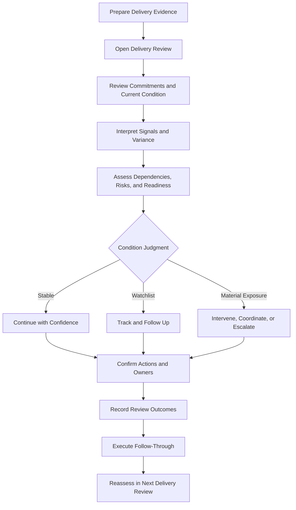
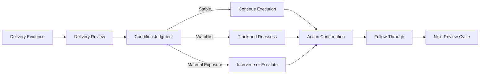

# Delivery Review Playbook

The **Delivery Review Playbook** defines the practical operating guidance through which leaders, delivery teams, and cross-functional partners conduct recurring **Delivery Reviews** within the **Product Delivery System** of the **Product Leadership Operating System (PLOS)**.

Where the **Delivery Review Model** defines the canonical review structure, purpose, and operating logic, this playbook defines how that review should be prepared, run, interpreted, and followed through in practice. It translates the governing review model into repeatable operating behavior so that delivery reviews function as control mechanisms rather than status meetings.

It explains how organizations should use recurring delivery review to assess execution health, surface meaningful delivery signals, evaluate dependencies, identify risks, determine required interventions, and maintain delivery confidence through disciplined review and action follow-through.

---

## Purpose

The purpose of this artifact is to define the canonical **Delivery Review Playbook** for the **Product Delivery System**.

This playbook exists to ensure that delivery reviews are:

- prepared with evidence rather than opinion
- run with consistent structure rather than improvised discussion
- focused on execution condition rather than narrative status
- capable of surfacing risk, dependency exposure, readiness concerns, and signal deterioration
- translated into owned follow-through actions rather than unresolved observations
- operated as recurring delivery controls rather than reporting rituals

Within the **Product Leadership Operating System**, a delivery review is not a ceremonial checkpoint. It is a working control forum used to interpret the current condition of delivery and decide whether execution should continue unchanged, be corrected locally, be coordinated across boundaries, or be escalated through the appropriate control path.

This artifact establishes the practical operating guidance required to support the broader operating loop:

**Strategy → Governance → Delivery → Outcomes → Learning → Strategy**

---

## Diagram

---

## Diagram Interpretation

The **Delivery Review Playbook** begins before the review itself. The first requirement is preparation of relevant delivery evidence so that the review can operate on actual execution condition rather than on memory, opinion, or presentation quality.

Once the review begins, the first task is to anchor the discussion around current commitments, current execution condition, and the state of the work in motion. This keeps the forum connected to the actual delivery responsibilities of the team rather than drifting into broad project narration.

From there, the review interprets delivery signals and execution variance. This includes looking at progress movement, slippage, confidence changes, blockers, dependency behavior, quality concerns, and emerging execution instability. The intent is not merely to observe change, but to judge what that change means for delivery health.

The review then expands into assessment of dependencies, risks, and release-related readiness where relevant. This ensures that delivery condition is assessed as a system-level operating state rather than as a narrow view of internal team progress alone.

The central control point in the playbook is the **condition judgment**. At the end of the review, the team and review owners should be able to determine whether delivery is:

- stable enough to continue with confidence
- showing watchlist conditions that require closer follow-up
- facing material exposure that requires intervention, cross-functional coordination, or escalation

From there, the review produces explicit actions, owners, and follow-through expectations. The review is not complete when discussion ends. It is complete only when the operating consequences of the review have been made explicit and can be re-evaluated in the next cycle.

In this way, the playbook ensures that **Delivery Reviews** operate as recurring execution controls inside the **Product Delivery System** rather than as informational meetings.

---

## Operating Logic

### 1. Review Objective

The objective of a delivery review is to determine the current condition of delivery and decide what operating response is required.

This means the review should answer questions such as:

- are commitments still credible
- is execution stable or degrading
- what signals matter most right now
- what risks or dependencies require attention
- is confidence rising, holding, or deteriorating
- what action is required before the next review cycle

The review is not primarily for broadcasting progress. It is for interpreting condition and directing response.

### 2. Review Inputs

A delivery review should be based on current evidence rather than narrative summaries alone.

Canonical inputs may include:

- current commitments and milestone status
- delivery signal movement
- variance against plan or expected progress
- blocker status
- dependency condition
- risk status
- quality or defect indicators
- release-readiness indicators where relevant
- prior review actions and whether they changed conditions

Inputs should be current enough to support real judgment and selective enough to keep the review focused on meaningful execution conditions.

### 3. Review Participants

The exact participant set may vary by implementation, but the review should include the minimum set of roles needed to interpret delivery condition and commit action.

Typical participants may include:

- delivery owner or delivery lead
- product leadership or product owner
- engineering or technical delivery counterpart
- relevant program, operations, or cross-functional partners
- dependency owners when needed
- escalation or governance participants only when conditions warrant it

Participation should be driven by control need, not attendance habit.

### 4. Review Structure

A strong delivery review should follow a consistent operating sequence.

Canonical sequence:

1. confirm the scope of review and current commitments  
2. review current delivery condition and key signal movement  
3. interpret execution variance and confidence changes  
4. assess dependencies, blockers, and quality issues  
5. assess delivery risk and release-related implications where relevant  
6. determine the condition judgment  
7. assign actions, owners, timing, and revalidation expectations  

This structure keeps the review decision-oriented rather than presentation-oriented.

### 5. Condition Judgment

Every delivery review should end with a clear condition judgment.

Canonical condition judgments are:

- **stable** — execution remains within acceptable bounds
- **watchlist** — some conditions require closer tracking or clarification
- **material exposure** — delivery condition requires intervention, coordination, or escalation

The condition judgment should reflect the state of the delivery system, not the optimism of the presenters.

### 6. Signal Interpretation

Delivery reviews should interpret signals, not just display them.

This means the review should examine what observed changes imply for:

- commitment credibility
- delivery confidence
- dependency stability
- quality integrity
- release posture
- required intervention timing

Signal interpretation should remain contextual and evidence-based. A signal becomes useful only when the review can determine whether it is noise, early warning, or material exposure.

### 7. Dependency and Interface Assessment

Delivery condition cannot be judged accurately if dependency behavior is ignored.

The review should assess:

- whether required handoffs are on track
- whether external teams are creating delivery exposure
- whether interface assumptions remain valid
- whether unresolved dependency issues require coordination
- whether delivery timing depends on conditions outside the focal team’s control

This keeps the review aligned with the broader delivery system rather than reducing it to internal team reporting.

### 8. Risk and Escalation Handling

The review should surface risk early enough to route it through the proper control path.

When material exposure is identified, the review should determine whether it should move into:

- local delivery correction
- cross-functional coordination
- release readiness review
- risk and escalation review
- governance attention if delivery authority is exceeded

This ensures the **Delivery Review Playbook** stays aligned with the established Pillar 4 control set rather than inventing its own parallel responses.

### 9. Action Commitment

A review has operating value only if it produces follow-through.

Every material review outcome should generate:

- a clear action
- a named owner
- a time expectation
- a revalidation point
- a basis for determining whether the action improved the condition

Actions should be specific enough that the next review can determine whether conditions changed.

### 10. Follow-Through Discipline

The next delivery review should not begin as though the previous one never happened.

Follow-through discipline requires teams to revisit:

- what actions were committed
- whether those actions were completed
- whether they changed delivery condition
- what new signals have emerged since the prior review
- whether the original judgment still holds

This prevents delivery reviews from becoming repetitive diagnosis without control effect.

### 11. Review Cadence

Delivery reviews should occur on a cadence appropriate to the volatility and importance of the work.

Cadence should be:

- frequent enough to detect signal deterioration early
- stable enough to create operating discipline
- adaptable enough to intensify when delivery conditions become unstable

The cadence itself is not the control. The combination of cadence, evidence, judgment, and follow-through is the control.

### 12. Relationship to the Five-System Architecture

Within the canonical five-system architecture:

- the **Strategy Execution System** establishes the commitments whose credibility delivery reviews help assess
- the **Portfolio Governance System** receives escalated issues when delivery condition exceeds normal delivery authority or creates broader tradeoff implications
- the **Product Delivery System** owns the delivery review as a recurring execution control mechanism
- the **Customer Outcomes System** may ultimately reflect whether degraded delivery condition threatens value realization
- the **Decision Intelligence System** supports review quality through evidence, signals, and visibility, but it does not control the condition judgment

This preserves the architectural principle that **Decision Intelligence supports — it does not control**.

---

## Supporting Diagram

---

## Why This Matters

Delivery reviews are one of the most commonly misunderstood forums in delivery organizations. Many teams call a meeting a “delivery review” when it is actually a status presentation, a project check-in, or a loosely structured escalation discussion.

Without a defined **Delivery Review Playbook**:

- reviews drift into reporting rather than control
- teams optimize for narrative confidence rather than condition clarity
- meaningful signals go uninterpreted
- dependencies and risks surface too late
- actions are discussed but not tracked
- recurring meetings consume time without improving delivery reliability
- delivery confidence becomes subjective rather than evidence-based

The **Delivery Review Playbook** matters because it defines how recurring review becomes operating discipline.

It ensures that delivery reviews:

- use evidence rather than presentation quality
- interpret execution condition rather than restate activity
- produce explicit condition judgments
- connect to the correct delivery control paths
- create owned follow-through that can be reassessed

A strong delivery system does not merely hold recurring meetings. It uses those meetings to maintain control of execution conditions over time.

---

## How To Use This

Use this artifact as the canonical practical guide for operating **Delivery Reviews** within the **Product Delivery System**.

It should be used when:

- setting up recurring delivery review forums
- training review owners and participants
- standardizing review preparation and meeting flow
- improving weak or status-heavy delivery review habits
- aligning review outcomes with risk, dependency, and release controls
- building supporting review templates, agendas, or preparation checklists

This artifact should guide supporting implementation materials such as:

- delivery review agendas
- review templates
- evidence preparation checklists
- action tracking mechanisms
- condition judgment rubrics
- follow-through trackers

Supporting materials may operationalize this playbook in more detail, but they must not redefine the canonical delivery review logic established here.

This artifact is most effective when used together with related **Pillar 4** artifacts, especially:

- **Delivery Review Model**
- **Metrics and Signals**
- **Delivery Risk and Escalation Model**
- **Release Readiness Model**
- **Delivery Signal Flow Diagram**

In practice, this playbook should be used to ensure that delivery reviews remain execution control forums rather than passive reporting routines.

---

## Relationship to the Operating System

This artifact belongs to **Pillar 4 — Product Delivery System** within the **Product Leadership Operating System (PLOS)**.

It supports the canonical operating loop:

**Strategy → Governance → Delivery → Outcomes → Learning → Strategy**

Its primary role is to define how the **Delivery Review Model** should be carried out in practice so that recurring delivery review produces meaningful execution control.

Its architectural relationship to the broader operating system is as follows:

- it strengthens execution control within **Delivery**
- it helps determine when delivery conditions remain stable and when they require intervention
- it provides a recurring mechanism for moving material issues toward **Governance** when delivery authority is exceeded
- it helps preserve the delivery conditions required to support successful **Outcomes**
- it generates learning about signal quality, action effectiveness, and recurring delivery weaknesses that can improve future execution

Within the canonical five-system architecture:

- the **Strategy Execution System** provides the commitments and priorities whose delivery condition is being reviewed
- the **Portfolio Governance System** receives issues when delivery review reveals conditions that require tradeoff, intervention, or recommitment beyond delivery authority
- the **Product Delivery System** owns the recurring delivery review mechanism and its operating discipline
- the **Customer Outcomes System** reflects whether sustained delivery health supports realized value
- the **Decision Intelligence System** supports the review with evidence and visibility, but it does not determine the review judgment

This artifact does not introduce a new system, alter the operating loop, or redefine the established delivery controls. It exists to operationalize one of the core recurring control mechanisms inside the **Product Delivery System**.

---

## Summary

The **Delivery Review Playbook** defines the canonical operating guidance for preparing, running, interpreting, and following through on **Delivery Reviews** within the **Product Delivery System**.

It ensures that delivery reviews:

- begin with evidence
- interpret execution condition
- assess signals, risks, dependencies, and readiness
- produce clear condition judgments
- route issues into the correct delivery control path
- generate owned follow-through actions
- improve delivery confidence over time

This playbook reinforces the principle that a delivery review is not a status meeting. It is a recurring execution control forum used to preserve delivery integrity, surface exposure early, and direct timely response.

Within the **Product Leadership Operating System**, this artifact serves as the canonical practical guide for turning the **Delivery Review Model** into disciplined operating behavior.

---

## License

This project is licensed under the MIT License. See the [LICENSE](LICENSE) file for details.
