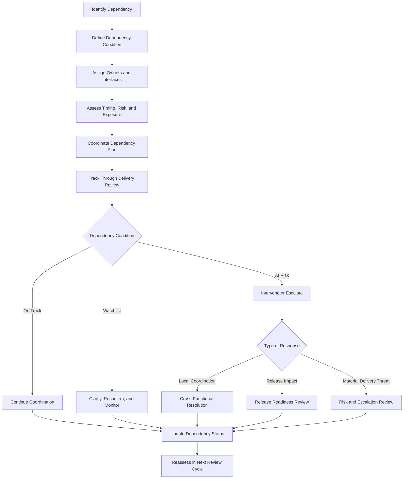
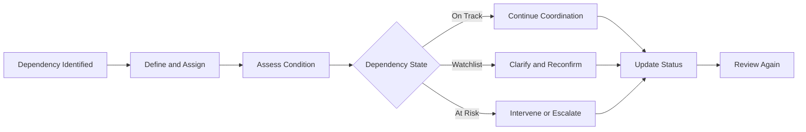

# Dependency Management Playbook

The **Dependency Management Playbook** defines the practical operating guidance through which leaders, delivery teams, and cross-functional partners identify, assess, coordinate, govern, and resolve delivery dependencies within the **Product Delivery System** of the **Product Leadership Operating System (PLOS)**.

Where the **Dependency Coordination** artifact defines the canonical structure and operating logic through which dependencies are managed as part of delivery control, this playbook defines how that dependency discipline should be carried out in practice. It translates the governing dependency model into repeatable operating behavior so that dependencies are managed as active delivery-control conditions rather than as informal follow-up work, reactive escalation, or hidden schedule risk.

It explains how organizations should use structured dependency management to maintain execution flow, clarify inter-team commitments, surface dependency exposure early, determine when coordination is sufficient, determine when escalation is required, and preserve delivery confidence through disciplined follow-through.

---

## Purpose

The purpose of this artifact is to define the canonical **Dependency Management Playbook** for the **Product Delivery System**.

This playbook exists to ensure that dependencies are:

- identified explicitly rather than discovered late
- assessed as delivery conditions rather than treated as background context
- coordinated through clear ownership rather than informal follow-up
- reviewed as part of recurring delivery control rather than only during crisis
- connected to delivery risk, readiness, and escalation when dependency exposure becomes material
- governed as execution-critical relationships rather than passive planning assumptions

Within the **Product Leadership Operating System**, dependencies are not administrative details. They are execution conditions that can strengthen or destabilize delivery depending on whether they are made visible, coordinated, and governed effectively.

This artifact establishes the practical operating guidance required to support the broader operating loop:

**Strategy → Governance → Delivery → Outcomes → Learning → Strategy**

---

## Diagram

---

## Diagram Interpretation

The **Dependency Management Playbook** begins when a delivery dependency is identified. That dependency may involve another team, a shared service, a platform capability, an external commitment, a sequencing requirement, an environment dependency, or any other condition that affects whether work can proceed as planned.

The first responsibility is not merely to note that a dependency exists, but to define the dependency condition clearly enough for it to be managed. This includes understanding what is required, who is involved, what timing matters, what assumptions are in play, and what delivery exposure exists if the dependency is delayed, changed, or not fulfilled.

Once the dependency is defined, the playbook requires explicit ownership and interface clarity. Dependencies that belong to everyone typically belong to no one. The playbook therefore treats dependency coordination as an operating responsibility that must have named participants, explicit connection points, and clear expectations.

After definition and ownership, the dependency must be assessed in terms of timing, exposure, and delivery impact. This prevents dependencies from being treated as neutral planning artifacts. Some dependencies are low risk and well-controlled. Others are fragile, late, cross-boundary, or tightly coupled to critical commitments.

The playbook then moves into dependency coordination. This is where required actions, handoffs, confirmations, and timing expectations are actively managed. The goal is not merely to “watch” a dependency, but to create the conditions under which it can be fulfilled reliably.

The dependency is then tracked through recurring delivery review. This is important because dependency management is not a one-time planning activity. It is an ongoing delivery-control discipline that must be reassessed as execution conditions change.

At each review point, the dependency condition should resolve into one of three states:

- **on track**, where the dependency remains sufficiently reliable
- **watchlist**, where the dependency needs clarification, reconfirmation, or closer monitoring
- **at risk**, where the dependency now threatens delivery timing, confidence, release posture, or broader execution stability

When dependencies remain on track, coordination continues with normal monitoring. When they move into watchlist condition, the correct response is targeted clarification and renewed confirmation. When they become at risk, the playbook routes them into the appropriate control path, including local cross-functional resolution, release-readiness review, or formal risk and escalation review.

In this way, the playbook ensures that dependencies are treated as governed operating conditions inside the **Product Delivery System** rather than as invisible assumptions or late-stage surprises.

---

## Operating Logic

### 1. Dependency Objective

The objective of dependency management is to preserve execution integrity by ensuring that external conditions required for delivery are visible, coordinated, and governable.

This means dependency management should answer questions such as:

- what outside condition must be true for delivery to proceed
- who owns that condition
- when must it be satisfied
- what assumptions does the current plan depend on
- how much delivery exposure exists if the dependency slips or changes
- what action is required to keep the dependency reliable

Dependency management is not about documenting connections for completeness. It is about controlling execution exposure.

### 2. Dependency Identification

Dependencies should be identified early enough that they can be actively managed before they create instability.

Canonical dependency types may include:

- upstream capability dependencies
- downstream integration dependencies
- cross-team sequencing dependencies
- shared platform or service dependencies
- environment or infrastructure dependencies
- decision dependencies
- external vendor or partner dependencies
- release-window or timing dependencies

Dependencies should be framed in delivery terms rather than generic project language. A useful dependency statement should make clear what is needed, from whom, by when, and with what consequence if it is not met.

### 3. Dependency Definition

Once identified, the dependency should be defined clearly enough to support coordination.

A well-defined dependency should establish:

- the required deliverable, decision, interface, or condition
- the dependent team or workstream
- the providing team or owner
- the timing expectation
- the handoff or interaction point
- the current confidence level
- the consequences of failure or delay

This prevents teams from operating on vague dependency assumptions that cannot be reviewed or governed.

### 4. Ownership and Interface Clarity

Every meaningful dependency should have explicit ownership on both sides of the interface.

This includes:

- a dependent owner
- a provider or counterpart owner
- a coordination point
- an agreed way to confirm status
- a clear path for raising concern if conditions deteriorate

Dependency ownership is not the same as dependency blame. It is the mechanism through which coordination becomes actionable.

### 5. Dependency Assessment

Dependencies should be assessed as live execution conditions rather than as passive planning notes.

Canonical assessment questions include:

- how critical is this dependency to current commitments
- how stable is the counterpart commitment
- how close is the dependency to becoming time-critical
- how much schedule or sequencing flexibility exists
- how much uncertainty exists around delivery or handoff quality
- whether the dependency creates single-point execution risk
- whether unresolved issues are already degrading delivery confidence

This assessment helps determine which dependencies require routine monitoring and which require more active coordination.

### 6. Coordination Mechanics

Dependency coordination should be explicit, lightweight where possible, and sufficiently strong where needed.

Typical coordination actions may include:

- commitment confirmation
- handoff planning
- interface clarification
- timing alignment
- risk surfacing
- readiness checks
- issue resolution sessions
- dependency-specific follow-up actions

The purpose of coordination is to maintain reliability, not to create unnecessary administrative overhead.

### 7. Dependency States

Every actively managed dependency should resolve into a recognizable condition state.

Canonical dependency states are:

- **on track** — dependency remains reliable within current expectations
- **watchlist** — dependency requires clarification, reconfirmation, or closer monitoring
- **at risk** — dependency threatens timing, confidence, sequencing, release posture, or delivery stability

These states allow teams to judge dependency condition proportionately and consistently.

### 8. Review Integration

Dependencies should be tracked through recurring delivery review rather than only through ad hoc follow-up.

Recurring review should confirm:

- whether the dependency still exists in the same form
- whether commitments remain credible
- whether timing assumptions still hold
- whether risk exposure has increased or decreased
- whether prior coordination actions improved the condition
- whether escalation is now warranted

This keeps dependency management embedded within normal delivery control.

### 9. Escalation and Control Routing

When a dependency becomes materially unstable, the response should match the nature of the exposure.

Canonical response paths include:

- **local cross-functional coordination** when the issue can still be resolved through direct operating alignment
- **release readiness review** when dependency instability threatens controlled release
- **risk and escalation review** when dependency exposure materially threatens commitments or exceeds normal delivery authority
- **governance attention** when tradeoffs, sequencing shifts, or recommitment decisions move beyond delivery control

This ensures dependency management stays aligned with the established Pillar 4 control set rather than inventing a separate escalation model.

### 10. Action Commitment and Follow-Through

Every meaningful dependency issue should produce explicit follow-through.

This should include:

- a clear action
- a named owner
- a timing expectation
- a revalidation point
- a basis for determining whether the dependency condition improved

Dependency actions are complete only when the underlying delivery condition improves or the issue is routed to the appropriate higher-order control path.

### 11. Cadence and Timing Discipline

Dependency management should operate on a cadence appropriate to the volatility and criticality of the work.

This means:

- high-criticality dependencies may need tighter coordination cycles
- stable dependencies may require only periodic reconfirmation
- timing discipline should intensify as the dependency becomes more time-sensitive
- dependencies should not first become visible at the point of failure

The cadence should support control without creating noise.

### 12. Relationship to the Five-System Architecture

Within the canonical five-system architecture:

- the **Strategy Execution System** establishes commitments whose credibility often depends on coordinated dependency performance
- the **Portfolio Governance System** receives issues when dependency instability creates tradeoff, sequencing, or commitment decisions beyond delivery authority
- the **Product Delivery System** owns dependency visibility, coordination, reassessment, and delivery-level intervention
- the **Customer Outcomes System** may ultimately reflect whether dependency breakdowns impair realized value
- the **Decision Intelligence System** supports dependency visibility, timing insight, and evidence quality, but it does not control dependency judgment or action decisions

This preserves the architectural principle that **Decision Intelligence supports — it does not control**.

---

## Supporting Diagram

---

## Why This Matters

Dependencies are one of the most common sources of delivery instability, yet they are often managed informally until they become urgent. Teams may track internal progress carefully while treating cross-team or external conditions as planning assumptions rather than as active delivery controls.

Without a defined **Dependency Management Playbook**:

- dependencies remain implicit too long
- ownership is unclear across interfaces
- critical timing assumptions go untested
- teams discover coordination failures too late
- dependency issues surface as surprises inside delivery reviews or release windows
- escalation happens reactively rather than proportionately
- delivery confidence erodes without a clear mechanism for restoring it

The **Dependency Management Playbook** matters because it defines how dependency visibility becomes operating discipline.

It ensures that dependencies are:

- identified explicitly
- defined in delivery terms
- coordinated through clear ownership
- reviewed as live operating conditions
- escalated through the correct control paths when necessary

A strong delivery system does not merely acknowledge dependencies. It manages them as execution-critical conditions that must remain visible, coordinated, and governable over time.

---

## How To Use This

Use this artifact as the canonical practical guide for operating **dependency management** within the **Product Delivery System**.

It should be used when:

- establishing recurring dependency-management practices
- training delivery teams and cross-functional partners on dependency discipline
- improving weak or informal dependency-tracking habits
- clarifying ownership across delivery interfaces
- aligning dependency management with risk, release, and delivery-review controls
- building supporting templates, trackers, or coordination routines

This artifact should guide supporting implementation materials such as:

- dependency trackers
- dependency review templates
- interface coordination checklists
- handoff confirmation mechanisms
- dependency risk rubrics
- escalation triggers

Supporting materials may operationalize this playbook in more detail, but they must not redefine the canonical dependency-management logic established here.

This artifact is most effective when used together with related **Pillar 4** artifacts, especially:

- **Dependency Coordination**
- **Delivery Review Model**
- **Delivery Risk and Escalation Model**
- **Release Readiness Model**
- **Delivery Signal Flow Diagram**

In practice, this playbook should be used to ensure that dependency management remains a delivery-control discipline rather than a reactive follow-up habit.

---

## Relationship to the Operating System

This artifact belongs to **Pillar 4 — Product Delivery System** within the **Product Leadership Operating System (PLOS)**.

It supports the canonical operating loop:

**Strategy → Governance → Delivery → Outcomes → Learning → Strategy**

Its primary role is to define how the dependency discipline of the **Product Delivery System** should be carried out in practice so that cross-boundary delivery conditions remain governable.

Its architectural relationship to the broader operating system is as follows:

- it strengthens execution control within **Delivery**
- it helps determine when cross-boundary conditions remain stable and when they require intervention
- it provides a practical mechanism for moving dependency instability toward **Governance** when delivery authority is exceeded
- it helps preserve the delivery conditions required to support successful **Outcomes**
- it generates learning about interface weaknesses, timing fragility, and recurring coordination failures that can improve future execution

Within the canonical five-system architecture:

- the **Strategy Execution System** provides the commitments whose delivery credibility often depends on dependency reliability
- the **Portfolio Governance System** receives issues when dependency instability creates sequencing, scope, or commitment tradeoffs beyond delivery authority
- the **Product Delivery System** owns dependency coordination, reassessment, and delivery-level intervention
- the **Customer Outcomes System** reflects whether coordinated delivery conditions support realized value
- the **Decision Intelligence System** supports dependency visibility and evidence quality, but it does not determine dependency judgment or response

This artifact does not introduce a new system, alter the operating loop, or redefine the established delivery controls. It exists to operationalize one of the core cross-boundary control disciplines inside the **Product Delivery System**.

---

## Summary

The **Dependency Management Playbook** defines the canonical operating guidance for identifying, assessing, coordinating, reviewing, and resolving delivery dependencies within the **Product Delivery System**.

It ensures that dependencies:

- are made explicit early
- are defined in actionable delivery terms
- have clear owners and interfaces
- are assessed as live execution conditions
- are reviewed through recurring delivery control
- are routed into the correct intervention or escalation path when needed
- improve delivery confidence when managed well

This playbook reinforces the principle that dependencies are not background planning artifacts. They are governed operating conditions that can materially strengthen or weaken delivery performance.

Within the **Product Leadership Operating System**, this artifact serves as the canonical practical guide for turning dependency coordination into disciplined operating behavior.

---

## License

This project is licensed under the MIT License. See the [LICENSE](LICENSE) file for details.
