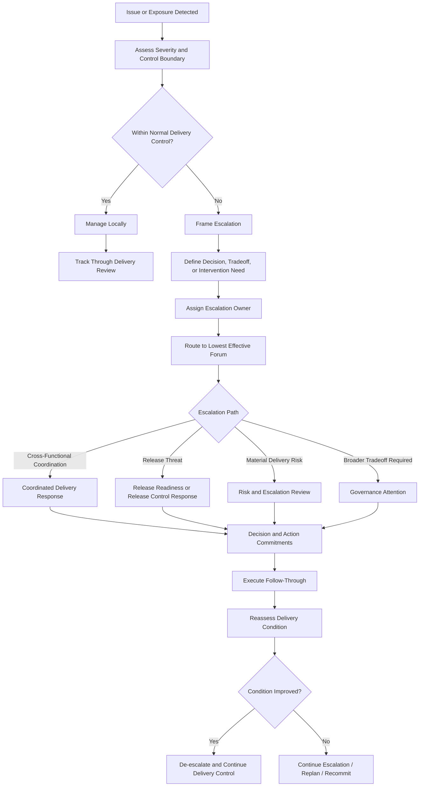
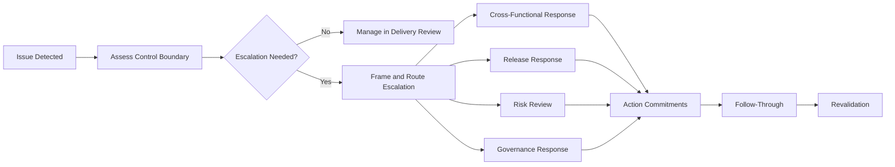

# Escalation Playbook

The **Escalation Playbook** defines the practical operating guidance through which leaders, delivery teams, and cross-functional partners identify, frame, route, govern, and resolve escalations within the **Product Delivery System** of the **Product Leadership Operating System (PLOS)**.

Where the **Delivery Risk and Escalation Model** defines the canonical structure and operating logic through which delivery risk is escalated when normal delivery control is no longer sufficient, this playbook defines how that escalation discipline should be carried out in practice. It translates the governing escalation model into repeatable operating behavior so that escalation functions as a controlled delivery mechanism rather than as informal urgency, personality-driven intervention, or unmanaged leadership attention.

It explains how organizations should use structured escalation to move issues to the lowest effective decision level, clarify what must be decided, preserve accountability at the delivery layer, determine when broader coordination is sufficient, determine when governance is required, and restore execution stability through disciplined follow-through.

---

## Purpose

The purpose of this artifact is to define the canonical **Escalation Playbook** for the **Product Delivery System**.

This playbook exists to ensure that escalations are:

- triggered through explicit thresholds rather than frustration or volume
- framed as decision and control needs rather than generic issue reporting
- routed to the appropriate response path rather than pushed upward by habit
- governed with clear ownership, timing, and expected outcomes
- connected to delivery risk, dependency exposure, release readiness, and delivery review when relevant
- resolved through action and revalidation rather than visibility alone

Within the **Product Leadership Operating System**, escalation is not evidence of delivery failure by itself. It is a governed operating mechanism used when a delivery issue exceeds local control, crosses important boundaries, threatens critical commitments, or requires broader intervention than the team can provide on its own.

This artifact establishes the practical operating guidance required to support the broader operating loop:

**Strategy → Governance → Delivery → Outcomes → Learning → Strategy**

---

## Diagram

---

## Diagram Interpretation

The **Escalation Playbook** begins when a delivery issue, risk, dependency failure, release threat, or other material exposure is detected. The first question is not whether the issue feels urgent. The first question is whether the issue remains within normal delivery control or whether it has crossed a boundary that requires broader intervention.

If the issue can still be managed effectively within the team or immediate delivery context, it should remain there and be tracked through normal **Delivery Review**. This preserves local accountability and prevents escalation from becoming the default response to normal delivery friction.

When the issue exceeds normal delivery control, the playbook requires explicit escalation framing. This means the escalation must be translated from a raw problem statement into a clear articulation of what decision, tradeoff, coordination, or intervention is now required. The point of escalation is not simply to make a problem more visible. It is to secure the response needed to restore control.

Once framed, the escalation must have a named owner and be routed to the **lowest effective forum**. This is a critical architectural principle. Escalations should not jump automatically to the highest level available. They should move first to the lowest level capable of resolving the issue without unnecessary delay or expanded governance involvement.

The playbook then routes the escalation into one of several canonical response paths:

- **coordinated delivery response** when the issue requires cross-functional operating alignment
- **release-readiness or release-control response** when the issue threatens controlled release
- **risk and escalation review** when delivery exposure is material and requires structured escalation handling
- **governance attention** when broader tradeoffs, reprioritization, or commitment decisions exceed delivery authority

Each path should produce explicit decisions and action commitments. Escalation is not complete when the issue is heard. It is complete only when an accountable response is defined and moved into follow-through.

After action is taken, the delivery condition must be reassessed. If the condition improves, the issue should be de-escalated and returned to normal delivery control. If the condition does not improve, escalation may continue, intensify, or convert into replanning or recommitment.

In this way, the playbook ensures that escalation operates as a governed delivery mechanism inside the **Product Delivery System** rather than as unmanaged urgency or personality-driven intervention.

---

## Operating Logic

### 1. Escalation Objective

The objective of escalation is to restore delivery control when an issue exceeds the authority, capacity, or coordination reach of normal delivery management.

This means escalation should answer questions such as:

- what condition has moved outside normal delivery control
- why local correction is no longer sufficient
- what decision, tradeoff, coordination, or intervention is now required
- what level of response is needed to restore control
- who owns the escalation path
- how the organization will know whether escalation improved the condition

Escalation is not primarily about alerting leadership. It is about obtaining the right response at the right level.

### 2. Escalation Triggers

Escalation should be triggered by threshold conditions rather than by frustration, visibility gaps, or personality dynamics.

Canonical escalation triggers may include:

- the team lacks authority to resolve the issue
- the issue affects multiple teams or interfaces
- the issue threatens committed milestones or release integrity
- the issue materially reduces delivery confidence
- a dependency has become unstable beyond local coordination capacity
- mitigation efforts have stalled or failed
- unresolved decisions are blocking execution
- the issue now requires tradeoffs beyond normal delivery authority

These triggers should be interpreted proportionately, but they should remain explicit enough to prevent escalation ambiguity.

### 3. Escalation Framing

A valid escalation should be framed clearly enough that the receiving forum can act on it.

A strong escalation framing should establish:

- what the issue is
- why it exceeds normal delivery control
- what commitments, releases, or dependencies are affected
- what evidence supports the concern
- what timing pressure exists
- what decision, intervention, or tradeoff is required
- what happens if no action is taken

This prevents escalations from turning into broad narrative descriptions without clear operating consequence.

### 4. Escalation Ownership

Every escalation requires a named owner.

The escalation owner is responsible for:

- ensuring the issue is framed clearly
- routing it to the correct forum
- confirming the necessary participants are engaged
- documenting the required decision or action
- ensuring follow-through occurs
- confirming whether the escalation resolved the condition

Escalation ownership is not the same as being at fault. It is the mechanism through which escalation becomes governed rather than diffuse.

### 5. Routing Principle

Escalations should be routed to the lowest effective response level first.

Canonical routing options include:

- **local delivery correction** when the issue still remains within delivery-team control
- **cross-functional coordination** when the issue requires operating alignment across interfaces
- **release-readiness or release-control response** when the issue threatens controlled release
- **risk and escalation review** when the issue is now a material delivery exposure
- **governance attention** when the issue requires priority, scope, sequence, or commitment decisions beyond delivery authority

This preserves local accountability while still enabling timely intervention.

### 6. Cross-Functional Escalation

When an issue crosses functional or team boundaries but does not yet require broader governance, the escalation should move into coordinated delivery response.

This may involve:

- dependency clarification
- decision acceleration
- interface resolution
- sequencing coordination
- staffing or capacity alignment
- shared action commitments across teams

The goal is to resolve the condition through delivery-system coordination before it becomes a broader governance problem.

### 7. Release-Related Escalation

When an issue threatens controlled release, the escalation should move into the appropriate release-control mechanism.

This may include:

- readiness re-evaluation
- conditional release review
- launch timing reassessment
- rollback or containment planning
- hold / proceed / replan decisions

This keeps release-threatening issues aligned with the **Release Readiness Model** rather than allowing them to bypass release controls.

### 8. Material Risk Escalation

When the issue now constitutes material delivery exposure, the escalation should be handled through the **Risk and Escalation Review** path.

This is appropriate when:

- current mitigation is insufficient
- exposure now threatens delivery continuity or release integrity
- confidence has materially deteriorated
- coordinated intervention is required
- delivery leadership needs to make explicit tradeoff or intervention decisions

This ensures escalation remains tied to the established risk-control structure inside Pillar 4.

### 9. Governance Escalation

Escalation should move into governance only when the issue requires decisions beyond delivery authority.

This may include:

- commitment reset
- reprioritization
- sequencing change
- scope tradeoff
- resource tradeoff
- formal intervention on a portfolio-affecting condition

Governance is not the default destination for escalation. It is the correct destination when the issue now affects governed commitments or tradeoffs beyond delivery-level control.

### 10. Action Commitment and Resolution

Every escalation should produce explicit follow-through.

This should include:

- the decision made
- the actions required
- the named owners
- the expected timing
- the revalidation point
- the condition that would indicate resolution or de-escalation

Escalation is incomplete if visibility increases but execution does not change.

### 11. De-Escalation Logic

Escalation should not remain open by default once the triggering condition has improved.

De-escalation should occur when:

- the issue is back within normal delivery control
- the required decision has been made and implemented
- the dependency or release threat has been stabilized
- delivery confidence has recovered to acceptable bounds
- the issue has converted into an updated plan with committed ownership

This ensures escalation remains a temporary control intensification rather than a permanent state.

### 12. Follow-Through and Revalidation

Escalation outcomes must be revalidated in subsequent delivery control forums.

Revalidation should confirm:

- whether agreed actions were completed
- whether those actions improved the condition
- whether the decision produced the intended effect
- whether further escalation is still required
- whether the issue should return to normal delivery review and control

This closes the loop between escalation and actual delivery-state change.

### 13. Relationship to the Five-System Architecture

Within the canonical five-system architecture:

- the **Strategy Execution System** establishes commitments whose credibility may be threatened when escalation becomes necessary
- the **Portfolio Governance System** receives escalations when tradeoffs, sequencing shifts, scope decisions, or commitment resets exceed delivery authority
- the **Product Delivery System** owns escalation framing, routing, follow-through, and de-escalation as part of execution control
- the **Customer Outcomes System** may ultimately reflect whether unresolved escalations impair value realization
- the **Decision Intelligence System** supports escalation with evidence, signals, and visibility, but it does not determine escalation judgment or response

This preserves the architectural principle that **Decision Intelligence supports — it does not control**.

---

## Supporting Diagram

---

## Why This Matters

Escalation is one of the most misused mechanisms in delivery organizations. Teams often escalate too late, too early, too vaguely, or to the wrong forum. In those conditions, escalation becomes either an unmanaged urgency channel or a substitute for normal delivery discipline.

Without a defined **Escalation Playbook**:

- issues are pushed upward without clear framing
- normal delivery problems get escalated prematurely
- material risks stay local too long
- leaders receive visibility without decision clarity
- cross-functional issues bounce between teams without resolution
- release threats bypass structured control
- escalation creates noise without restoring delivery stability

The **Escalation Playbook** matters because it defines how escalation becomes governed operating discipline.

It ensures that escalations are:

- threshold-based
- clearly framed
- routed to the correct forum
- connected to explicit decisions and actions
- followed through until the condition changes

A strong delivery system does not eliminate escalation. It uses escalation deliberately, proportionately, and effectively when normal delivery control is no longer enough.

---

## How To Use This

Use this artifact as the canonical practical guide for operating **escalation** within the **Product Delivery System**.

It should be used when:

- establishing escalation practices for delivery teams
- training leaders and cross-functional partners on how to escalate well
- improving vague or personality-driven escalation habits
- clarifying what should stay in normal delivery control versus what should move upward
- aligning escalation behavior with risk, release, dependency, and review controls
- building supporting templates, trackers, or escalation routines

This artifact should guide supporting implementation materials such as:

- escalation templates
- escalation framing checklists
- threshold guidance
- routing decision aids
- follow-through trackers
- de-escalation criteria

Supporting materials may operationalize this playbook in more detail, but they must not redefine the canonical escalation logic established here.

This artifact is most effective when used together with related **Pillar 4** artifacts, especially:

- **Delivery Risk and Escalation Model**
- **Delivery Review Model**
- **Release Readiness Model**
- **Dependency Coordination**
- **Delivery Signal Flow Diagram**

In practice, this playbook should be used to ensure that escalation remains a controlled delivery mechanism rather than an unmanaged urgency path.

---

## Relationship to the Operating System

This artifact belongs to **Pillar 4 — Product Delivery System** within the **Product Leadership Operating System (PLOS)**.

It supports the canonical operating loop:

**Strategy → Governance → Delivery → Outcomes → Learning → Strategy**

Its primary role is to define how the escalation discipline of the **Product Delivery System** should be carried out in practice so that material delivery issues are routed and resolved appropriately.

Its architectural relationship to the broader operating system is as follows:

- it strengthens execution control within **Delivery**
- it helps determine when normal delivery control is no longer sufficient
- it provides a practical mechanism for moving material delivery issues toward **Governance** only when delivery authority is exceeded
- it helps preserve the delivery conditions required to support successful **Outcomes**
- it generates learning about recurring failure modes, response timing, and escalation effectiveness that can improve future execution

Within the canonical five-system architecture:

- the **Strategy Execution System** provides the commitments whose credibility escalation activity may threaten or protect
- the **Portfolio Governance System** receives escalated issues when delivery conditions create tradeoffs or recommitment needs beyond delivery authority
- the **Product Delivery System** owns escalation framing, routing, follow-through, and de-escalation as part of delivery control
- the **Customer Outcomes System** reflects whether timely escalation helps preserve realized value
- the **Decision Intelligence System** supports escalation with evidence and visibility, but it does not determine escalation judgment or response

This artifact does not introduce a new system, alter the operating loop, or redefine the established delivery controls. It exists to operationalize one of the core intensification mechanisms inside the **Product Delivery System**.

---

## Summary

The **Escalation Playbook** defines the canonical operating guidance for identifying, framing, routing, resolving, and de-escalating escalations within the **Product Delivery System**.

It ensures that escalations:

- are triggered through explicit thresholds
- are framed clearly enough to support decision-making
- are routed to the lowest effective response level
- remain connected to delivery, dependency, release, risk, and governance controls
- produce explicit action commitments
- are revalidated until delivery condition improves
- return to normal delivery control when stability is restored

This playbook reinforces the principle that escalation is not noise, panic, or unmanaged visibility. It is a governed operating mechanism used when delivery issues exceed normal control and require stronger intervention.

Within the **Product Leadership Operating System**, this artifact serves as the canonical practical guide for turning escalation into disciplined operating behavior.

---

## License

This project is licensed under the MIT License. See the [LICENSE](LICENSE) file for details.
