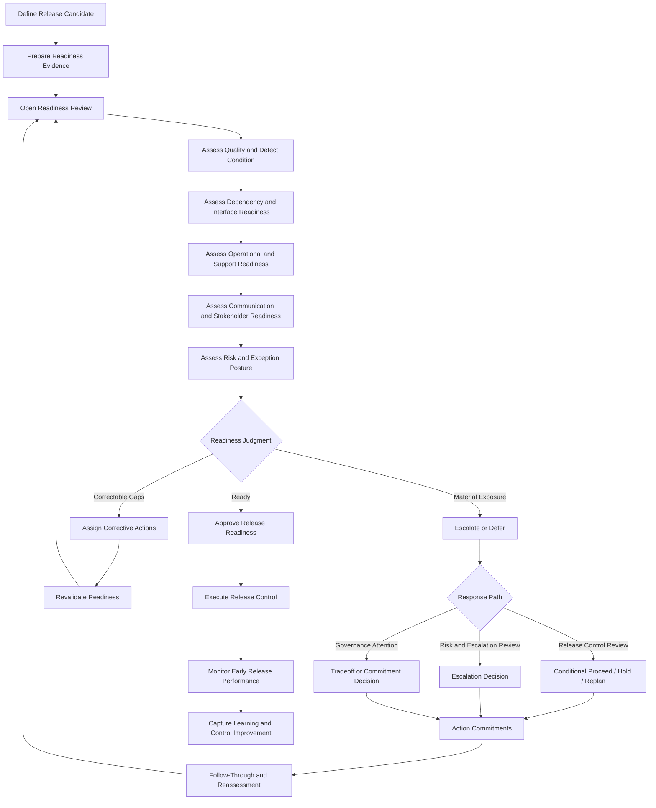
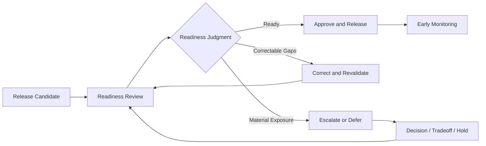

# Release Readiness Playbook

The **Release Readiness Playbook** defines the practical operating guidance through which leaders, delivery teams, and cross-functional partners assess, confirm, govern, and act on release readiness within the **Product Delivery System** of the **Product Leadership Operating System (PLOS)**.

Where the **Release Readiness Model** defines the canonical structure and operating logic through which release readiness is assessed as part of delivery control, this playbook defines how that readiness discipline should be carried out in practice. It translates the governing readiness model into repeatable operating behavior so that release readiness functions as a controlled delivery mechanism rather than as a calendar milestone, informal confidence judgment, or last-minute launch checkpoint.

It explains how organizations should prepare for readiness review, evaluate evidence across quality, dependency, operational, communication, and risk conditions, determine whether release approval is justified, determine when corrective action is sufficient, determine when escalation or deferral is required, and preserve release integrity through disciplined follow-through.

---

## Purpose

The purpose of this artifact is to define the canonical **Release Readiness Playbook** for the **Product Delivery System**.

This playbook exists to ensure that release readiness is:

- assessed through explicit readiness conditions rather than optimism
- governed through evidence rather than presentation quality
- evaluated as a delivery-control decision rather than a ceremonial milestone
- connected to quality, dependency, operational, communication, and risk posture
- capable of triggering corrective action, escalation, or deferral when required
- integrated into the broader delivery control system rather than treated as an isolated launch event

Within the **Product Leadership Operating System**, release readiness is not synonymous with work completion. It is the governed determination that the current release candidate is sufficiently prepared to move from active delivery into controlled release under acceptable conditions.

This artifact establishes the practical operating guidance required to support the broader operating loop:

**Strategy → Governance → Delivery → Outcomes → Learning → Strategy**

---

## Diagram

---

## Diagram Interpretation

The **Release Readiness Playbook** begins when a release candidate is defined. The first responsibility is not to ask whether the release date is approaching, but whether the release candidate is sufficiently clear to be assessed. This requires an explicit understanding of what scope is being released, what dependencies matter, what operational conditions apply, and what known exceptions or open questions remain.

Once the release candidate is defined, the playbook requires preparation of readiness evidence. This ensures that readiness review is based on actual release condition rather than on confidence rhetoric, incomplete status summaries, or calendar pressure. The readiness review should therefore begin with evidence that allows participants to evaluate quality, dependencies, operational support, communication, and remaining risk in a structured way.

The playbook then moves through a sequence of readiness assessments. The release is examined first for quality and defect condition, then for dependency and interface readiness, then for operational and support readiness, then for stakeholder and communication readiness, and finally for the risk and exception posture surrounding the release. This structure preserves the principle that release readiness is a system-level judgment rather than a narrow engineering completion signal.

At the center of the playbook is the **readiness judgment**. The review should resolve into one of three states:

- **ready**, where the release candidate is sufficiently prepared to proceed under acceptable conditions
- **correctable gaps**, where readiness is incomplete but recoverable within normal delivery control
- **material exposure**, where the current release condition exceeds acceptable bounds and requires escalation, tradeoff, or deferral

If the release is ready, the playbook moves into controlled release execution followed by early-release monitoring. If there are correctable gaps, the playbook assigns explicit actions and returns the release candidate to revalidation. If material exposure exists, the playbook routes the issue into the appropriate response path, including release-control review, risk and escalation review, or governance attention when broader tradeoffs exceed delivery authority.

After corrective or escalated action is taken, the release condition must be reassessed. This preserves the principle that readiness is not restored by discussion alone. It is restored only when the condition of the release candidate has changed sufficiently to justify a new readiness judgment.

In this way, the playbook ensures that readiness review operates as a governed delivery-control mechanism inside the **Product Delivery System** rather than as a symbolic launch checkpoint.

---

## Operating Logic

### 1. Readiness Objective

The objective of release readiness is to determine whether the current release candidate is prepared to proceed into controlled release under acceptable delivery, quality, operational, and risk conditions.

This means readiness should answer questions such as:

- what exactly is being released
- what evidence supports the release condition
- whether quality is within acceptable bounds
- whether required dependencies are stable
- whether operational and support conditions are prepared
- whether communication and stakeholder conditions are sufficiently aligned
- whether remaining risks or exceptions are acceptable
- what decision is required before proceeding

Release readiness is not primarily about confirming that work is finished. It is about confirming that release conditions are acceptable.

### 2. Release Candidate Definition

A readiness review should not begin with an ambiguous release candidate.

The release candidate should establish:

- intended release scope
- included and excluded items where relevant
- affected interfaces or dependencies
- release timing assumptions
- operational context
- known exceptions, limitations, or open items
- affected stakeholders

This prevents readiness review from becoming vague or unstable because the object of review is unclear.

### 3. Readiness Inputs

Readiness review should operate on current evidence rather than broad narrative summaries.

Canonical readiness inputs may include:

- scope-completion status
- defect and quality condition
- testing completion and confidence
- dependency confirmation
- environment and configuration status
- deployment and rollback readiness
- monitoring and alerting readiness
- support-team preparedness
- communication plans
- open risks and accepted exceptions
- prior readiness actions and whether they changed the condition

Inputs should be current enough to support judgment and focused enough to preserve decision quality.

### 4. Review Participants

The participant set may vary by implementation, but readiness review should include the minimum set of roles needed to evaluate the release condition and commit action.

Typical participants may include:

- delivery or release owner
- product leadership or product owner
- engineering or technical delivery counterpart
- quality or testing counterpart where relevant
- operational or support counterpart
- dependency owners where needed
- escalation or governance participants only when conditions warrant it

Participation should be driven by release-control need, not by meeting habit.

### 5. Review Structure

A strong readiness review should follow a consistent operating sequence.

Canonical sequence:

1. confirm the release candidate and intended timing  
2. review quality and defect condition  
3. review dependency and interface readiness  
4. review operational and support readiness  
5. review communication and stakeholder readiness  
6. review risk and exception posture  
7. determine the readiness judgment  
8. assign actions, owners, timing, and revalidation expectations  

This structure keeps the review grounded in actual release condition rather than drifting into presentation flow.

### 6. Quality and Defect Assessment

A release should not be judged ready solely because delivery activity is nominally complete.

Quality review should assess:

- unresolved defects
- concentration and severity of known defects
- regression exposure
- test completion and confidence
- workflow stability
- accepted limitations
- whether current quality posture supports controlled release

The purpose is not to require perfection. The purpose is to determine whether quality condition is acceptable within the intended release bounds.

### 7. Dependency and Interface Assessment

Release readiness depends on required cross-boundary conditions being sufficiently stable.

The review should assess:

- dependency fulfillment status
- interface reliability
- environment availability
- configuration alignment
- sequencing assumptions
- external team commitments
- remaining dependency fragility

This prevents release approval from being based on internal team confidence alone when the release depends on broader operating conditions.

### 8. Operational and Support Assessment

A release may be technically deployable while still being operationally unready.

Operational review should assess:

- deployment readiness
- rollback or recovery readiness
- monitoring and alerting setup
- runbook completeness
- support-team readiness
- incident-response preparedness
- internal launch enablement

This keeps readiness tied to real operating conditions rather than code movement alone.

### 9. Communication and Stakeholder Assessment

A release is not fully ready if the relevant people do not know what is changing, when it is changing, or how to respond.

The review should assess:

- internal communication readiness
- external communication readiness where relevant
- customer-impact awareness
- partner or cross-functional alignment
- training or enablement needs
- go-live ownership clarity

This protects release control from breaking down because communication conditions were treated as secondary.

### 10. Risk and Exception Assessment

Readiness review should explicitly evaluate open risks and exceptions rather than allowing them to remain implicit.

This assessment should determine:

- what material risks remain open
- what exceptions are being consciously accepted
- what mitigations are in place
- whether current exposure remains within acceptable bounds
- what thresholds would require hold, escalation, or deferral

This keeps release readiness aligned with the **Delivery Risk and Escalation Model** rather than bypassing risk control logic.

### 11. Readiness Judgment

Every readiness review should end with a clear readiness judgment.

Canonical readiness judgments are:

- **ready** — release conditions are acceptable within defined bounds
- **correctable gaps** — readiness is incomplete but recoverable within delivery control
- **material exposure** — release condition requires escalation, tradeoff, or deferral

The judgment should reflect the condition of the release candidate, not schedule pressure or presenter optimism.

### 12. Corrective Action and Revalidation

When readiness gaps are correctable within delivery control, the release should not be escalated prematurely. It should move into corrective action with explicit follow-through.

Corrective action should include:

- specific gap closure actions
- named owners
- expected timing
- revalidation criteria
- the point at which the release returns to readiness review

This preserves proportionality while still enforcing disciplined control.

### 13. Escalation and Deferral Handling

When material exposure exists, the release should move into the correct higher-order control path.

This may include:

- release-control review for conditional proceed, hold, or replan decisions
- risk and escalation review when the issue is now a material delivery threat
- governance attention when the issue requires tradeoffs, reprioritization, or commitment decisions beyond delivery authority

This ensures release-threatening issues are handled through established Pillar 4 control mechanisms rather than improvised leadership attention.

### 14. Follow-Through and Early Monitoring

Readiness approval does not end the control loop.

After approval and launch, the release should move into early monitoring to confirm:

- deployment stability
- incident behavior
- defect emergence
- support demand
- customer-impact signals
- whether any controlled conditions remain acceptable

This keeps release readiness tied to observed operating behavior rather than assumed success.

### 15. Relationship to the Five-System Architecture

Within the canonical five-system architecture:

- the **Strategy Execution System** establishes the commitments and priorities the release is intended to advance
- the **Portfolio Governance System** receives issues when release conditions require tradeoffs, reprioritization, or recommitment beyond delivery authority
- the **Product Delivery System** owns readiness preparation, review, judgment, corrective action, and release-control follow-through
- the **Customer Outcomes System** reflects whether released work produces intended value under actual operating conditions
- the **Decision Intelligence System** supports readiness through evidence, visibility, and early monitoring signals, but it does not determine the readiness judgment

This preserves the architectural principle that **Decision Intelligence supports — it does not control**.

---

## Supporting Diagram

---

## Why This Matters

Release readiness is one of the most commonly compressed and misunderstood control points in delivery organizations. Teams often treat it as a final checkpoint that confirms a predetermined launch date rather than as a governed judgment about actual release condition.

Without a defined **Release Readiness Playbook**:

- feature completion is mistaken for release readiness
- known risks remain implicit
- dependencies are assumed rather than confirmed
- operational conditions are reviewed too late
- communication readiness is treated as secondary
- schedule pressure overrides release judgment
- corrective action and escalation paths become inconsistent

The **Release Readiness Playbook** matters because it defines how readiness becomes operating discipline.

It ensures that release readiness is:

- evidence-based
- broader than development completion
- structured across the full release condition
- capable of producing corrective action, escalation, or deferral
- followed through until the release condition actually improves

A strong delivery system does not assume that a release is ready because the date is near. It determines readiness explicitly and governs the consequences of that determination.

---

## How To Use This

Use this artifact as the canonical practical guide for operating **release readiness** within the **Product Delivery System**.

It should be used when:

- establishing recurring release-readiness review practices
- training delivery, engineering, quality, and operations partners on readiness discipline
- improving weak or deadline-driven launch habits
- clarifying what evidence is required before release approval
- aligning readiness behavior with risk, dependency, escalation, and release-control mechanisms
- building supporting templates, trackers, or readiness routines

This artifact should guide supporting implementation materials such as:

- readiness review agendas
- readiness evidence checklists
- readiness judgment rubrics
- release approval templates
- corrective action trackers
- early-monitoring checklists

Supporting materials may operationalize this playbook in more detail, but they must not redefine the canonical release-readiness logic established here.

This artifact is most effective when used together with related **Pillar 4** artifacts, especially:

- **Release Readiness Model**
- **Delivery Risk and Escalation Model**
- **Dependency Coordination**
- **Delivery Review Model**
- **Delivery Signal Flow Diagram**

In practice, this playbook should be used to ensure that release readiness remains a governed delivery-control discipline rather than a final-stage formality.

---

## Relationship to the Operating System

This artifact belongs to **Pillar 4 — Product Delivery System** within the **Product Leadership Operating System (PLOS)**.

It supports the canonical operating loop:

**Strategy → Governance → Delivery → Outcomes → Learning → Strategy**

Its primary role is to define how the release-readiness discipline of the **Product Delivery System** should be carried out in practice so that the transition from delivery into release remains controlled and governable.

Its architectural relationship to the broader operating system is as follows:

- it strengthens execution control within **Delivery**
- it defines a practical mechanism for determining whether work should move from active delivery into controlled release
- it provides a path for moving unresolved release issues toward **Governance** only when delivery authority is exceeded
- it helps preserve the conditions required to support successful **Outcomes**
- it generates learning about quality thresholds, dependency fragility, operational readiness, and launch control that can improve future execution

Within the canonical five-system architecture:

- the **Strategy Execution System** provides the commitments and priorities that releases are intended to advance
- the **Portfolio Governance System** receives issues when release condition creates tradeoffs or recommitment needs beyond delivery authority
- the **Product Delivery System** owns readiness preparation, review, judgment, corrective action, release control, and early monitoring follow-through
- the **Customer Outcomes System** reflects whether released work behaves acceptably and creates intended value once in operation
- the **Decision Intelligence System** supports readiness and early monitoring with evidence and visibility, but it does not determine readiness judgment

This artifact does not introduce a new system, alter the operating loop, or redefine the established delivery controls. It exists to operationalize one of the core transition-control mechanisms inside the **Product Delivery System**.

---

## Summary

The **Release Readiness Playbook** defines the canonical operating guidance for preparing, assessing, judging, correcting, escalating, and following through on release readiness within the **Product Delivery System**.

It ensures that release readiness:

- is grounded in explicit evidence
- is broader than work completion alone
- assesses quality, dependency, operational, communication, and risk conditions
- produces a clear readiness judgment
- routes gaps into corrective action, escalation, or deferral when needed
- follows through into early release monitoring
- improves future release discipline through learning

This playbook reinforces the principle that release readiness is not a ceremonial launch checkpoint. It is a governed operating mechanism used to protect release integrity and ensure that the movement from delivery into release happens under acceptable conditions.

Within the **Product Leadership Operating System**, this artifact serves as the canonical practical guide for turning release readiness into disciplined operating behavior.

---

## License

This project is licensed under the MIT License. See the [LICENSE](LICENSE) file for details.
    M --> U[Monitor Early Release Performance]
    U --> V[Capture Learning and Control Improvement]v
