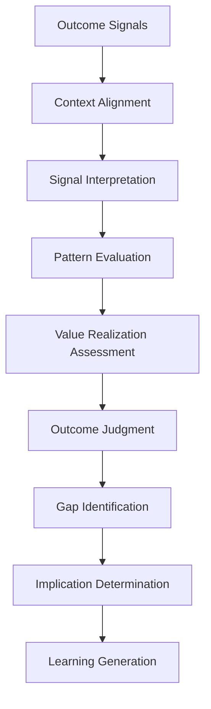
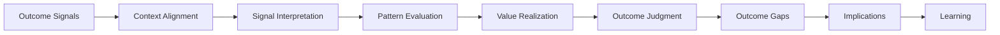

# Outcome Evaluation Model

The **Outcome Evaluation Model** defines the canonical structure and operating logic through which the **Customer Outcomes System** evaluates whether delivered capabilities produce meaningful customer and business outcomes within the **Product Leadership Operating System (PLOS)**.

Where the **Customer Outcomes System Metrics and Signals** define the signal layer, the **Outcome Signal Interpretation Model** defines meaning, and the **Value Realization Model** defines value qualification, this model defines how value-qualified signals are translated into formal outcome judgments.

It ensures that outcome evaluation is structured, consistent, and governed rather than ad hoc, intuition-driven, or purely metric-based.

---

## Purpose

The purpose of this artifact is to:

- define the canonical process for evaluating outcome performance  
- establish how value-qualified signals are translated into formal outcome judgments  
- define how outcome achievement is assessed against intended outcomes and expected conditions  
- guide how evaluation informs downstream gap identification  
- ensure consistent outcome judgment across the organization  

This model ensures that the **Customer Outcomes System** produces **reliable, interpretable outcome judgments** that can inform delivery, governance, and strategy.

---

## Model Overview

The **Outcome Evaluation Model** operates as a structured evaluation flow:

---

## Model Components

### 1. Outcome Signals

The model begins with structured signals defined in the **Customer Outcomes System Metrics and Signals** artifact.

These signals represent observable evidence of post-delivery performance, including:

- customer behavior
- adoption and activation patterns
- engagement depth and continuity
- retention and churn movement
- value realization indicators
- experience and satisfaction signals
- business-impact indicators
- unintended consequence signals

The purpose of this component is to ensure that outcome evaluation begins with **real-world signals**, not internal delivery activity or anecdotal impressions.

Outcome signals answer:

> **What observable evidence do we have about what happened after delivery?**

---

### 2. Context Alignment

Signals cannot be interpreted meaningfully without context.

This component aligns observed signals against the conditions required for valid evaluation, including:

- intended outcome definition
- strategic value hypothesis
- baseline state before change
- expected direction of movement
- relevant timeframe
- release scope and rollout conditions
- segment, cohort, or user context
- known constraints, exceptions, or confounding conditions

Context alignment ensures that the evaluation is anchored in what success was intended to mean and under what conditions the outcome should be judged.

Context alignment answers:

> **What should these signals mean in this specific situation?**

---

### 3. Signal Interpretation

This component translates observed signals into meaningful directional understanding.

Signal interpretation includes:

- determining whether signals are improving, stable, declining, or ambiguous
- assessing signal magnitude and significance
- distinguishing meaningful movement from noise
- evaluating signal reliability and stability
- identifying early warning signs or emerging strength
- interpreting individual signals in relation to intended outcomes

This component prevents evaluation from collapsing into raw metric reading without analytical judgment.

Signal interpretation answers:

> **What are the signals indicating right now?**

---

### 4. Pattern Evaluation

Outcome evaluation should not rely on isolated indicators. It must assess how signals behave together.

Pattern evaluation includes:

- identifying reinforcing signal patterns
- identifying conflicting or mixed signal patterns
- evaluating signal consistency across categories
- examining time-based trends and trajectories
- comparing across cohorts, segments, or contexts
- identifying anomalies or unexpected combinations

This component helps determine whether isolated signal movement reflects a broader outcome condition or merely a narrow or temporary effect.

Pattern evaluation answers:

> **What broader pattern is emerging across the signals?**

---

### 5. Value Realization Assessment

This component determines whether observed patterns reflect actual value creation.

Value realization assessment includes:

- customer value realization
- business value realization
- degree of alignment to intended outcomes
- tradeoffs between value dimensions
- durability and sustainability of realized value
- whether observed value is partial, emerging, degraded, or absent

This is the core evaluative component of the model. It shifts the focus from whether something happened to whether what happened actually matters.

Value realization assessment answers:

> **Is meaningful value being created?**

---

### 6. Outcome Judgment

This component converts the evaluation into an explicit outcome state.

Canonical outcome states include:

- **Outcome Achieved** — intended value is being realized at acceptable levels
- **Outcome Progressing** — movement is positive but value is not yet fully realized
- **Outcome At Risk** — signals suggest instability, degradation, or likely shortfall
- **Outcome Not Achieved** — intended value is not being realized
- **Unclear Outcome** — available signals are insufficient, immature, or conflicting

This component is essential because evaluation must end in a usable judgment, not a vague narrative.

Outcome judgment answers:

> **What is the current state of the outcome?**

---

### 7. Outcome Gap Identification

Once a judgment is established, the model identifies where intended outcomes are falling short.

Outcome gap identification includes:

- adoption shortfalls
- weak engagement depth
- retention breakdowns
- value delays or failures
- customer-friction signals
- business-impact underperformance
- unintended negative effects
- segment-specific or context-specific breakdowns

This component ensures that evaluation does not stop at judgment, but isolates where the outcome model is failing or underperforming.

Outcome gap identification answers:

> **Where is the gap between intended outcome and actual outcome?**

---

### 8. Implication Determination

This component determines what the evaluation means for action.

Implication determination includes deciding whether the current outcome condition suggests:

- continued observation
- local optimization or refinement
- further investigation
- targeted intervention
- return to delivery for iteration
- escalation for broader review
- governance reconsideration
- strategic hypothesis adjustment

This component converts evaluation into operational consequence.

Implication determination answers:

> **What response does this outcome condition require?**

---

### 9. Learning Generation

The final component translates outcome evaluation into structured learning.

Learning generation includes:

- validated assumptions
- invalidated assumptions
- emerging hypotheses
- systemic insights
- recurring performance patterns
- evidence of model weakness or strength
- implications for future delivery, governance, or strategy

This is the component that closes the loop between outcomes and learning.

Learning generation answers:

> **What should the system learn from what happened?**

---

## Operating Logic

### 1. Evaluation Must Be Structured

Outcome evaluation must follow a defined and repeatable logic.

It should not depend on:

- isolated dashboards
- local narrative preference
- anecdotal interpretation
- single-metric overreaction

A structured model ensures that outcomes are judged consistently across time, teams, products, and contexts.

---

### 2. Signals Must Be Interpreted in Context

Observed signal movement has no reliable meaning without understanding:

- what outcome was intended
- what baseline existed
- what timeframe applies
- what rollout conditions or constraints matter
- what user or business segment is affected

This means the same signal may have very different meaning in different contexts.

Outcome evaluation is therefore not metric reading. It is contextual interpretation.

---

### 3. Outcome Judgment Must Use Multiple Signals

No single signal is sufficient to judge an outcome reliably.

Evaluation should combine:

- usage and adoption signals
- engagement and continuity signals
- value realization signals
- experience signals
- business-impact signals
- unintended consequence signals

This prevents the organization from declaring success or failure based on partial evidence.

---

### 4. Value Realization Is the Core Standard

The purpose of the model is not to confirm that activity occurred. It is to determine whether meaningful value was created.

This means evaluation should prioritize questions such as:

- did the customer achieve something better
- did the organization realize intended business impact
- was the value durable
- did benefits outweigh side effects
- did real-world behavior validate the intended outcome hypothesis

Value realization is the core evaluative standard of Pillar 5.

---

### 5. Outcome States Must Be Explicit

Every evaluation cycle should conclude with a clear outcome state.

Ambiguous conclusions such as:

- “some promising signs”
- “still being watched”
- “mixed but maybe okay”

are not sufficient by themselves.

The model requires an explicit judgment so that downstream learning, response, and governance implications can be grounded in a stable assessment.

---

### 6. Gaps Must Be Identified Precisely

A weak outcome judgment is not enough. The model must also identify **where** and **how** the intended outcome is failing, lagging, or behaving unexpectedly.

Gap precision matters because:

- different gaps require different responses
- weak adoption is not the same as weak retention
- business underperformance is not the same as customer-friction failure
- unintended consequences may exist even when primary signals look positive

This ensures that the system responds to the actual outcome problem rather than to generic underperformance.

---

### 7. Evaluation Must Produce Implications

Outcome evaluation is incomplete if it ends at interpretation.

It must determine whether the result implies:

- continue and monitor
- refine the product
- revisit delivery assumptions
- escalate material outcome concerns
- question the original value hypothesis
- reconsider strategic direction

This preserves the principle that evaluation is a control mechanism, not a reporting exercise.

---

### 8. Learning Must Be Generated Deliberately

Learning should not be treated as a vague byproduct of evaluation.

The model requires deliberate learning generation so that the organization captures:

- what was validated
- what was invalidated
- what should be tested next
- what assumptions were incorrect
- what systemic issues should be strengthened or corrected

This is how the **Outcomes → Learning** portion of the operating loop remains disciplined.

---

### 9. Evaluation Is Continuous, Not One-Time

Outcome evaluation is not a one-time post-launch event.

It should recur across time because:

- value realization may emerge slowly
- early usage may not predict sustained success
- unintended consequences may appear later
- customer adaptation may change signal meaning
- business impact may lag release timing

This means the model supports repeated evaluation cycles rather than a single success declaration.

---

### 10. Relationship to the Five-System Architecture

Within the canonical five-system architecture:

- the **Strategy Execution System** defines the intended outcome and value hypothesis being evaluated
- the **Portfolio Governance System** may use evaluated outcome evidence to inform reprioritization, continuation, or investment reconsideration
- the **Product Delivery System** provides the released capability whose real-world effect is being evaluated
- the **Customer Outcomes System** owns the evaluation logic, judgment, gap identification, and learning generation
- the **Decision Intelligence System** supports the model with measurement, signal visibility, and data quality, but it does not determine outcome meaning or judgment

This preserves the architectural rule that **Decision Intelligence supports — it does not control**.

---

## Supporting Diagram

---

## Why This Matters

Organizations often claim to be outcome-driven while still operating primarily on delivery completion, feature usage snapshots, or isolated business metrics. Without a defined **Outcome Evaluation Model**, signals may be collected, but they are not consistently translated into clear outcome judgments, actionable implications, or structured learning.

Without this model:

- metrics remain disconnected from meaning
- teams interpret the same outcome signals differently
- value realization is assumed rather than assessed
- outcome gaps are described vaguely rather than diagnosed clearly
- interventions are delayed, misdirected, or inconsistent
- learning remains weak, anecdotal, or non-transferable

The **Outcome Evaluation Model** matters because it creates a disciplined way to move from:

- signal observation
- to evaluation
- to judgment
- to implication
- to learning

It ensures that the **Customer Outcomes System** does not become a reporting layer, but instead functions as a governed evaluation mechanism inside the broader operating system.

A strong product organization does not stop at measuring outcomes. It evaluates whether those outcomes are meaningful, whether value is being realized, where the gaps are, and what should happen next.

---

## How To Use This

Use this artifact as the canonical model for evaluating outcome performance within the **Customer Outcomes System**.

It should be used when:

- structuring recurring outcome reviews
- interpreting outcome signals after release
- assessing whether intended value is being realized
- aligning teams on how to determine outcome state
- identifying where outcomes are falling short
- generating implications for intervention, refinement, governance input, or strategy learning
- building supporting evaluation templates, rubrics, or review workflows

This model should guide the use of supporting artifacts such as:

- outcome review agendas
- signal interpretation templates
- value realization assessments
- outcome gap analyses
- intervention decision guides
- learning capture frameworks

Supporting materials may operationalize this model in greater detail, but they must not redefine the canonical evaluation logic established here.

This artifact is most effective when used together with related **Pillar 5** artifacts, especially:

- **Unified Customer Outcomes System**
- **Customer Outcomes System Interfaces**
- **Customer Outcomes System Metrics and Signals**

In practice, this model should be used to ensure that outcome evaluation remains disciplined, comparable, and actionable across the operating system.

---

## Relationship to the Operating System

This artifact belongs to **Pillar 5 — Customer Outcomes System** within the **Product Leadership Operating System (PLOS)**.

It supports the canonical operating loop:

**Strategy → Governance → Delivery → Outcomes → Learning → Strategy**

Its primary role is to define how outcome performance is evaluated during the **Outcomes** phase so that the organization can determine whether delivered capabilities are creating intended value and what learning should follow.

Its architectural relationship to the broader operating system is as follows:

- it strengthens the evaluation discipline within **Outcomes**
- it converts post-delivery signals into explicit outcome judgments
- it identifies when outcome gaps require product refinement, further observation, escalation, or governance input
- it generates structured learning that informs future **Strategy**
- it helps preserve the connection between delivered work and realized value

Within the canonical five-system architecture:

- the **Strategy Execution System** defines the intended outcomes and value hypotheses being evaluated
- the **Portfolio Governance System** may use evaluated outcome evidence to support continuation, adjustment, or reprioritization decisions
- the **Product Delivery System** provides the released capabilities whose effects are now being evaluated
- the **Customer Outcomes System** owns the evaluation logic, value judgment, gap identification, and learning generation
- the **Decision Intelligence System** provides measurement, visibility, and analytics support, but it does not determine outcome meaning or judgment

This artifact does not introduce a new system, alter the operating loop, or redefine the responsibilities of adjacent pillars. It exists to define the canonical evaluation mechanism inside the **Customer Outcomes System**.

---

## Summary

The **Outcome Evaluation Model** defines the canonical structure and operating logic through which the **Customer Outcomes System** evaluates whether delivered capabilities are producing meaningful customer and business outcomes.

It ensures that outcome evaluation:

- begins with structured signals
- interprets those signals in context
- evaluates patterns rather than isolated metrics
- assesses whether value is being realized
- produces an explicit outcome judgment
- identifies where outcome gaps exist
- determines implications for action
- generates structured learning

This model reinforces the principle that outcomes are not self-explanatory. They must be evaluated through a disciplined and repeatable process that transforms signals into meaning, meaning into judgment, and judgment into learning.

Within the **Product Leadership Operating System**, this artifact serves as the canonical model for turning observable outcome behavior into structured outcome understanding.

---

## License

This project is licensed under the MIT License. See the [LICENSE](LICENSE) file for details.
