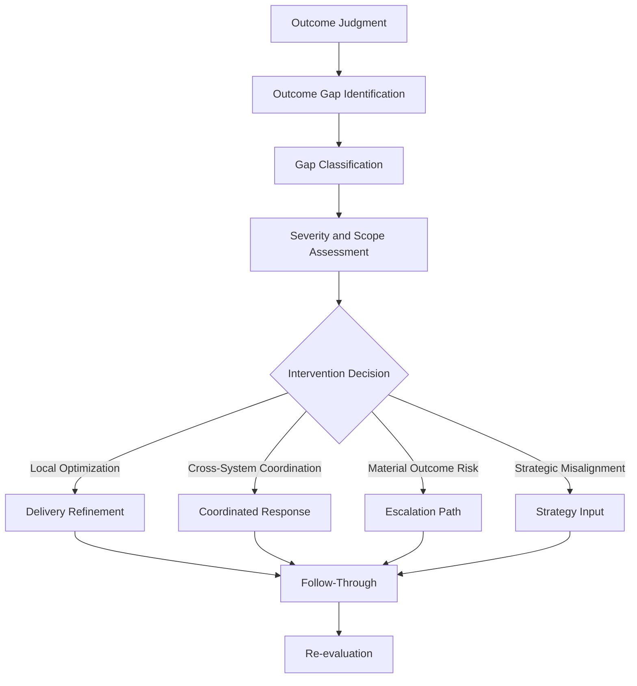
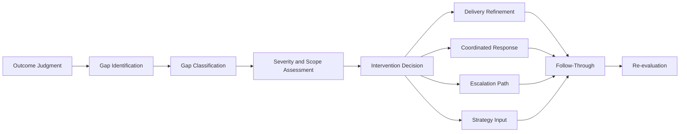

# Outcome Gap and Intervention Model

The **Outcome Gap and Intervention Model** defines the canonical structure and operating logic through which the **Customer Outcomes System** identifies outcome gaps and determines the appropriate intervention response within the **Product Leadership Operating System (PLOS)**.

Where the **Outcome Evaluation Model** defines how outcomes are evaluated and judged, this model defines what happens next — how gaps between intended and actual outcomes are diagnosed, classified, and translated into proportionate, system-aligned responses.

It ensures that outcome gaps do not result in vague concern or reactive action, but instead drive structured, appropriate, and governed intervention.

---

## Purpose

The purpose of this artifact is to:

- define how outcome gaps are identified and structured
- establish how gaps are classified and framed
- determine how intervention needs are identified and routed
- ensure proportional and system-aligned response framing to outcome conditions
- define when issues remain within delivery, when they should inform strategy, and when they should be surfaced to governance for separate prioritization
- translate outcome gaps into structured intervention pathways

This model ensures that the **Customer Outcomes System** produces not only understanding, but **appropriate and controlled response**.

---

## Model Overview

The **Outcome Gap and Intervention Model** operates as a structured response flow:

---

## Model Components

### 1. Outcome Judgment (Input)

The model begins with the output of the **Outcome Evaluation Model**.

Outcome judgment establishes the current outcome state and provides the trigger condition for gap analysis. Canonical judgment states include:

- **Outcome Achieved**
- **Outcome Progressing**
- **Outcome At Risk**
- **Outcome Not Achieved**
- **Unclear Outcome**

Not every judgment requires intervention. However, judgments indicating underperformance, ambiguity, degradation, or material instability should move into structured gap analysis.

This component answers:

> **What current outcome condition are we responding to?**

---

### 2. Outcome Gap Identification

This component identifies where the intended outcome is falling short of expectation.

Outcome gaps may include:

- adoption shortfalls
- engagement-quality gaps
- weak retention or continuity
- delayed or absent value realization
- customer-friction or experience breakdowns
- business-impact underperformance
- unintended negative effects
- segment-specific or context-specific failure patterns

The purpose of this component is to move from general underperformance to specific diagnosis.

Outcome gap identification answers:

> **Where is the intended outcome not being achieved?**

---

### 3. Gap Classification

Once identified, the gap must be classified so that the response can be matched to the nature of the problem.

Classification dimensions may include:

- **gap type** — adoption, engagement, retention, value, experience, business impact, unintended consequence
- **gap origin** — product design, delivery execution, dependency, operational condition, market/context shift, strategic assumption
- **gap containment** — localized, cross-functional, systemic
- **gap duration** — emerging, persistent, chronic

This prevents all gaps from being treated as the same kind of issue.

Gap classification answers:

> **What kind of gap is this, and where does it originate?**

---

### 4. Severity and Scope Assessment

This component determines how serious the gap is and how widely it affects the system.

Assessment considerations include:

- magnitude of performance shortfall
- number of users, customers, or segments affected
- business impact severity
- direction and rate of change
- risk trajectory
- urgency and time sensitivity
- downstream consequences if left unresolved

This component ensures that intervention intensity is proportional to actual exposure.

Severity and scope assessment answers:

> **How serious is the gap, and how broadly does it matter?**

---

### 5. Intervention Decision

This component determines the appropriate response path.

The intervention decision should consider:

- classification of the gap
- severity and scope
- whether the issue remains controllable within delivery
- whether cross-functional coordination is required
- whether escalation or governance involvement is necessary
- whether the gap reflects a strategic rather than operational issue

The decision principle is to route the issue to the **lowest effective level of response**.

Intervention decision answers:

> **What kind of response is required, and where should it occur?**

---

### 6. Delivery Refinement

This response path is used when the gap can be addressed within normal **Product Delivery System** control.

Typical responses may include:

- feature iteration
- workflow optimization
- usability improvements
- product refinements
- configuration or enablement adjustments
- incremental fixes to strengthen value realization

This path preserves delivery accountability when the issue is still solvable through normal product and delivery mechanisms.

Delivery refinement answers:

> **Can this gap be corrected through controlled delivery improvement?**

---

### 7. Coordinated Response

This response path is used when the gap cannot be resolved by the product team alone and requires broader coordination.

Typical coordinated responses may include:

- dependency alignment
- cross-functional process changes
- operational support adjustments
- onboarding or training changes
- communication improvements
- coordination across product, engineering, support, operations, or commercial teams

This path is appropriate when the issue is broader than a local product problem but does not yet require formal escalation or governance intervention.

Coordinated response answers:

> **Does this gap require coordinated adjustment across system boundaries?**

---

### 8. Escalation Path

This response path is used when the outcome gap represents a material outcome risk that exceeds normal delivery or cross-functional coordination capacity.

Typical triggers include:

- sustained or worsening outcome degradation
- material value loss
- inability of local teams to resolve the issue
- broad exposure across customers or segments
- significant release or adoption consequences
- need for formal intervention beyond team authority

This path connects Pillar 5 back into the appropriate escalation mechanisms of the broader operating system.

Escalation answers:

> **Has this gap become material enough to require stronger intervention?**

---

### 9. Strategy Input

This response path is used when the gap indicates a flaw in the original strategic assumption, value hypothesis, or intended outcome framing.

This may include:

- invalidated assumptions
- misdefined target outcome
- weak market fit
- incorrect prioritization logic
- strategic mismatch between capability and need
- structural misunderstanding of customer value

This path ensures that not all outcome gaps are forced back into delivery when the real issue is upstream.

Strategy input answers:

> **Does this gap indicate a strategic issue rather than an execution issue?**

---

### 10. Follow-Through

Every intervention path must produce controlled follow-through.

This includes:

- explicit actions
- named owners
- expected results
- timing expectations
- revalidation criteria
- accountability for execution

This component ensures that intervention is not merely discussed but actually carried out.

Follow-through answers:

> **What actions will be taken, by whom, and by when?**

---

### 11. Re-evaluation

After intervention, the outcome must be re-evaluated through the **Outcome Evaluation Model**.

This confirms:

- whether the gap improved
- whether the intervention produced the intended effect
- whether the issue persists, evolved, or resolved
- whether additional response is required
- whether learning should now be captured

This closes the loop between gap diagnosis, intervention, and renewed outcome understanding.

Re-evaluation answers:

> **Did the intervention improve the outcome condition?**

---

## Operating Logic

### 1. Gap Identification Must Be Explicit

Outcome gaps should not remain vague or implied.

The model requires that gaps be:

- stated clearly
- anchored to intended outcomes
- supported by observable signals
- described specifically enough to enable differentiated response

This prevents outcome underperformance from being treated as general dissatisfaction or narrative concern.

---

### 2. Gaps Must Be Classified Before Action

A gap should not move directly from detection to intervention without classification.

Classification is required because:

- not all gaps come from the same source
- not all gaps need the same response
- some gaps are delivery issues
- some gaps are coordination issues
- some gaps are strategic issues

This protects the system from reactive and misrouted action.

---

### 3. Severity and Scope Should Determine Response Intensity

The model requires response proportionality.

This means:

- small localized gaps should not trigger large-scale intervention
- material and widening gaps should not remain in passive observation
- broader system impact should increase response seriousness
- worsening trajectory should matter as much as current size

This prevents both overreaction and underreaction.

---

### 4. Route to the Lowest Effective Response Level

Intervention should occur at the lowest level capable of resolving the issue.

This means:

- use **delivery refinement** when delivery can solve it
- use **coordinated response** when multiple functions must align
- use **escalation** when the issue exceeds normal authority or control
- use **strategy input** when the issue reflects faulty assumptions or misaligned intent

This preserves accountability and keeps the operating system efficient.

---

### 5. Distinguish Delivery Problems from Strategic Problems

A core rule of the model is that outcome gaps must not automatically be treated as delivery failures.

Some outcome gaps originate from:

- weak product execution
- poor onboarding or operational support
- dependency failures
- flawed positioning
- invalid strategy assumptions
- misdefined value hypotheses

The model exists in part to ensure correct routing across those possibilities.

---

### 6. Intervention Must Produce Action, Not Awareness

A valid intervention decision must result in explicit follow-through.

That means every response should define:

- what will change
- who owns the response
- how success will be judged
- when re-evaluation will occur

Awareness without action is not intervention.

---

### 7. Re-evaluation Is Mandatory

The model requires that intervention be followed by renewed evaluation.

Without re-evaluation:

- the organization cannot confirm whether the action worked
- gaps may persist unnoticed
- learning remains weak
- repeated failure modes cannot be diagnosed clearly

This preserves closed-loop control inside Pillar 5.

---

### 8. Learning Is the Final System Objective

The end state of the model is not merely issue closure. It is structured learning.

This means every meaningful gap and intervention should contribute to:

- validated learning
- invalidated assumptions
- improved future delivery
- improved future outcome definition
- improved governance and strategy decisions

This is how the **Outcomes → Learning** transition remains disciplined and useful.

---

### 9. Relationship to the Five-System Architecture

Within the canonical five-system architecture:

- the **Strategy Execution System** may receive structured inputs when outcome gaps indicate hypothesis failure, value misalignment, or strategic reconsideration
- the **Portfolio Governance System** may receive inputs when outcome gaps imply reprioritization, resource shifts, or portfolio-level intervention beyond delivery authority
- the **Product Delivery System** owns local product refinement and execution-side changes required to address controllable outcome gaps
- the **Customer Outcomes System** owns the identification, classification, severity assessment, intervention logic, and re-evaluation of outcome gaps
- the **Decision Intelligence System** supports the model with measurement, signal visibility, and evidence quality, but it does not determine gap meaning or intervention choice

This preserves the architectural rule that **Decision Intelligence supports — it does not control**.

---

## Supporting Diagram

---

## Why This Matters

Organizations often detect that outcomes are underperforming, but they do not respond in a disciplined way. Gaps are noticed, discussed, and sometimes escalated, yet the actual nature of the problem remains unclear and the response path is often inconsistent.

Without a defined **Outcome Gap and Intervention Model**:

- outcome gaps remain vague or loosely described
- teams respond inconsistently to similar conditions
- delivery teams are asked to solve problems that are actually strategic
- strategic issues are misread as execution failures
- escalation is used too early, too late, or without clear framing
- interventions create activity without resolving the outcome condition
- learning is lost because the response path is not structured

The **Outcome Gap and Intervention Model** matters because it defines how outcome shortfalls become governed response.

It ensures that the organization can move from:

- outcome judgment
- to precise gap diagnosis
- to proportionate intervention
- to follow-through
- to re-evaluation
- to structured learning

This model prevents the **Customer Outcomes System** from becoming a passive observation layer. Instead, it makes Pillar 5 an active control system that determines how outcome problems should be handled across delivery, coordination, escalation, and strategy.

A strong product organization does not merely notice when outcomes are weak. It diagnoses the type of gap, routes the response correctly, and confirms whether intervention improved the condition.

---

## How To Use This

Use this artifact as the canonical model for responding to outcome gaps within the **Customer Outcomes System**.

It should be used when:

- translating outcome evaluation results into action
- identifying where intended outcomes are falling short
- classifying different types of outcome gaps
- determining whether a gap belongs in delivery, coordination, escalation, or strategy
- aligning teams on the correct level of intervention
- building supporting intervention workflows, decision guides, or review routines
- ensuring that outcome response remains proportionate and system-aligned

This model should guide the use of supporting materials such as:

- outcome gap analysis templates
- intervention decision rubrics
- severity and scope assessments
- response-routing guides
- follow-through trackers
- re-evaluation workflows
- learning capture mechanisms

Supporting materials may operationalize this model in greater detail, but they must not redefine the canonical response logic established here.

This artifact is most effective when used together with related **Pillar 5** artifacts, especially:

- **Outcome Evaluation Model**
- **Customer Outcomes System Metrics and Signals**
- **Customer Outcomes System Interfaces**
- **Unified Customer Outcomes System**

In practice, this model should be used to ensure that outcome gaps are handled consistently, proportionately, and with clear accountability across the operating system.

---

## Relationship to the Operating System

This artifact belongs to **Pillar 5 — Customer Outcomes System** within the **Product Leadership Operating System (PLOS)**.

It supports the canonical operating loop:

**Strategy → Governance → Delivery → Outcomes → Learning → Strategy**

Its primary role is to define how the **Customer Outcomes System** responds when evaluated outcomes fall short of intent, show instability, or reveal misalignment.

Its architectural relationship to the broader operating system is as follows:

- it strengthens control discipline within **Outcomes**
- it converts evaluated outcome gaps into explicit response paths
- it determines when issues should return to **Delivery** for refinement
- it determines when issues require broader coordination or escalation
- it determines when issues should inform **Governance** or **Strategy** through structured learning
- it helps preserve the connection between realized value, intervention quality, and future system improvement

Within the canonical five-system architecture:

- the **Strategy Execution System** may receive structured input when gaps indicate flawed assumptions, weak value hypotheses, or strategic misalignment
- the **Portfolio Governance System** may receive input when gaps imply reprioritization, resource shifts, or portfolio-level intervention beyond delivery authority
- the **Product Delivery System** owns the execution of local refinements and delivery-side changes used to address controllable outcome gaps
- the **Customer Outcomes System** owns gap identification, classification, severity assessment, intervention logic, and re-evaluation
- the **Decision Intelligence System** provides the measurement, signal visibility, and evidence quality needed to support the model, but it does not determine gap meaning or intervention choice

This artifact does not introduce a new system, alter the operating loop, or redefine adjacent system responsibilities. It exists to define the canonical response mechanism for outcome gaps inside the **Customer Outcomes System**.

---

## Summary

The **Outcome Gap and Intervention Model** defines the canonical structure and operating logic through which the **Customer Outcomes System** identifies outcome gaps and determines the appropriate intervention response.

It ensures that outcome gaps:

- are identified explicitly
- are classified before action is taken
- are assessed for severity and scope
- are routed to the lowest effective response level
- produce concrete follow-through
- are re-evaluated after intervention
- generate structured learning for the broader operating system

This model reinforces the principle that outcome shortfalls are not self-correcting and should not be handled through vague concern or inconsistent action. They must be diagnosed, routed, acted on, and re-evaluated through a disciplined and repeatable process.

Within the **Product Leadership Operating System**, this artifact serves as the canonical model for turning outcome gaps into governed intervention and system learning.

---

## License

This project is licensed under the MIT License. See the [LICENSE](LICENSE) file for details.
