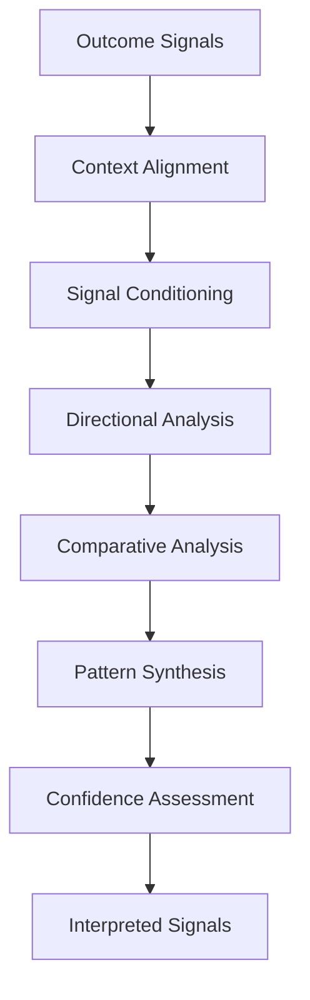
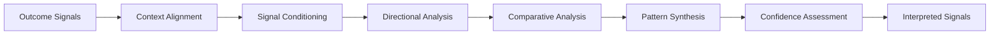

# Outcome Signal Interpretation Model

The **Outcome Signal Interpretation Model** defines the canonical structure and operating logic through which the **Customer Outcomes System** interprets outcome signals to determine their meaning within the **Product Leadership Operating System (PLOS)**.

Where the **Customer Outcomes System Metrics and Signals** define the signal layer and the **Outcome Evaluation Model** defines how interpreted signals are evaluated into outcome judgments, this model defines the critical middle step — how raw signals are translated into meaningful, reliable, and context-aware interpretation.

It ensures that signals do not remain raw data points or superficial indicators, but are consistently interpreted into actionable understanding.

---

## Purpose

The purpose of this artifact is to:

- define how outcome signals are interpreted in a structured way
- establish how context shapes signal meaning
- ensure consistent interpretation across teams and time
- prevent misinterpretation based on isolated or misleading signals
- define how multiple signals are combined into coherent understanding
- provide a bridge between measurement and evaluation

This model ensures that the **Customer Outcomes System** operates on **interpreted signals**, not raw metrics or unstructured observations.

---

## Model Overview

The **Outcome Signal Interpretation Model** operates as a structured interpretation flow:

---

## Model Components

### 1. Outcome Signals (Input)

The model begins with structured outcome signals defined in the **Customer Outcomes System Metrics and Signals** artifact.

These signals may include:

- adoption behavior
- engagement patterns
- retention and continuity
- value realization indicators
- experience signals
- business impact indicators
- unintended consequence signals

At this stage, signals are available for interpretation, but they are not yet meaningful on their own. They are observed indicators, not finished judgments.

This component answers:

> **What signals are available to interpret?**

---

### 2. Context Alignment

Signals must be aligned to the correct context before interpretation can occur.

Context includes:

- intended outcome definition
- expected direction of movement
- baseline state
- timeframe and maturity stage
- release scope and rollout conditions
- segment, cohort, or user context
- external factors, constraints, or known confounding conditions

This component prevents the same signal from being interpreted the same way in every situation. A signal that is positive in one context may be neutral or concerning in another.

This component answers:

> **What should these signals mean in this specific situation?**

---

### 3. Signal Conditioning

Signals must be conditioned so that interpretation is based on usable evidence rather than distorted or unreliable inputs.

Signal conditioning includes:

- validating data quality
- filtering obvious noise
- normalizing across time periods, cohorts, or segments where appropriate
- identifying incomplete or inconsistent data
- flagging anomalies and outliers
- recognizing measurement limitations

This step protects the model from false precision and unstable interpretation.

This component answers:

> **Are these signals reliable enough to interpret?**

---

### 4. Directional Analysis

This component determines the direction and movement of signals over time.

Directional analysis includes:

- improving vs declining vs stable movement
- rate of change
- acceleration or deceleration
- early movement vs sustained movement
- temporary fluctuation vs meaningful trend

This step establishes whether outcome conditions appear to be strengthening, weakening, or remaining static.

This component answers:

> **How are these signals changing over time?**

---

### 5. Comparative Analysis

Signals must be compared against relevant reference points.

Comparative analysis includes:

- baseline vs current state
- expected vs observed movement
- cohort comparisons
- segment comparisons
- historical comparisons
- release-phase comparisons where relevant

This prevents interpretation from relying on isolated point-in-time readings without reference.

This component answers:

> **How do these signals compare to what we expected or previously observed?**

---

### 6. Pattern Synthesis

This component integrates multiple interpreted signals into a coherent pattern.

Pattern synthesis includes:

- identifying reinforcing signals
- identifying conflicting signals
- evaluating cross-category relationships
- detecting dominant patterns across signal groups
- separating broader trends from isolated anomalies
- determining whether the overall pattern is coherent or mixed

This is where interpretation moves from individual signal reading into system-level meaning.

This component answers:

> **What broader pattern do the signals form together?**

---

### 7. Confidence Assessment

Interpretation must include explicit confidence.

Confidence assessment includes:

- data completeness and quality
- signal stability vs volatility
- adequacy of sample size
- consistency across signals
- strength of the observed pattern
- degree of ambiguity or uncertainty

This ensures that interpretation does not imply more certainty than the evidence supports.

This component answers:

> **How confident are we in this interpretation?**

---

### 8. Interpreted Signals (Output)

The output of this model is a set of interpreted signals that are:

- context-aware
- reliability-conditioned
- directionally understood
- comparatively evaluated
- pattern-synthesized
- confidence-qualified

These interpreted signals become the input to the **Outcome Evaluation Model**.

This component answers:

> **What do the signals actually mean?**

---

## Operating Logic

### 1. Signals Must Not Be Used Raw

Raw metrics or observed signal points should not move directly into evaluation or decision-making.

They must first be:

- aligned to context
- conditioned for reliability
- interpreted for direction and comparison
- synthesized into broader meaning

This prevents the organization from confusing visibility with understanding.

---

### 2. Context Defines Meaning

Signal meaning depends on context.

The same signal may mean different things depending on:

- product maturity
- rollout timing
- user segment
- expected adoption curve
- baseline conditions
- external constraints

Interpretation therefore cannot be separated from the intended outcome and operating conditions.

---

### 3. Interpretation Is Multi-Step

Interpretation is not a single analytical act. It requires several distinct operations:

- contextualization
- conditioning
- directional reading
- comparative reading
- synthesis
- confidence assessment

Skipping steps weakens interpretation quality and increases the risk of false conclusions.

---

### 4. Signals Must Be Interpreted Together

No single signal should determine overall meaning by itself.

Interpretation should consider:

- reinforcing signals
- contradicting signals
- missing signals
- category interaction
- broader system behavior

This prevents overreaction to isolated movements and improves the reliability of downstream evaluation.

---

### 5. Confidence Must Be Explicit

The model requires confidence to be stated, not implied.

This matters because:

- some signals are noisy
- some patterns are immature
- some movements are ambiguous
- some interpretations are provisional

Explicit confidence helps the organization distinguish between strong interpretation, tentative interpretation, and insufficient evidence.

---

### 6. Interpretation Precedes Evaluation

This model sits between signal observation and outcome evaluation.

The canonical sequence is:

**Metrics → Signals → Interpretation → Evaluation → Learning**

This means the **Outcome Evaluation Model** should operate on interpreted signals, not raw signals.

---

### 7. Interpretation Must Be Consistent

The same interpretation logic should be applied consistently across:

- teams
- products
- business units
- time periods

This enables comparability and prevents fragmentation in how outcome meaning is understood.

---

### 8. Interpretation Supports Judgment, But Does Not Replace It

Interpretation does not itself produce the final outcome judgment.

It produces the structured understanding required for outcome evaluation.

This preserves the internal layering inside Pillar 5:

- **Signal Interpretation Model** = meaning formation
- **Outcome Evaluation Model** = judgment formation

---

### 9. Relationship to the Five-System Architecture

Within the canonical five-system architecture:

- the **Strategy Execution System** defines the intended outcomes and expectations that provide context for interpretation
- the **Portfolio Governance System** may later rely on interpreted and evaluated outcome evidence to inform portfolio decisions
- the **Product Delivery System** produces the released capabilities whose real-world behavior generates the observed signals
- the **Customer Outcomes System** owns the interpretation of outcome signals as part of outcome understanding
- the **Decision Intelligence System** provides measurement, signal visibility, and data quality support, but it does not determine signal meaning

This preserves the architectural rule that **Decision Intelligence supports — it does not control**.

---

## Supporting Diagram

---

## Why This Matters

Organizations often collect large amounts of outcome-related data without establishing a disciplined way to interpret what those signals actually mean. As a result, teams may react to dashboards, anecdotes, or isolated movements without understanding whether those signals indicate real improvement, temporary fluctuation, emerging risk, or simple noise.

Without a defined **Outcome Signal Interpretation Model**:

- signals are interpreted inconsistently across teams
- isolated metrics are overemphasized
- context is ignored or applied unevenly
- noise is mistaken for signal
- conflicting signals are not reconciled well
- confidence is assumed rather than assessed
- downstream outcome evaluation becomes unreliable

The **Outcome Signal Interpretation Model** matters because it creates a governed interpretation layer between measurement and evaluation.

It ensures that the organization can move from:

- observed signals
- to contextual understanding
- to comparative meaning
- to synthesized patterns
- to confidence-qualified interpretation
- to reliable outcome evaluation

This model prevents the **Customer Outcomes System** from collapsing into raw analytics consumption. Instead, it ensures that Pillar 5 interprets signals deliberately, consistently, and in a way that supports better outcome judgment and learning.

A strong product organization does not merely see signals. It understands what they mean, how confident it should be in that meaning, and how that interpretation should inform broader outcome evaluation.

---

## How To Use This

Use this artifact as the canonical model for interpreting outcome signals within the **Customer Outcomes System**.

It should be used when:

- interpreting post-release outcome signals
- aligning teams on how signals should be read in context
- preventing inconsistent or premature interpretation of dashboards and metrics
- preparing inputs for outcome evaluation
- distinguishing real patterns from isolated movement or noise
- building supporting interpretation templates, workflows, or review routines
- improving the consistency and quality of outcome understanding across the organization

This model should guide the use of supporting materials such as:

- signal interpretation templates
- context-alignment checklists
- confidence assessment rubrics
- comparative analysis guides
- outcome review preparation materials
- signal synthesis workflows

Supporting materials may operationalize this model in greater detail, but they must not redefine the canonical interpretation logic established here.

This artifact is most effective when used together with related **Pillar 5** artifacts, especially:

- **Customer Outcomes System Metrics and Signals**
- **Outcome Evaluation Model**
- **Outcome Gap and Intervention Model**
- **Unified Customer Outcomes System**

In practice, this model should be used to ensure that signal interpretation remains disciplined, comparable, and reliable before signals are turned into outcome judgments or intervention decisions.

---

## Relationship to the Operating System

This artifact belongs to **Pillar 5 — Customer Outcomes System** within the **Product Leadership Operating System (PLOS)**.

It supports the canonical operating loop:

**Strategy → Governance → Delivery → Outcomes → Learning → Strategy**

Its primary role is to define how outcome signals are interpreted during the **Outcomes** phase so that the organization can translate raw measurement into structured understanding before formal evaluation occurs.

Its architectural relationship to the broader operating system is as follows:

- it strengthens interpretive discipline within **Outcomes**
- it converts observed signals into context-aware meaning
- it provides reliable interpretive inputs to the **Outcome Evaluation Model**
- it helps prevent weak interpretation from distorting downstream intervention, governance input, or strategic learning
- it preserves the connection between measurement, meaning, evaluation, and learning

Within the canonical five-system architecture:

- the **Strategy Execution System** provides the intended outcomes, expectations, and value hypotheses that contextualize interpretation
- the **Portfolio Governance System** may later rely on interpreted and evaluated outcome evidence to inform prioritization, continuation, or adjustment decisions
- the **Product Delivery System** provides the released capabilities whose real-world behavior generates the signals being interpreted
- the **Customer Outcomes System** owns signal interpretation as part of outcome understanding
- the **Decision Intelligence System** provides measurement, visibility, and data-quality support, but it does not determine signal meaning

This artifact does not introduce a new system, alter the operating loop, or redefine adjacent system responsibilities. It exists to define the canonical interpretation mechanism inside the **Customer Outcomes System**.

---

## Summary

The **Outcome Signal Interpretation Model** defines the canonical structure and operating logic through which the **Customer Outcomes System** interprets outcome signals before they are evaluated into formal outcome judgments.

It ensures that signal interpretation:

- begins with structured outcome signals
- aligns those signals to the correct context
- conditions them for reliability
- evaluates their direction and comparison points
- synthesizes broader patterns across signals
- makes confidence explicit
- produces interpreted signals suitable for evaluation

This model reinforces the principle that outcome signals are not self-explanatory. They must be translated through a disciplined and repeatable interpretation process before they can support reliable outcome judgment, intervention, and learning.

Within the **Product Leadership Operating System**, this artifact serves as the canonical model for turning observed outcome signals into structured interpretive understanding.

---

## License

This project is licensed under the MIT License. See the [LICENSE](LICENSE) file for details.
