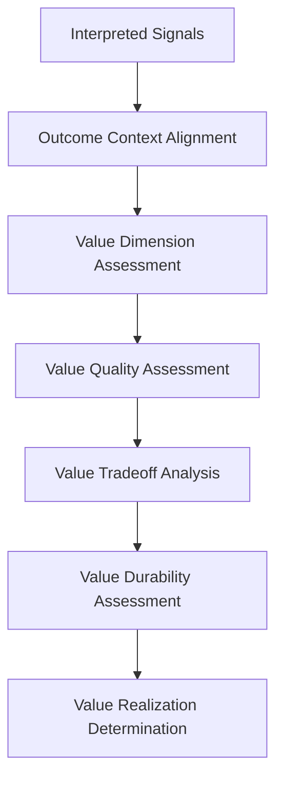
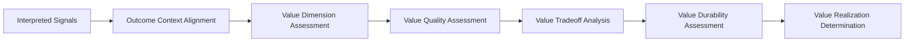

# Value Realization Model

The **Value Realization Model** defines the canonical structure and operating logic through which the **Customer Outcomes System** determines whether delivered capabilities produce meaningful customer and business value within the **Product Leadership Operating System (PLOS)**.

Where the **Outcome Evaluation Model** defines how outcomes are evaluated and judged, this model defines the core evaluative standard within that process — how value is identified, assessed, qualified, and validated.

It ensures that outcome evaluation does not stop at signal interpretation or directional movement, but explicitly determines whether **real value is being created, sustained, and aligned with intent**.

---

## Purpose

The purpose of this artifact is to:

- define how value realization is assessed within outcome evaluation
- establish the dimensions of customer and business value
- ensure that value is evaluated beyond activity or usage
- distinguish between signal improvement and actual value creation
- define how value quality, durability, and tradeoffs are assessed
- support consistent determination of whether outcomes truly matter

This model ensures that the **Customer Outcomes System** evaluates not just what changed, but **whether what changed is meaningful**.

---

## Model Overview

The **Value Realization Model** operates as a structured assessment flow:

---

## Model Components

### 1. Interpreted Signals (Input)

The model begins with interpreted signals produced by the **Outcome Signal Interpretation Model**.

These interpreted signals provide structured understanding of:

- adoption and usage behavior
- engagement depth and continuity
- retention and persistence patterns
- value-related performance indicators
- experience and satisfaction movement
- business-impact signals
- unintended consequence signals

At this stage, the signals have already been contextualized and interpreted, but they have not yet been converted into a formal value determination.

This component answers:

> **What interpreted signals suggest potential value creation or value shortfall?**

---

### 2. Outcome Context Alignment

Value must be assessed relative to intended outcomes and explicit expectations.

Context alignment includes:

- intended outcome definition
- customer value hypothesis
- business value hypothesis
- expected benefit and impact
- baseline conditions
- timeframe and maturity stage
- rollout conditions
- segment or cohort context
- known constraints or confounding conditions

This ensures that value is not judged in isolation or redefined after the fact. Value must be evaluated against what the organization intended to create.

This component answers:

> **What value was intended, and under what conditions should it be assessed?**

---

### 3. Value Dimension Assessment

This component evaluates value across the primary dimensions that matter inside the **Customer Outcomes System**.

Canonical value dimensions include:

#### Customer Value

- successful completion of important tasks
- reduced friction, effort, or time
- increased effectiveness or capability
- improved experience or satisfaction
- stronger continuity of use because the capability is genuinely useful

#### Business Value

- revenue contribution or growth
- conversion improvement
- retention or expansion effect
- cost efficiency or avoided loss
- stronger market, product, or portfolio position

This step ensures that value is not narrowly interpreted through one metric or one perspective.

This component answers:

> **What kinds of value appear to be present?**

---

### 4. Value Quality Assessment

This component evaluates the quality and meaningfulness of the value being observed.

Value quality includes:

- depth of value rather than surface activity
- clarity of benefit to customers or the business
- consistency of value across users, cohorts, or contexts
- strength of alignment with the intended outcome
- distinction between marginal improvement and meaningful change

This is where the model separates real value from shallow signal movement.

This component answers:

> **How strong, meaningful, and aligned is the value being created?**

---

### 5. Value Tradeoff Analysis

Value realization often includes tradeoffs that must be made explicit.

Tradeoff analysis includes:

- customer value gained vs business value gained
- short-term gain vs long-term sustainability
- benefit vs complexity or cost
- value in one segment vs degradation in another
- positive movement vs unintended negative effects
- localized improvement vs broader system impact

This step prevents the model from overstating value when improvement in one dimension creates hidden loss elsewhere.

This component answers:

> **What tradeoffs accompany the value being realized?**

---

### 6. Value Durability Assessment

This component determines whether observed value appears durable or temporary.

Durability assessment includes:

- persistence of value signals over time
- retention and continued use
- stability vs volatility of the benefit
- repeatability of the value in normal operating conditions
- dependence on temporary conditions, incentives, or novelty
- likelihood that the realized benefit will continue

This step protects the model from declaring success too early.

This component answers:

> **Is the value durable enough to count as real realization?**

---

### 7. Value Realization Determination

This component produces the explicit value realization state.

Canonical value realization states include:

- **Strong Value Realization** — meaningful, sustained, and aligned value is being created
- **Emerging Value** — positive value signals exist but are not yet fully mature or stable
- **Partial Value** — some dimensions of value are being realized while others remain weak or absent
- **Weak Value** — only limited or marginal value is being created
- **No Value Realization** — intended value is not being achieved
- **Unclear Value** — evidence is insufficient, immature, or conflicting

This component converts the prior analysis into a clear and usable determination.

This component answers:

> **Is meaningful value actually being realized, and to what degree?**

---

## Operating Logic

### 1. Value Is the Core Standard of Outcome Success

The central purpose of Pillar 5 is not to confirm that customers used something or that a metric moved. It is to determine whether meaningful value was created.

This means the model must continuously return to the question:

- did the delivered capability create meaningful benefit
- for whom
- in what form
- with what strength
- for how long

Signal movement without value realization is not sufficient.

---

### 2. Value Must Be Assessed Against Intended Outcomes

Value cannot be defined after the fact based only on whatever improved.

The model requires alignment to:

- intended outcome definition
- original value hypothesis
- expected customer benefit
- expected business benefit
- declared success conditions

This prevents opportunistic reinterpretation of success and keeps assessment anchored to intent.

---

### 3. Value Assessment Must Be Multi-Dimensional

Real value is rarely one-dimensional.

The model therefore requires explicit consideration of:

- customer value
- business value
- experiential value
- operational or strategic value where relevant
- unintended negative effects

This prevents narrow judgments based on one attractive metric while ignoring broader value weakness.

---

### 4. Value Quality Matters More Than Movement Alone

The model distinguishes between:

- activity
- improvement
- meaningful value

Some signal movement may be real but still shallow, fragile, or low consequence. The model requires judgment about the quality of the value, not just the existence of signal change.

This protects the organization from false positives.

---

### 5. Tradeoffs Must Be Evaluated Explicitly

A capability may create value in one area while creating cost or damage in another.

The model therefore requires explicit examination of:

- who benefits
- who may be negatively affected
- whether gains are offset by hidden costs
- whether one value dimension is being improved at the expense of another
- whether net value remains positive

This ensures value realization is assessed systemically rather than selectively.

---

### 6. Durability Determines Whether Value Is Truly Realized

Short-lived benefit is not the same as sustained value realization.

The model requires evaluation of:

- stability over time
- repeated evidence of benefit
- persistence beyond novelty or launch effects
- continuity across cohorts or contexts
- resilience under normal operating conditions

This prevents the organization from confusing early promise with realized value.

---

### 7. Value Realization States Must Be Explicit

The model requires a clear value determination.

It is not enough to say:

- “there are some positive signs”
- “customers seem to like it”
- “metrics are trending in the right direction”

Instead, the organization must explicitly determine whether value is:

- strong
- emerging
- partial
- weak
- absent
- unclear

This creates a stable basis for outcome judgment, intervention, and learning.

---

### 8. Value Assessment Informs Outcome Evaluation, Not Separate It

The **Value Realization Model** is not a standalone decision system. It is a core evaluative mechanism inside Pillar 5.

Its output directly supports:

- **Outcome Evaluation Model** judgments
- identification of value-related outcome gaps
- intervention routing in the **Outcome Gap and Intervention Model**
- structured learning about what creates or fails to create value

This preserves the internal coherence of the **Customer Outcomes System**.

---

### 9. Relationship to the Five-System Architecture

Within the canonical five-system architecture:

- the **Strategy Execution System** defines the intended value and outcome hypotheses against which realization is assessed
- the **Portfolio Governance System** may later use value realization evidence to support continuation, reprioritization, or investment adjustment decisions
- the **Product Delivery System** provides the delivered capabilities whose real-world value is now being assessed
- the **Customer Outcomes System** owns the assessment of value dimensions, quality, tradeoffs, durability, and final value realization determination
- the **Decision Intelligence System** provides the measurements, signal visibility, and supporting analytics needed for assessment, but it does not determine what counts as value

This preserves the architectural rule that **Decision Intelligence supports — it does not control**.

---

## Supporting Diagram

---

## Why This Matters

Organizations frequently confuse activity, adoption, or positive signal movement with actual value creation. A product may be used, discussed, or even liked, yet still fail to create meaningful customer benefit or durable business impact. Without a defined **Value Realization Model**, teams often overstate success based on partial evidence, shallow usage, or short-term movement that does not hold over time.

Without this model:

- usage is mistaken for value
- signal improvement is mistaken for meaningful impact
- customer benefit and business benefit are not evaluated together
- tradeoffs remain hidden
- short-term gains are overvalued
- weak or partial value is misread as success
- downstream outcome judgment becomes unreliable

The **Value Realization Model** matters because it creates a disciplined way to determine whether outcomes actually matter.

It ensures that the organization can move from:

- interpreted signals
- to value assessment
- to quality evaluation
- to tradeoff analysis
- to durability judgment
- to explicit value realization determination

This model prevents the **Customer Outcomes System** from treating observable movement as sufficient proof of success. Instead, it enforces the principle that outcome success depends on whether meaningful value is being created, sustained, and aligned to intent.

A strong product organization does not merely ask whether something changed. It asks whether the change created real value for customers, for the business, and over time.

---

## How To Use This

Use this artifact as the canonical model for assessing value realization within the **Customer Outcomes System**.

It should be used when:

- determining whether observed outcomes reflect meaningful value
- distinguishing between activity, improvement, and true value realization
- assessing value across customer and business dimensions
- evaluating whether observed value is strong, partial, weak, or unclear
- identifying tradeoffs that complicate apparent success
- judging whether value is durable or temporary
- supporting explicit outcome judgment and downstream intervention decisions
- building supporting value assessment templates, review flows, or decision guides

This model should guide the use of supporting materials such as:

- value realization assessment templates
- customer and business value review checklists
- tradeoff analysis tools
- durability tracking frameworks
- value hypothesis validation workflows
- outcome review preparation materials

Supporting materials may operationalize this model in greater detail, but they must not redefine the canonical value assessment logic established here.

This artifact is most effective when used together with related **Pillar 5** artifacts, especially:

- **Outcome Signal Interpretation Model**
- **Outcome Evaluation Model**
- **Outcome Gap and Intervention Model**
- **Customer Outcomes System Metrics and Signals**
- **Unified Customer Outcomes System**

In practice, this model should be used to ensure that value realization remains explicit, comparable, and grounded in meaningful impact rather than superficial movement.

---

## Relationship to the Operating System

This artifact belongs to **Pillar 5 — Customer Outcomes System** within the **Product Leadership Operating System (PLOS)**.

It supports the canonical operating loop:

**Strategy → Governance → Delivery → Outcomes → Learning → Strategy**

Its primary role is to define how value is assessed during the **Outcomes** phase so that the organization can determine whether delivered capabilities are creating meaningful benefit and whether that benefit is sufficient to count as real outcome success.

Its architectural relationship to the broader operating system is as follows:

- it strengthens the evaluative discipline within **Outcomes**
- it provides the core value standard used inside outcome evaluation
- it helps distinguish between signal movement and meaningful impact
- it helps identify when weak, partial, or absent value should trigger further diagnosis or intervention
- it supports structured learning about what types of delivery actually create meaningful customer and business benefit
- it helps preserve the connection between intended outcomes, realized value, and future strategic refinement

Within the canonical five-system architecture:

- the **Strategy Execution System** defines the intended value and outcome hypotheses against which realized value is assessed
- the **Portfolio Governance System** may later use value realization evidence to support continuation, adjustment, or investment reprioritization decisions
- the **Product Delivery System** provides the released capabilities whose real-world value is being assessed
- the **Customer Outcomes System** owns the assessment of value dimensions, quality, tradeoffs, durability, and explicit value realization determination
- the **Decision Intelligence System** provides measurement, signal visibility, and supporting analytics, but it does not determine what counts as value

This artifact does not introduce a new system, alter the operating loop, or redefine adjacent system responsibilities. It exists to define the canonical value-assessment mechanism inside the **Customer Outcomes System**.

---

## Summary

The **Value Realization Model** defines the canonical structure and operating logic through which the **Customer Outcomes System** determines whether delivered capabilities are creating meaningful customer and business value.

It ensures that value realization assessment:

- begins with interpreted signals
- aligns value assessment to intended outcomes
- evaluates multiple value dimensions
- distinguishes shallow movement from meaningful value
- makes tradeoffs explicit
- assesses durability over time
- produces an explicit value realization state

This model reinforces the principle that outcomes are not successful merely because something improved. They are successful when meaningful value is created, sustained, and aligned with intent.

Within the **Product Leadership Operating System**, this artifact serves as the canonical model for determining whether delivered work is producing real value rather than merely observable activity.

---

## License

This project is licensed under the MIT License. See the [LICENSE](LICENSE) file for details.
    
