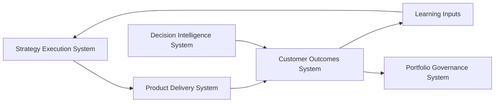

# Customer Outcomes System Interfaces

The **Customer Outcomes System Interfaces** define the canonical interaction points between the **Customer Outcomes System** and the other systems within the **Product Leadership Operating System (PLOS)**.

Where the **Unified Customer Outcomes System** defines the internal structure and operating logic of outcome evaluation, this artifact defines how the system exchanges signals, context, evaluative outputs, and learning inputs with adjacent systems across the operating loop.

It ensures that the **Customer Outcomes System** remains properly integrated into the broader architecture while preserving clear system boundaries, ownership, and responsibilities.

---

## Purpose

The purpose of this artifact is to:

- define how the **Customer Outcomes System** connects to other systems in PLOS
- establish clear boundaries between outcome evaluation and adjacent responsibilities
- define what inputs the system requires and what outputs it produces
- ensure consistent interpretation and routing of outcome signals
- prevent overlap, ambiguity, or system drift across pillars

This artifact ensures that outcome evaluation is not isolated, but also not conflated with delivery, governance, strategy, or decision intelligence.

---

## Interface Overview

The **Customer Outcomes System** interfaces with four primary systems:

1. **Product Delivery System (Upstream)**
2. **Strategy Execution System (Downstream via Learning)**
3. **Portfolio Governance System (Indirect via Learning and Escalation)**
4. **Decision Intelligence System (Supporting System)**

Each interface defines:

- inputs received
- outputs produced
- boundary conditions
- interaction purpose

---

## 1. Interface with Product Delivery System

### Purpose

To receive released capabilities and initial delivery context required to evaluate real-world outcomes.

---

### Inputs from Product Delivery System

The **Customer Outcomes System** receives:

- released product capabilities
- release scope and intended outcome definitions
- delivery context (what was built, why, and expected impact)
- release timing and rollout conditions
- known limitations, exceptions, or constraints at release
- early operational signals where relevant

---

### Outputs to Product Delivery System

The **Customer Outcomes System** provides:

- outcome performance signals
- identified outcome gaps
- evidence of value realization or degradation
- signals indicating unintended consequences
- recommendations for iteration or adjustment
- inputs for continued delivery refinement

---

### Boundary Rules

- the **Product Delivery System** owns execution and release
- the **Customer Outcomes System** owns outcome evaluation
- the **Customer Outcomes System does not execute delivery changes**
- delivery adjustments must flow back through **Delivery control mechanisms**

---

## 2. Interface with Strategy Execution System

### Purpose

To provide validated learning that informs strategic refinement and future outcome definition.

---

### Inputs from Strategy Execution System

The **Customer Outcomes System** receives:

- intended outcomes and value hypotheses
- strategic objectives and priorities
- definitions of success and expected impact
- assumptions underlying strategic decisions

---

### Outputs to Strategy Execution System

The **Customer Outcomes System** provides:

- validated or invalidated outcome hypotheses
- evidence of actual outcome performance
- insight into customer behavior and value realization
- identification of strategic misalignment or opportunity
- learning inputs that inform future strategy definition

---

### Boundary Rules

- the **Strategy Execution System** defines intended outcomes
- the **Customer Outcomes System** evaluates actual outcomes
- the **Customer Outcomes System does not define strategy**
- strategy changes occur through formal strategy processes

---

## 3. Interface with Portfolio Governance System

### Purpose

To inform governance decisions with evidence of outcome performance and value realization.

---

### Inputs from Portfolio Governance System

The **Customer Outcomes System** may receive:

- approved investment decisions and priorities
- portfolio-level outcome expectations
- governance-defined success criteria
- constraints or tradeoffs affecting delivery and outcomes

---

### Outputs to Portfolio Governance System

The **Customer Outcomes System** provides:

- outcome performance evidence across investments
- identification of underperforming or overperforming initiatives
- signals indicating need for reprioritization or reallocation
- evidence supporting continuation, adjustment, or termination decisions
- inputs for portfolio review and rebalance

---

### Boundary Rules

- the **Portfolio Governance System** owns prioritization and investment decisions
- the **Customer Outcomes System** provides evidence, not decisions
- governance actions are taken through governance forums, not within outcomes evaluation

---

## 4. Interface with Decision Intelligence System

### Purpose

To leverage data, analytics, and signal visibility required for outcome evaluation.

---

### Inputs from Decision Intelligence System

The **Customer Outcomes System** receives:

- structured data and metrics
- dashboards and reporting views
- signal collection and instrumentation
- analytics outputs and visualizations
- trend analysis and segmentation capabilities

---

### Outputs to Decision Intelligence System

The **Customer Outcomes System** provides:

- requirements for signal definition and measurement
- interpretation context for signals
- feedback on signal quality and gaps
- refinement needs for data collection and visibility
- prioritization of metrics aligned to outcome evaluation

---

### Boundary Rules

- the **Decision Intelligence System** provides data and visibility
- the **Customer Outcomes System** interprets and evaluates meaning
- **Decision Intelligence does not determine outcome judgment**
- **Customer Outcomes does not build analytics infrastructure**

---

## Interface Interaction Model

The **Customer Outcomes System** operates as a central evaluation layer within the operating loop:

---

## Interface Design Principles

### 1. Clear Ownership

Each system retains ownership of its domain:

- **Strategy Execution System** defines intended outcomes, value hypotheses, and strategic direction
- **Portfolio Governance System** governs prioritization, investment decisions, and portfolio tradeoffs
- **Product Delivery System** owns execution, release, and delivery control
- **Customer Outcomes System** owns outcome evaluation, value realization assessment, and learning generation
- **Decision Intelligence System** provides data, measurement, analytics, and signal visibility

Clear ownership prevents the **Customer Outcomes System** from drifting into delivery execution, governance decision-making, strategic definition, or analytics-platform responsibility.

---

### 2. No System Overlap

Interfaces must connect systems without collapsing them into one another.

The **Customer Outcomes System** must not:

- execute delivery work
- make governance decisions
- define strategy
- replace analytics infrastructure
- become a generic reporting layer

Likewise, adjacent systems must not absorb outcome interpretation simply because they provide related inputs. Delivery may provide release context, governance may define outcome expectations, strategy may define intent, and Decision Intelligence may provide visibility, but the **Customer Outcomes System** remains the system responsible for evaluating what actually happened and what it means.

---

### 3. Evidence-Based Exchange

All interface exchanges should be grounded in explicit evidence rather than narrative impression alone.

This means interface flows should rely on:

- observable outcome signals
- structured evaluation inputs
- explicit interpretation logic
- clearly stated implications
- traceable learning outputs

The purpose of this principle is to ensure that movement across system boundaries remains disciplined, reviewable, and useful for decision-making.

---

### 4. Bidirectional Learning Flow

Interfaces are not purely one-directional handoffs. They must support closed-loop learning across the operating system.

This means:

- **Product Delivery System** provides released capabilities and release context to the **Customer Outcomes System**
- **Customer Outcomes System** provides outcome evidence and adjustment inputs back toward delivery refinement
- **Customer Outcomes System** provides validated learning into strategy and governance processes
- **Decision Intelligence System** supports visibility, while receiving refinement needs from outcome interpretation

This principle ensures that the operating loop remains alive and adaptive rather than becoming a sequence of disconnected functional stages.

---

### 5. Consistent Signal Translation

Signals must be translated consistently across interfaces so that outcome evaluation remains stable over time.

This means signals should be:

- defined against intended outcomes
- interpreted using consistent logic
- comparable across time periods or cohorts where appropriate
- connected to value realization rather than isolated activity
- translated into implications that adjacent systems can act on without ambiguity

This prevents interface breakdowns in which one system measures activity, another system assumes meaning, and no system owns the interpretation of actual outcomes.

---

## Summary

The **Customer Outcomes System Interfaces** define how the **Customer Outcomes System** connects to the broader **Product Leadership Operating System (PLOS)** while preserving clear system boundaries and responsibilities.

They ensure that:

- outcome evaluation receives the inputs it needs from delivery, strategy, governance, and decision support
- outcome insights are routed back into delivery refinement, governance evidence, and strategic learning
- interpretation remains distinct from measurement
- system ownership remains explicit
- the operating loop remains connected, evidence-based, and governable

This artifact ensures that the **Customer Outcomes System** functions as an integrated architectural system rather than as an isolated analysis layer, enabling the organization to consistently translate delivery into value understanding and structured learning.

---

## License

This project is licensed under the MIT License. See the [LICENSE](LICENSE) file for details.
