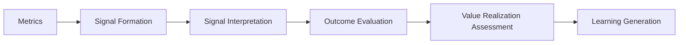

# Customer Outcomes System Metrics and Signals

The **Customer Outcomes System Metrics and Signals** define the canonical structure through which outcome performance is observed, measured, and evaluated within the **Customer Outcomes System** of the **Product Leadership Operating System (PLOS)**.

Where the **Unified Customer Outcomes System** defines the system responsible for evaluating real-world performance and value realization, this artifact defines the **signal layer** that enables that evaluation to occur in a structured, consistent, and interpretable way.

It explains what signals matter, how they are structured, and how they connect to downstream interpretation, value qualification, outcome evaluation, and learning generation.

This layer provides **evidence inputs only**. It does not determine meaning, value, or judgment.

---

## Purpose

The purpose of this artifact is to:

- define the canonical set of outcome-oriented signals used for evaluation
- distinguish outcome signals from delivery activity or operational metrics
- establish how signals are structured and categorized for downstream interpretation
- ensure consistency in how outcome performance is measured across the system
- support meaningful outcome evaluation and value realization assessment
- enable reliable input into learning and strategic refinement

This artifact ensures that the **Customer Outcomes System** operates on **structured, interpretable signals** rather than fragmented or inconsistent metrics.

---

## Signal Philosophy

### Outcomes Over Activity

Signals in this system must represent **real-world effects**, not internal activity.

- ❌ tasks completed
- ❌ features shipped
- ❌ velocity or throughput

- ✅ behavior change
- ✅ adoption patterns
- ✅ value realization
- ✅ customer impact

---

### Signals vs Metrics

- **Metrics** are quantified measurements  
- **Signals** are interpreted indicators derived from one or more metrics

The **Customer Outcomes System** operates on **signals**, not raw metrics.

This ensures that evaluation focuses on meaning rather than measurement alone.

---

### Measurement vs Interpretation

- **Decision Intelligence System** → provides measurement and visibility  
- **Customer Outcomes System** → provides interpretation and meaning  

Signals sit at the boundary:

> **Metrics → Signals → Interpretation → Learning**

---

## Signal Categories

Outcome signals should be organized into consistent categories to ensure full coverage of outcome evaluation.

---

### 1. Adoption Signals

Measure whether intended capabilities are being used.

Examples:

- feature adoption rates
- user activation rates
- onboarding completion
- initial usage behavior
- adoption velocity

Core question:

> **Are customers using what was delivered?**

---

### 2. Engagement Signals

Measure the depth and quality of usage.

Examples:

- frequency of use
- session depth
- repeat interaction patterns
- feature utilization breadth
- engagement duration

Core question:

> **How meaningfully are customers engaging?**

---

### 3. Retention and Continuity Signals

Measure whether usage is sustained over time.

Examples:

- retention rates
- churn rates
- cohort retention curves
- reactivation behavior
- usage decay patterns

Core question:

> **Are customers continuing to derive value?**

---

### 4. Value Realization Signals

Measure whether intended value is being achieved.

Examples:

- task success rates
- outcome completion rates
- time-to-value
- efficiency improvements
- goal achievement indicators

Core question:

> **Is the intended value actually being realized?**

---

### 5. Experience and Satisfaction Signals

Measure perceived customer experience.

Examples:

- satisfaction scores
- feedback sentiment
- support interactions
- friction indicators
- usability signals

Core question:

> **How do customers perceive the experience?**

---

### 6. Business Impact Signals

Measure impact on business-level outcomes.

Examples:

- revenue contribution
- conversion rates
- cost reduction
- margin impact
- customer lifetime value

Core question:

> **What is the business impact of the outcome?**

---

### 7. Unintended Consequence Signals

Measure unexpected or negative effects.

Examples:

- increased support load
- user confusion or misuse
- negative feedback patterns
- system stress or degradation
- drop-offs in related workflows

Core question:

> **What unexpected effects are emerging?**

---

## Signal Structure

Each signal should be defined in a structured way to support consistent evaluation.

A canonical signal definition should include:

- **signal name**
- **signal category**
- **underlying metrics**
- **intended outcome alignment**
- **expected direction (improve, maintain, reduce)**
- **baseline reference point**
- **current observed state**
- **trend over time**
- **confidence level**
- **interpretation context**

This structure ensures that signals are not isolated numbers but interpretable indicators of outcome performance.

---

## Signal Interpretation Principles

### 1. Signals Require Context

A signal has meaning only in relation to:

- intended outcome
- baseline state
- expected direction
- timeframe
- segment or cohort

---

### 2. Signals Must Be Interpreted in Combination

No single signal determines outcome success.

Evaluation should consider:

- multiple signal categories
- reinforcing or conflicting signals
- patterns across signals
- system-level behavior

---

### 3. Trend Matters More Than Point-in-Time

Signals should be evaluated over time.

- direction of change
- rate of change
- stability vs volatility
- sustained vs temporary movement

---

### 4. Confidence Must Be Explicit

Signal interpretation should include confidence assessment:

- data quality
- sample size
- signal stability
- noise vs pattern clarity

---

### 5. Correlation vs Causation Awareness

Signals indicate **what is happening**, not always **why**.

Interpretation should:

- acknowledge uncertainty
- avoid over-attribution
- consider alternative explanations

---

## Signal Integration with Outcome Evaluation

Signals feed directly into outcome evaluation:

- **Adoption + Engagement → Usage validation**
- **Retention → Sustained value**
- **Value realization → Outcome success**
- **Experience → Customer perception**
- **Business impact → Organizational value**
- **Unintended consequences → Risk and exposure**

Outcome evaluation is the process of **interpreting these signals together**.

---

## Signal Flow in the System

---

## Relationship to Decision Intelligence System

The **Decision Intelligence System** and the **Customer Outcomes System** operate in close coordination but with clearly distinct responsibilities.

The **Decision Intelligence System** is responsible for:

- data collection and instrumentation
- metric definition and calculation
- dashboards and reporting
- data pipelines and analytics infrastructure
- signal visibility and access

The **Customer Outcomes System** is responsible for:

- defining which signals matter for outcome evaluation
- structuring signals in relation to intended outcomes
- interpreting signals to determine meaning
- evaluating value realization
- determining implications for action and learning

The relationship between the two systems can be understood as:

> **Decision Intelligence provides measurement and visibility.  
Customer Outcomes provides interpretation and meaning.**

The **Customer Outcomes System** depends on the **Decision Intelligence System** for reliable data and signal visibility, but it does not delegate judgment. Interpretation remains a responsibility of the outcomes system to preserve architectural clarity and accountability.

---

## What This Artifact Does Not Define

This artifact does not define:

- specific metrics, KPIs, or dashboards
- tooling, analytics platforms, or data pipelines
- experimentation frameworks or A/B testing systems
- delivery performance metrics or operational execution signals
- governance decisions or prioritization criteria
- implementation-level tracking mechanisms

It defines the **structure and logic of outcome signals**, not their implementation or tooling.

---

## Key Principles

### 1. Signals Represent Real-World Outcomes

Signals must reflect actual customer behavior and business impact rather than internal activity or delivery output.

---

### 2. Signals Are Structured and Consistent

Signals should be defined and categorized consistently so that outcome evaluation is comparable across time, teams, and contexts.

---

### 3. Signals Enable Interpretation

Signals are not ends in themselves. They exist to support meaningful interpretation and outcome evaluation.

---

### 4. Signals Require Context

Signals must be evaluated in relation to intended outcomes, baselines, expected direction, and time horizon.

---

### 5. Signals Are Evaluated Systemically

Signals should be interpreted in combination, not isolation, to understand system-level outcome performance.

---

### 6. Signals Support Learning

The ultimate purpose of signals is to generate learning that improves future decisions, not to report status.

---

## Summary

The **Customer Outcomes System Metrics and Signals** define the canonical structure through which outcome performance is observed and evaluated within the **Customer Outcomes System**.

They ensure that:

- outcome evaluation is grounded in real-world signals
- signals are categorized and consistently structured
- interpretation is based on meaningful, contextualized indicators
- value realization can be assessed across customer and business dimensions
- learning is derived from observable outcome behavior

This artifact provides the foundation for transforming raw measurement into structured signals, and structured signals into actionable understanding within the **Product Leadership Operating System (PLOS)**.

---

## License

This project is licensed under the MIT License. See the [LICENSE](LICENSE) file for details.
