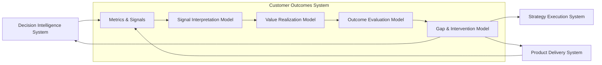
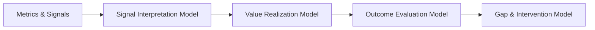

# Customer Outcomes System Diagram

The **Customer Outcomes System Diagram** defines the canonical system-level visual representation of the **Customer Outcomes System** within the **Product Leadership Operating System (PLOS)**.

Where the **Unified Customer Outcomes System** defines the internal architecture of outcome understanding in prose, this artifact provides the primary diagram that shows the major layers, operating relationships, and flow through which delivered capabilities are interpreted, evaluated, qualified for value, and converted into learning and response.

It explains how the Customer Outcomes System operates as a coherent evaluative system rather than as a disconnected collection of metrics, reports, or retrospective observations.

---

# Purpose

The purpose of this artifact is to provide the **canonical visual model** for how the **Customer Outcomes System** operates.

It shows how the system converts observed post-delivery signals into structured understanding by moving through a disciplined sequence of:

- signal intake
- signal interpretation
- value qualification
- outcome evaluation
- response generation

This diagram exists to make clear that outcome understanding is not a single activity. It is a layered system that determines whether delivered capabilities created meaningful customer and business value, what gaps remain, and what the organization should learn or change as a result.

---

# Diagram

---

# Diagram Interpretation

The **Customer Outcomes System** sits downstream of delivery and upstream of learning-driven adjustment. Its role is not to execute work, govern investments, or produce analytics. Its role is to determine whether delivered work resulted in meaningful outcomes and to convert that understanding into actionable learning.

The system begins with **Metrics & Signals**, where observed evidence from product usage, operational behavior, service performance, customer response, and business effect is assembled. These signals are not yet conclusions. They are the observable inputs used by the system to understand post-delivery reality.

Those inputs move into the **Signal Interpretation Model**, where signals are translated into meaning. This layer determines what patterns, movement, changes, and conditions indicate in context. It does not yet determine whether value has been achieved. It establishes what the signals appear to mean.

The interpreted signals then move into the **Value Realization Model**, which provides the evaluative standard for what should count as meaningful value. This layer determines whether interpreted change connects to intended customer benefit, business gain, strategic contribution, or meaningful progress toward an expected result.

That value understanding then informs the **Outcome Evaluation Model**, which produces formal judgment. This is the layer where the system determines whether an outcome has been achieved, partially achieved, unrealized, unstable, misaligned, or otherwise qualified against the expected standard.

Finally, the **Gap & Intervention Model** converts evaluation into structured response. This is where the system identifies gaps, clarifies likely causes, frames intervention needs, and generates learning that can inform strategic refinement, delivery correction, and measurement improvement.

The diagram also shows that the **Strategy Execution System** provides the expected intent, desired outcomes, and value expectations that help anchor evaluation. However, strategy does not directly perform outcome evaluation. Likewise, the **Decision Intelligence System** provides signals and visibility, but does not interpret meaning or make evaluative judgments.

---

# Layer Structure

The canonical internal layering of the **Customer Outcomes System** is:

1. **Metrics & Signals**  
2. **Signal Interpretation Model**  
3. **Value Realization Model**  
4. **Outcome Evaluation Model**  
5. **Gap & Intervention Model**

This layering is non-negotiable within Pillar 5.

Each layer has a distinct responsibility:

- **Metrics & Signals** gathers evidence  
- **Signal Interpretation** determines meaning  
- **Value Realization** defines value qualification  
- **Outcome Evaluation** determines judgment  
- **Gap & Intervention** determines response  

These layers must not be collapsed, merged, reordered, or treated as interchangeable.

---

# Operating Logic

The operating logic of the **Customer Outcomes System** is sequential, evaluative, and learning-oriented.

It begins after delivery has occurred and observable effects can be detected. The system gathers outcome-relevant signals from delivery results, usage patterns, customer behaviors, performance indicators, and business measures. These signals are assembled as inputs, not conclusions.

The first evaluative move is interpretation. The system determines what those signals mean in context by identifying direction, relevance, significance, and pattern. Interpretation establishes understanding of what happened, but not yet whether it mattered.

The second move is value qualification. The system assesses whether the interpreted effects represent meaningful customer and business value. This prevents the organization from mistaking movement for value or activity for outcome.

The third move is evaluation. The system judges whether intended outcomes have been realized, to what degree, with what confidence, and under what conditions. This creates formal outcome understanding rather than anecdotal reaction.

The fourth move is response. The system identifies where gaps exist, what type of intervention may be required, and what should be learned. That learning then informs the broader PLOS loop by feeding strategic adjustment, delivery correction, and better instrumentation.

This operating logic preserves the canonical PLOS loop:

**Strategy → Governance → Delivery → Outcomes → Learning → Strategy**

Within that loop, the **Customer Outcomes System** is the system responsible for converting post-delivery reality into structured outcome understanding and reusable learning.

---

# System Boundaries

The **Customer Outcomes System** must maintain strict boundaries with adjacent systems.

## What It Owns

The system owns:

- post-delivery outcome interpretation  
- value qualification  
- outcome judgment  
- gap identification  
- intervention framing  
- learning generation from realized or unrealized outcomes  

## What It Does Not Own

The system does not own:

- defining portfolio investment priorities  
- making governance tradeoff decisions  
- executing delivery work  
- releasing product changes  
- generating raw telemetry infrastructure  
- producing analytics platforms or dashboards  
- deciding strategy independently of learning inputs  

These boundaries are critical to preserving system integrity.

---

# Relationship to Decision Intelligence

The **Decision Intelligence System** provides the informational substrate that supports the **Customer Outcomes System**, but it does not replace it.

Decision Intelligence may provide:

- metrics  
- dashboards  
- trend visibility  
- evidence streams  
- analytical views  
- measurement structure  

But Decision Intelligence does **not**:

- interpret meaning on behalf of the outcomes system  
- define whether value was realized  
- evaluate whether outcomes were achieved  
- determine intervention priorities  

The critical rule is:

> **Decision Intelligence supports — it does not interpret, decide, or control**

That rule must remain explicit in all related artifacts.

---

# Relationship to Product Delivery

The **Product Delivery System** creates the conditions that make outcomes observable, but it is not responsible for evaluating whether those outcomes created meaningful value.

Delivery may produce:

- releases  
- feature changes  
- operational improvements  
- implementation quality  
- execution data  

But delivery success is not equivalent to outcome success.

The Customer Outcomes System exists precisely to prevent the organization from confusing:

- shipping with impact  
- completion with adoption  
- release with value  
- execution with outcome realization  

This distinction is essential to maintaining closed-loop learning.

---

# Relationship to Strategy Execution

The **Strategy Execution System** defines intended direction, desired outcomes, and the value hypotheses that anchor what success should mean.

The Customer Outcomes System uses those expectations as reference points during value qualification and outcome evaluation, but it does not create strategic intent itself. Instead, it returns structured learning to strategy so that strategic assumptions, expected outcomes, and future priorities can be refined.

This preserves proper loop closure:

- strategy defines intended outcomes  
- delivery creates observable change  
- outcomes determines what was actually realized  
- learning informs the next strategic adjustment  

---

# Interface Logic

Interfaces into and out of the **Customer Outcomes System** must preserve clean ownership and responsibility discipline.

## Inputs Into the System

Inputs may include:

- usage signals  
- customer behavior indicators  
- service or performance outcomes  
- satisfaction or retention indicators  
- business impact measures  
- expected outcome definitions from strategy  
- telemetry or reporting inputs from Decision Intelligence  

## Outputs From the System

Outputs may include:

- interpreted outcome meaning  
- value realization judgments  
- outcome achievement assessments  
- gap identification  
- intervention framing (not execution or prioritization)
- structured learning signals for strategic refinement  
- measurement improvement needs for Decision Intelligence  
- delivery feedback requiring corrective action  

Inputs and outputs must pass information and evaluative results, not control authority.

---

# Anti-Patterns Prevented by This Diagram

This diagram is intended to prevent several recurring architectural failures.

## 1. Treating Metrics as Outcomes

Raw metrics are not outcomes. The presence of signal movement alone does not establish value or success.

## 2. Letting Decision Intelligence Perform Evaluation

Analytics, dashboards, and reporting do not substitute for interpretation, value judgment, or outcome evaluation.

## 3. Collapsing Value and Evaluation

Determining what counts as value is not the same as judging whether value was achieved.

## 4. Skipping Interpretation

Organizations often jump from signals to decisions without first establishing meaning in context.

## 5. Treating Response as Part of Evaluation

Evaluation determines judgment. Response determines what should happen because of that judgment.

## 6. Confusing Delivery Success with Outcome Success

A well-executed release may still fail to create meaningful customer or business value.

---

# Why This Diagram Matters

This diagram matters because outcome understanding is frequently under-architected in product organizations.

Many teams can define strategy, govern work, and deliver features, but they lack a disciplined system for understanding whether delivered work actually created value. Without that system, organizations tend to over-rely on activity metrics, overstate success, under-detect gaps, and fail to convert operational experience into strategic learning.

The **Customer Outcomes System Diagram** makes outcome understanding visible as a formal system with clear layers, responsibilities, and interfaces. It establishes that learning is not accidental. It is produced through disciplined interpretation and evaluation.

This diagram also helps protect the integrity of Pillar 5 by preventing it from collapsing into either delivery reporting or analytics infrastructure.

---

# How to Use This Diagram

Use this diagram as the primary visual reference when:

- defining or reviewing Pillar 5 artifacts  
- validating whether a model belongs in the Customer Outcomes System  
- checking boundary integrity between outcomes, delivery, strategy, and Decision Intelligence  
- explaining how post-delivery learning is generated in PLOS  
- reviewing whether a team is treating signals, value, evaluation, and response as distinct layers  

This diagram should be used alongside the prose system definition and the supporting models that elaborate each internal layer.

It should not be used to redefine system responsibilities or invent alternative layer structures.

---

# Relationship to the Broader Product Leadership Operating System

The **Customer Outcomes System** is the fourth system in the canonical **PLSA** sequence:

1. Strategy Execution System  
2. Portfolio Governance System  
3. Product Delivery System  
4. Customer Outcomes System  
5. Decision Intelligence System  

Within the broader **PLOS** loop, the Customer Outcomes System is the mechanism through which delivered work is converted into outcome understanding and actionable learning.

Its role is essential because PLOS is not merely a delivery architecture. It is a closed-loop operating system. That loop cannot close unless outcome evaluation is structured, disciplined, and connected back to strategic refinement.

This makes Pillar 5 central to organizational learning quality.

---

# Supporting Diagram

The following simplified view highlights the internal evaluative flow of the **Customer Outcomes System**:

---

# Summary

The **Customer Outcomes System Diagram** defines the canonical visual architecture for how product organizations determine whether delivered capabilities produced meaningful customer and business value.

It establishes that outcome understanding is a **structured, layered system**, not a single activity or reporting function. The system moves from observable signals, to interpreted meaning, to value qualification, to formal evaluation, and ultimately to response and learning generation.

By preserving the separation between signals, interpretation, value, evaluation, and response, the architecture ensures that organizations do not confuse activity with impact, delivery with success, or data with understanding.

This system plays a critical role in closing the **Product Leadership Operating System (PLOS)** loop:

**Strategy → Governance → Delivery → Outcomes → Learning → Strategy**

Within that loop, the Customer Outcomes System is responsible for converting post-delivery reality into **actionable insight, validated learning, and informed adjustment**.

When implemented correctly, it strengthens:

- outcome clarity  
- value accountability  
- decision quality  
- learning effectiveness  
- strategic refinement  

Ultimately, this system ensures that product organizations operate not just as delivery engines, but as **learning systems capable of continuously improving value realization over time**.

---

# License

This project is licensed under the MIT License - see the [LICENSE](LICENSE) file for details.
