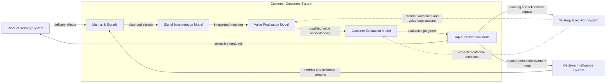
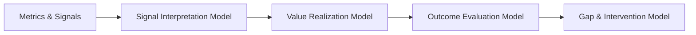

# Outcome Signal Flow Diagram

The **Outcome Signal Flow Diagram** defines the canonical end-to-end signal flow through which the **Customer Outcomes System** converts post-delivery evidence into structured interpretation, value qualification, outcome judgment, and learning-generating response within the **Product Leadership Operating System (PLOS)**.

Where the **Customer Outcomes System Diagram** defines the system-level structure of Pillar 5, this artifact defines the directional evaluative flow through which signals move across the internal layers of the system.

It explains how observed evidence progresses from raw post-delivery input to actionable outcome understanding rather than remaining trapped as disconnected metrics, dashboards, or anecdotal feedback.

---

# Purpose

The purpose of this artifact is to provide the **canonical flow diagram** for how outcome-relevant signals move through the **Customer Outcomes System**.

It exists to show that outcome understanding is not created at the moment signals appear. Signals must be gathered, interpreted, qualified for value, evaluated against intended outcomes, and converted into response and learning.

This diagram makes explicit the ordered flow through which the organization distinguishes:

- evidence from meaning
- meaning from value
- value from evaluation
- evaluation from response

Without this flow discipline, teams tend to collapse signals directly into conclusions, confuse movement with value, and weaken the learning loop that should connect outcomes back to strategy.

---

# Diagram

---

# Diagram Interpretation

The **Outcome Signal Flow Diagram** shows the canonical directional flow through which post-delivery evidence becomes outcome understanding.

The flow begins outside the **Customer Outcomes System** with two upstream contributors. The **Product Delivery System** creates observable delivery effects through releases, changes, capabilities, and operational execution. The **Decision Intelligence System** provides the signal substrate through metrics, telemetry, evidence streams, and visibility. Neither of these systems determines outcome meaning. They provide the observable inputs that the outcomes system must process.

Those inputs enter **Metrics & Signals**, the intake layer of Pillar 5. This layer gathers the relevant post-delivery evidence that may indicate customer, business, behavioral, or operational effects. At this point, the system has inputs, not judgment.

Signals then flow into the **Signal Interpretation Model**, where the organization determines what the observed movement means in context. This layer identifies relevant patterns, directional movement, significance, signal coherence, and possible implication. It transforms signals into interpreted meaning, but it does not yet decide whether value was created.

The interpreted output then moves into the **Value Realization Model**, where that meaning is tested against the evaluative standard for meaningful value. This is the layer that determines whether interpreted effects correspond to intended customer benefit, business improvement, strategic contribution, or other meaningful value realization.

That qualified value understanding then flows into the **Outcome Evaluation Model**, where the organization produces formal judgment. This is where the system determines whether expected outcomes were achieved, partially achieved, unrealized, unstable, misaligned, or otherwise qualified against expected conditions.

Finally, evaluative judgment flows into the **Gap & Intervention Model**, where the system identifies gaps, frames likely intervention needs, and generates learning. This response layer does not execute correction itself. It converts evaluation into structured output that can inform strategy refinement, delivery adjustment, and measurement improvement.

The diagram also shows that the **Strategy Execution System** provides expected outcome conditions and value expectations that anchor value qualification and evaluation. Strategy sets intent; the outcomes system determines what was actually realized.

---

# Flow Structure

The canonical outcome signal flow is:

1. **Delivery effects and evidence generation**  
2. **Signal intake**  
3. **Signal interpretation**  
4. **Value qualification**  
5. **Outcome evaluation**  
6. **Gap and intervention framing**  
7. **Learning and feedback routing**

This flow is sequential and must not be collapsed.

The corresponding internal flow through Pillar 5 is:

1. **Metrics & Signals**  
2. **Signal Interpretation Model**  
3. **Value Realization Model**  
4. **Outcome Evaluation Model**  
5. **Gap & Intervention Model**

Each stage produces the input required for the next stage:

- signals produce evidence  
- interpretation produces meaning  
- value qualification produces qualified value understanding  
- evaluation produces judgment  
- response produces learning and intervention framing  

---

# Operating Logic

The operating logic of the **Outcome Signal Flow Diagram** is evidence-to-learning conversion.

It begins when delivery creates observable effects and Decision Intelligence makes those effects measurable or visible. These effects may include usage change, behavioral response, performance movement, customer reaction, retention movement, business effect, or operational consequence.

The first logical move is intake. Relevant evidence must be gathered into a coherent signal set rather than treated as isolated observations.

The second move is interpretation. The system determines what happened in context. This step is essential because raw movement has no architectural meaning until it is interpreted.

The third move is value qualification. The system determines whether the interpreted movement reflects meaningful value realization rather than incidental change, noise, or local optimization.

The fourth move is evaluation. The system judges whether the observed and qualified effects satisfy the intended outcome condition, and if so, to what degree and under what level of confidence.

The fifth move is response. The system determines what the outcome judgment implies for correction, refinement, escalation, or reinforcement.

The sixth move is learning routing. The resulting learning is directed back into the broader operating system so that:

- **Strategy** can refine intent, assumptions, or expectations  
- **Delivery** can correct or strengthen execution  
- **Decision Intelligence** can improve measurement, visibility, or instrumentation  

This preserves the canonical PLOS loop and ensures that signal flow supports closed-loop learning rather than static reporting.

---

# Signal Ownership and Boundary Discipline

The **Outcome Signal Flow Diagram** reinforces strict boundary discipline across systems.

## Customer Outcomes System Owns

The Customer Outcomes System owns:

- signal intake for evaluative purposes  
- signal interpretation  
- value qualification  
- outcome judgment  
- gap identification  
- intervention framing  
- learning generation from evaluated outcomes  

## Customer Outcomes System Does Not Own

The Customer Outcomes System does not own:

- creating the delivery change itself  
- building analytics infrastructure  
- generating telemetry platforms  
- making governance prioritization decisions  
- independently redefining strategic intent  
- executing interventions directly  

This distinction matters because outcome flow must preserve system autonomy. Inputs may cross system boundaries, but ownership does not.

---

# Relationship to Decision Intelligence

The **Decision Intelligence System** provides evidence inputs into the flow, but it does not control the evaluative sequence.

Decision Intelligence contributes:

- metrics  
- reporting inputs  
- dashboards  
- telemetry  
- analytical views  
- visibility into movement and trend  

But Decision Intelligence does not perform:

- contextual interpretation  
- value qualification  
- outcome evaluation  
- intervention framing  

The governing rule remains:

> **Decision Intelligence supports — it does not interpret, decide, or control**

The signal flow therefore begins with Decision Intelligence contribution, but not with Decision Intelligence judgment.

---

# Relationship to Product Delivery

The **Product Delivery System** is the source of many observable effects that initiate the flow.

Delivery contributes:

- released capabilities  
- implemented changes  
- operational improvements  
- execution outcomes  
- release-side evidence  

But the flow makes clear that delivery output is only the beginning of outcome understanding. Delivery does not determine whether shipped work created meaningful customer or business value.

This preserves a critical Pillar 5 distinction:

> **Delivery success is not the same as outcome success**

The signal flow exists to ensure that the organization evaluates what delivery actually caused, not merely what delivery completed.

---

# Relationship to Strategy Execution

The **Strategy Execution System** anchors the flow by supplying expected outcome conditions and intended value direction.

Strategy contributes:

- desired outcomes  
- value expectations  
- intended customer benefit  
- expected business effect  
- strategic success conditions  

These expectations help structure both value qualification and evaluation. They do not replace them.

The Customer Outcomes System returns learning back to strategy only after signals have moved through interpretation, value qualification, evaluation, and response framing. This ensures strategy adjusts based on structured learning rather than reactive signal reading.

---

# Interface Logic

The interfaces in this flow must remain directional, bounded, and non-controlling.

## Inputs Into the Flow

Inputs may include:

- release effects from delivery  
- telemetry and measurement streams from Decision Intelligence  
- expected outcome definitions from strategy  
- intended value conditions  
- customer and operational evidence  
- business performance indicators  

## Internal Transformations

The flow transforms those inputs through:

- intake  
- interpretation  
- value qualification  
- evaluation  
- response framing  

## Outputs From the Flow

Outputs may include:

- validated outcome judgments  
- identified outcome gaps  
- intervention framing  
- structured learning signals  
- delivery corrective feedback  
- strategy refinement inputs  
- measurement improvement requests  

The interfaces must pass evidence, expectations, judgments, and learning, but not transfer control ownership between systems.

---

# Anti-Patterns Prevented by This Diagram

This diagram is intended to prevent several recurring flow failures.

## 1. Jumping Directly from Metrics to Decisions

Signals must be interpreted before they can be used meaningfully.

## 2. Treating Signal Movement as Proof of Value

Movement alone does not establish meaningful value realization.

## 3. Skipping Value Qualification

Not every positive signal corresponds to customer or business value.

## 4. Collapsing Evaluation into Interpretation

Understanding what happened is not the same as judging whether an intended outcome was achieved.

## 5. Letting Response Precede Judgment

Intervention should follow evaluation, not replace it.

## 6. Confusing Delivery Completion with Realized Outcomes

Releases may occur without meaningful customer or business effect.

## 7. Letting Decision Intelligence Become the Evaluator

Dashboards and analytical views support the flow, but do not substitute for outcome judgment.

---

# Why This Diagram Matters

This diagram matters because many organizations have signals but lack a disciplined way to move from signal visibility to outcome understanding.

Without a canonical signal flow, teams often:

- overreact to isolated metrics  
- confuse reporting with learning  
- treat local movement as strategic value  
- skip formal evaluation  
- respond before understanding the actual gap  
- weaken the integrity of the learning loop  

The **Outcome Signal Flow Diagram** solves that by making the internal evaluative sequence explicit. It shows that post-delivery evidence must pass through an ordered architecture before it can legitimately influence strategic refinement, delivery correction, or measurement improvement.

This makes the artifact especially important for protecting Pillar 5 from collapsing into dashboard interpretation, delivery retrospectives, or informal anecdotal learning.

---

# How to Use This Diagram

Use this diagram when:

- explaining how outcome signals move through Pillar 5  
- validating whether an artifact belongs to interpretation, value, evaluation, or response  
- checking whether a team is skipping evaluative stages  
- clarifying the difference between signal visibility and outcome judgment  
- reviewing feedback loops from outcomes back into strategy, delivery, and Decision Intelligence  
- teaching the internal operating logic of the Customer Outcomes System  

This artifact should be used alongside the **Customer Outcomes System Diagram**. The system diagram defines the structure. This flow diagram defines the directional movement through that structure.

It should not be used to redefine system boundaries or to introduce alternative evaluative sequences.

---

# Relationship to the Broader Product Leadership Operating System

Within the broader **Product Leadership Operating System**, the **Outcome Signal Flow Diagram** explains how the **Outcomes** stage of the canonical loop actually operates internally.

That loop is:

**Strategy → Governance → Delivery → Outcomes → Learning → Strategy**

This artifact clarifies that the Outcomes stage is not a single review point. It is an internal evaluative flow that converts post-delivery evidence into structured learning.

In that sense, the diagram provides the operational bridge between:

- delivered change  
- validated outcome understanding  
- learning-driven strategic refinement  

It therefore strengthens the integrity of the overall PLOS operating loop by making the internal mechanics of outcome learning explicit.

---

# Supporting Diagram

The following simplified view highlights the canonical internal flow of outcome signals through Pillar 5:

---

# Summary

The **Outcome Signal Flow Diagram** defines the canonical directional flow through which the **Customer Outcomes System** transforms post-delivery evidence into structured understanding, evaluative judgment, and learning-generating response.

It establishes that signals alone do not produce outcome understanding. Observable evidence must move through a disciplined sequence of interpretation, value qualification, and evaluation before it can be used to inform action or learning.

By preserving the distinction between signals, meaning, value, judgment, and response, this diagram ensures that organizations do not confuse metric movement with meaningful impact or delivery completion with realized outcomes.

Within the **Product Leadership Operating System (PLOS)**, this artifact strengthens the integrity of the **Outcomes** stage by making the internal evaluative flow explicit and repeatable. It ensures that learning is not reactive or anecdotal, but instead emerges from structured analysis and disciplined judgment.

When applied correctly, this flow improves:

- outcome clarity  
- value accountability  
- decision quality  
- learning precision  
- strategic refinement  

Ultimately, the diagram ensures that product organizations operate as **closed-loop learning systems**, where evidence is consistently transformed into insight, insight into judgment, and judgment into meaningful action and continuous improvement.

---

# License

This project is licensed under the MIT License - see the [LICENSE](LICENSE) file for details.
