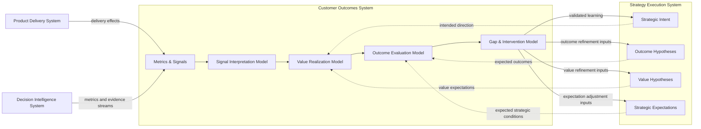
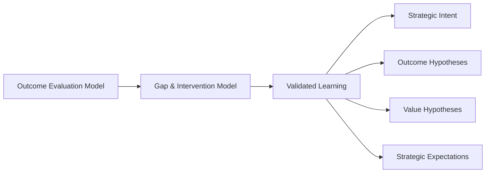

# Outcome to Strategy Feedback Diagram

The **Outcome to Strategy Feedback Diagram** defines the canonical feedback path through which the **Customer Outcomes System** returns structured learning to the **Strategy Execution System** within the **Product Leadership Operating System (PLOS)**.

Where the **Outcome Signal Flow Diagram** defines how post-delivery evidence moves through the internal evaluative layers of Pillar 5, this artifact defines how the resulting learning is routed back into strategy so that future intent, value assumptions, expected outcomes, and strategic expectations can be refined.

It explains how product organizations close the loop between realized outcomes and future strategic direction rather than allowing outcome learning to remain local, passive, or disconnected from strategic adjustment.

---

# Purpose

The purpose of this artifact is to provide the **canonical feedback diagram** for how evaluated outcomes inform strategic refinement.

It exists to show that the **Customer Outcomes System** does not end with evaluation or intervention framing. Its learning output must be routed back into the **Strategy Execution System** so that strategy can evolve based on realized evidence rather than remaining fixed despite changing conditions or incomplete assumptions.

This diagram makes explicit the feedback relationship through which the organization converts:

- evaluated outcomes into strategic learning
- realized gaps into strategic reconsideration
- realized value evidence into strategic reinforcement
- repeated evidence into improved future intent

Without this feedback discipline, organizations tend to separate delivery learning from strategy, weaken adaptation quality, and preserve plans that are no longer supported by observed reality.

---

---

# Diagram Interpretation

The **Outcome to Strategy Feedback Diagram** shows the canonical path through which the **Customer Outcomes System** closes the learning loop back into strategy.

Within Pillar 5, signals are gathered, interpreted, qualified for value, evaluated, and converted into response framing. That internal sequence produces more than local judgment. It produces structured learning about what was actually realized, what value was or was not created, what gaps remain, and what assumptions appear supported or unsupported by observed reality.

That learning is routed from the **Gap & Intervention Model** back into the **Strategy Execution System**. The diagram shows that this feedback does not return as undifferentiated commentary. It returns as structured strategic input across four distinct strategic targets.

First, learning informs **Strategic Intent**. This allows the organization to refine strategic direction when outcome evidence indicates that intended direction is misaligned, incomplete, overly broad, insufficiently specific, or no longer appropriate.

Second, learning informs **Outcome Hypotheses**. This allows the organization to adjust what outcomes it expects to occur, under what conditions those outcomes should emerge, and how success should be understood in future cycles.

Third, learning informs **Value Hypotheses**. This allows the organization to refine its assumptions about what kinds of delivered effects actually create meaningful customer and business value.

Fourth, learning informs **Strategic Expectations**. This allows expected conditions, confidence assumptions, timing assumptions, and strategic success criteria to be tightened based on evaluated evidence rather than aspiration.

The diagram therefore makes clear that the **Customer Outcomes System** does not directly redefine strategy on its own. It supplies validated learning that strategy must absorb and use to improve future direction.

---

# Feedback Structure

The canonical outcome-to-strategy feedback structure is:

1. **Outcome evidence is evaluated**  
2. **Gaps and intervention needs are framed**  
3. **Validated learning is extracted**  
4. **Learning is routed into strategic elements**  
5. **Strategy is refined for the next cycle**

This feedback path is part of the canonical PLOS loop:

**Strategy → Governance → Delivery → Outcomes → Learning → Strategy**

Within that loop, the **Outcome to Strategy Feedback Diagram** defines how the transition from **Learning → Strategy** is operationalized.

The feedback targets shown in this artifact are:

- **Strategic Intent**  
- **Outcome Hypotheses**  
- **Value Hypotheses**  
- **Strategic Expectations**

These targets must remain strategic in nature. Feedback from outcomes should improve future intent and assumptions, not bypass strategy by acting as a direct execution controller.

---

# Operating Logic

The operating logic of this diagram is learning-driven strategic refinement.

The flow begins after the **Customer Outcomes System** has already completed its internal evaluative sequence. Signals have been interpreted, value has been qualified, outcomes have been evaluated, and gaps have been identified. At that point, the organization has something more useful than raw metrics or anecdotal reaction. It has validated learning.

That learning may indicate several kinds of strategic insight. It may show that the intended problem was misunderstood, that the expected outcome condition was too optimistic, that the value hypothesis was incomplete, that the time horizon assumption was wrong, or that the strategic direction remains correct but needs sharper articulation.

The **Gap & Intervention Model** is the handoff point where these insights are converted into structured strategic inputs. Those inputs are then routed into the **Strategy Execution System**, where they inform refinement of intent, expected outcomes, value assumptions, and strategic expectations.

This preserves an important architectural rule:

> **Outcomes informs strategy through validated learning; it does not replace strategy**

The result is a disciplined feedback path in which strategy becomes progressively better informed by evaluated reality rather than remaining fixed, isolated, or assumption-driven.

---

# Boundary Discipline

This artifact depends on strict system boundary integrity.

## Customer Outcomes System Owns

The Customer Outcomes System owns:

- outcome interpretation  
- value qualification  
- outcome evaluation  
- gap identification  
- intervention framing  
- learning generation from evaluated outcomes  

## Strategy Execution System Owns

The Strategy Execution System owns:

- strategic direction  
- outcome intent  
- value hypotheses  
- strategic assumptions  
- strategic expectation setting  
- refinement of future intent  

## Boundary Rule

The Customer Outcomes System may generate validated learning that informs strategy, but it must not directly assume ownership of strategic definition.

Likewise, the Strategy Execution System must receive and absorb learning, but it must not bypass the outcomes system by treating raw metrics or unqualified observations as sufficient strategic feedback.

This separation preserves both system autonomy and feedback integrity.

---

# Relationship to the Customer Outcomes System

This artifact extends the internal logic of the **Customer Outcomes System** beyond evaluation and response framing into loop closure.

The **Customer Outcomes System Diagram** defines the structure of Pillar 5.  
The **Outcome Signal Flow Diagram** defines the internal evaluative sequence within Pillar 5.  
The **Outcome to Strategy Feedback Diagram** defines how evaluated learning exits Pillar 5 and informs strategy.

This means the present artifact should be understood as the external feedback continuation of the internal outcomes architecture, not as a separate or alternative process.

It specifically depends on the proper completion of the internal Pillar 5 sequence:

1. **Metrics & Signals**  
2. **Signal Interpretation Model**  
3. **Value Realization Model**  
4. **Outcome Evaluation Model**  
5. **Gap & Intervention Model**

Only after that sequence is completed can feedback be considered structurally valid for strategic use.

---

# Relationship to Strategy Execution

The **Strategy Execution System** is the receiver of validated learning in this diagram.

Strategy does not receive raw signals directly from this artifact. It receives structured learning derived from evaluated outcomes. This is important because strategic refinement must be based on disciplined interpretation and evaluation rather than reactive signal observation.

The strategic elements shown in the diagram serve different purposes:

- **Strategic Intent** captures directional refinement  
- **Outcome Hypotheses** capture expected-result refinement  
- **Value Hypotheses** capture value-creation refinement  
- **Strategic Expectations** capture assumption and condition refinement  

These are not interchangeable. Each one represents a distinct kind of strategic adjustment that may be informed by outcome learning.

---

# Interface Logic

The interface between the **Customer Outcomes System** and the **Strategy Execution System** must remain structured, bounded, and non-controlling.

## Inputs Into Strategy from Outcomes

Inputs may include:

- validated learning from evaluated outcomes  
- evidence-backed gap patterns  
- unrealized value insights  
- supported or unsupported assumptions  
- condition-based success or failure observations  
- recurring intervention themes  
- timing or expectation mismatches  

## What the Interface Must Not Become

The interface must not become:

- direct strategic control by the outcomes system  
- raw metric escalation without evaluation  
- delivery reporting disguised as strategic learning  
- anecdotal reaction loops  
- local optimization feedback mistaken for strategic refinement  

## Output of the Interface

The output of this interface is not a decision by the outcomes system. The output is improved strategic input quality.

That means the interface should strengthen:

- future strategic clarity  
- expectation precision  
- value hypothesis quality  
- outcome-definition quality  
- learning quality across the operating loop  

---

# Anti-Patterns Prevented by This Diagram

This diagram is intended to prevent several recurring feedback failures.

## 1. Treating Outcome Reviews as Endpoints

Outcome evaluation is not the end of the process. It must feed future strategy.

## 2. Letting Raw Metrics Drive Strategy Directly

Strategy should be informed by evaluated learning, not by unprocessed signal movement.

## 3. Failing to Refine Value Assumptions

Organizations often refine actions without refining the value assumptions that drove those actions.

## 4. Treating Learning as Undifferentiated

Not all learning affects the same part of strategy. Intent, outcomes, value hypotheses, and expectations must remain distinct.

## 5. Allowing Outcomes to Redefine Strategy Unilaterally

Outcomes informs strategy; it does not assume strategy ownership.

## 6. Preserving Strategic Assumptions Despite Contradictory Evidence

Without this feedback path, strategy often remains insulated from evaluated reality.

## 7. Confusing Intervention Framing with Strategic Refinement

Operational response and strategic adjustment are related, but not identical.

---

# Why This Diagram Matters

This diagram matters because many organizations claim to learn from outcomes but lack a disciplined architecture for how that learning actually influences future strategy.

Without a canonical feedback path, teams often:

- repeat unsupported assumptions  
- preserve vague strategic expectations  
- respond tactically without refining direction  
- confuse delivery correction with strategic learning  
- weaken the adaptive capacity of the operating system  

The **Outcome to Strategy Feedback Diagram** makes the learning-to-strategy transition explicit. It ensures that the outcomes stage of PLOS does not terminate in reporting, and that learning becomes a formal input into future strategic improvement.

This is essential to maintaining PLOS as a true operating system rather than a one-way execution model.

---

# How to Use This Diagram

Use this diagram when:

- explaining how learning feeds back from outcomes into strategy  
- validating whether a feedback mechanism is strategic or merely operational  
- checking whether evaluated learning is being routed into the right strategic constructs  
- clarifying the difference between gap identification and strategic refinement  
- reviewing whether strategy is being informed by validated learning or by raw signal noise  
- teaching how PLOS closes the loop between outcomes and future intent  

This artifact should be used alongside:

- the **Customer Outcomes System Diagram**  
- the **Outcome Signal Flow Diagram**  
- strategy artifacts that define intent, outcomes, value hypotheses, and expectations  

It should not be used to bypass strategy governance or to justify direct strategic control by the outcomes system.

---

# Relationship to the Broader Product Leadership Operating System

Within the broader **Product Leadership Operating System**, this artifact defines the final part of the canonical loop:

**Strategy → Governance → Delivery → Outcomes → Learning → Strategy**

Specifically, it makes explicit how **Learning → Strategy** operates.

That matters because PLOS depends on more than delivery coordination. It depends on disciplined loop closure. The operating system only improves over time if evaluated outcome learning is converted into better strategy for the next cycle.

This artifact therefore plays a key role in preserving the adaptive quality of PLOS. It ensures that strategy evolves through evaluated reality rather than remaining disconnected from the effects of delivery.

---

# Supporting Diagram

The following simplified view highlights the canonical feedback path from evaluated outcomes into strategy refinement:

---

# Summary

The **Outcome to Strategy Feedback Diagram** defines the canonical feedback path through which the **Customer Outcomes System** converts evaluated outcomes into structured strategic refinement.

It establishes that outcome evaluation is not the endpoint of the process. Once signals have been interpreted, qualified for value, evaluated, and translated into intervention framing, the resulting validated learning must be routed back into strategy to improve future intent, expectations, and assumptions.

By preserving the distinction between outcome evaluation and strategic refinement, this diagram ensures that organizations do not confuse operational response with strategic learning or raw signals with validated strategic insight.

Within the **Product Leadership Operating System (PLOS)**, this artifact strengthens the final stage of loop closure:

**Strategy → Governance → Delivery → Outcomes → Learning → Strategy**

It ensures that the **Learning → Strategy** transition is explicit, structured, and repeatable.

When applied correctly, this feedback path improves:

- strategic clarity  
- outcome definition quality  
- value hypothesis accuracy  
- expectation precision  
- learning effectiveness  

Ultimately, the diagram ensures that product organizations operate as **adaptive learning systems**, where evaluated reality continuously improves future strategy.

---

# License

This project is licensed under the MIT License - see the [LICENSE](LICENSE) file for details.
   
