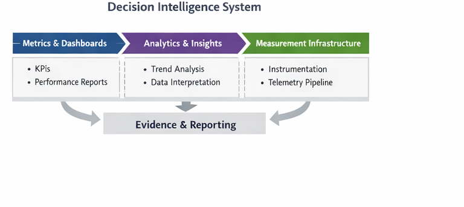

# Decision Intelligence System

## Purpose

This repository documents **Pillar 6** of the **Product Leadership Operating System (PLOS)** and defines how organizations generate, structure, and govern signals, metrics, dashboards, descriptive analytics, and measurement visibility across the operating system.

---

## Diagram

---

## System Role in PLOS

The **Decision Intelligence System** is the evidence-producing system within PLOS.

It is responsible for:

- instrumentation
- telemetry
- signal generation
- metrics and KPIs
- dashboards and reporting
- descriptive analytics
- measurement integrity and visibility

It does not own interpretation, evaluation, value qualification, recommendations, or decisions.

---

## What This Pillar Contains

This pillar contains:

- canonical Decision Intelligence system definitions
- instrumentation and telemetry models
- metrics and signal models
- analytics and visibility models
- measurement integrity models
- supporting diagrams and reference artifacts

---

## Boundary Rules

Decision Intelligence is an evidence-producing system.

It owns:

- instrumentation
- telemetry
- signals
- metrics
- dashboards
- descriptive analytics

It does not own:

- interpretation
- evaluation
- value qualification
- recommendations
- decisions

All decision influence must follow:

> Decision Intelligence → Customer Outcomes → Strategy / Governance

---

## Relationship to Other Pillars

- **Pillar 1** defines the architectural role of Decision Intelligence
- **Pillar 2** defines the operating model within which evidence is used
- **Pillar 3** receives visibility inputs but must not act directly on raw signals
- **Pillar 4** produces telemetry and execution evidence
- **Pillar 5** interprets Decision Intelligence outputs and generates learning
- **Pillar 7** provides repeatable execution playbooks that may use visibility outputs
- **Pillar 8** provides controlled experiments whose evidence may be observed through Decision Intelligence

---

## Repository Structure

- `/architecture` → canonical DI system definitions and models
- `/diagrams` → system diagrams and visual models
- `/assets` → supporting visual assets

---

## Key Artifacts

- `README.md`
- `architecture/`
- `diagrams/`
- `assets/`

---

## License

This project is licensed under the MIT License.

See the [LICENSE](../../LICENSE) file for details.
