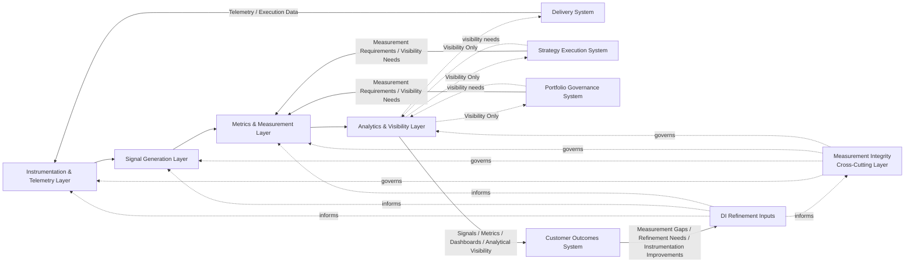
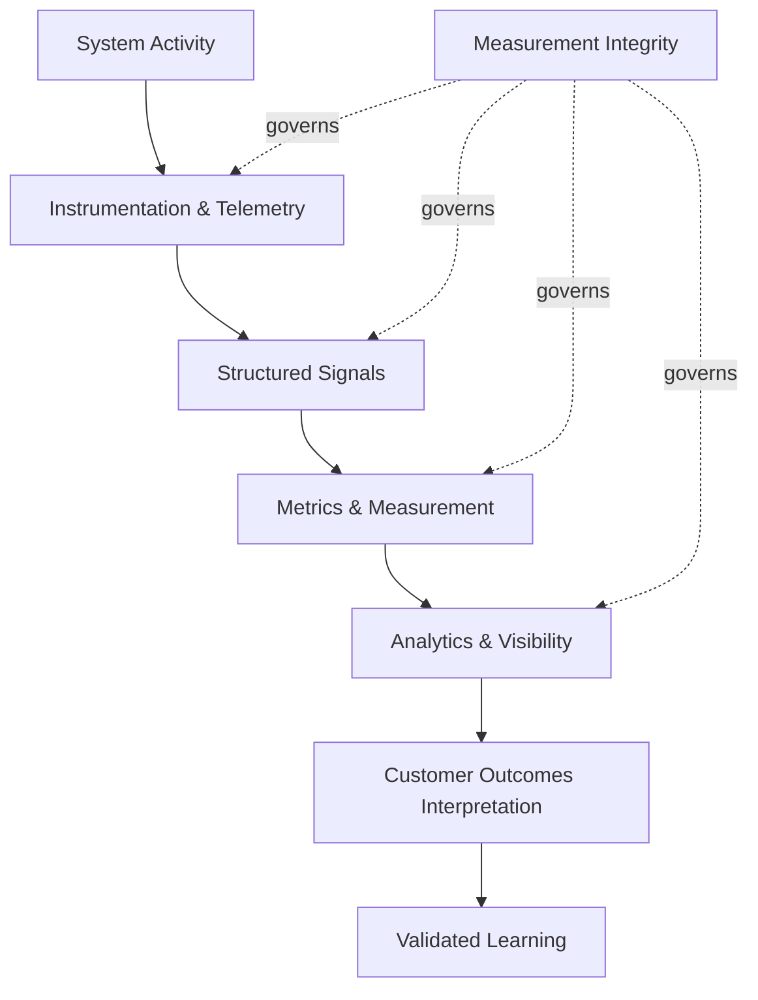

# Decision Intelligence System Diagram

The **Decision Intelligence System Diagram** defines the canonical visual representation of the **Decision Intelligence System** within the **Product Leadership Operating System (PLOS)**.

Where the **Decision Intelligence System** defines the role of Pillar 6 and the **Unified Decision Intelligence System** defines its internal architecture in prose, this artifact provides the primary system-level diagram that shows how **instrumentation, signal generation, metrics, analytics, visibility, and measurement integrity** operate together as a coherent system of evidence generation.

It explains how the Decision Intelligence System makes organizational behavior observable through structured measurement and analytical visibility while preserving strict separation from interpretation, evaluation, and decision-making.

---

# Purpose

The purpose of this artifact is to provide the **canonical system diagram** for the Decision Intelligence System.

It visually explains:

- how system activity becomes observable
- how telemetry becomes signals
- how signals become metrics
- how metrics support dashboards and analytical visibility
- how measurement integrity governs the full system across all layers
- how Decision Intelligence provides evidence to the operating system without producing meaning or decisions

---

# Diagram

---

# Diagram Interpretation

The diagram shows the **Decision Intelligence System** as a **structured evidence-generation system** composed of four sequential operating layers and one cross-cutting governing layer.

The sequential system flow is:

> **Instrumentation & Telemetry → Signal Generation → Metrics & Measurement → Analytics & Visibility**

This flow shows how:

- raw system activity is captured  
- telemetry is transformed into structured signals  
- signals are standardized into metrics  
- metrics are made visible through dashboards, reporting, and analytical views  

Across all four layers, **Measurement Integrity** operates as a **cross-cutting layer** that governs consistency, quality, traceability, and controlled evolution of the measurement system.

The diagram also shows the system’s interfaces with the rest of PLOS:

- **Delivery** provides telemetry and execution data  
- **Strategy** and **Governance** provide measurement requirements  
- **Customer Outcomes** consumes Decision Intelligence outputs for interpretation, value qualification, evaluation, and learning  
- **Customer Outcomes** also feeds back measurement gaps and refinement needs  

This structure makes clear that Decision Intelligence functions as a **system of evidence production and visibility**, not as a system of meaning-making, evaluation, or decision authority.

---

# Operating Logic

The operating logic of the **Decision Intelligence System** follows a disciplined evidentiary flow that transforms observable activity into structured visibility while preserving strict architectural boundaries.

## 1. Instrumentation & Telemetry

System activity becomes observable through instrumentation design, event capture, telemetry pipelines, and data collection mechanisms.

This layer is responsible for making delivery activity, system behavior, and operational events visible in a structured way.

## 2. Signal Generation

Raw telemetry is converted into structured signals and observable indicators that represent system behavior.

These signals remain **evidence only**. They do not contain interpretation, judgment, or implied meaning.

## 3. Metrics & Measurement

Signals are standardized into consistent measurement structures through defined metrics, measurement frameworks, and traceable definitions.

This layer ensures that evidence can be measured coherently and consistently across the operating system.

## 4. Analytics & Visibility

Metrics are presented through dashboards, reporting systems, and analytical views that provide descriptive visibility into system state and performance.

Outputs at this stage remain **descriptive**, not evaluative.

## 5. Measurement Integrity

**Measurement Integrity** governs all stages of the system by ensuring:

- data quality  
- consistency  
- traceability  
- definition stability  
- controlled metric evolution  

This layer is not a downstream step. It is a **cross-cutting governing layer** applied across the full system.

Together, these layers ensure that the Decision Intelligence System produces **reliable evidence** that can be used by the **Customer Outcomes System** for interpretation and evaluation without collapsing evidence into meaning.

---

# Boundary Rules

This diagram must be interpreted with the following architectural constraints:

- Decision Intelligence produces **evidence**, not **meaning**  
- Decision Intelligence does **not** interpret signals  
- Decision Intelligence does **not** qualify value  
- Decision Intelligence does **not** evaluate outcomes  
- Decision Intelligence does **not** define strategic meaning  
- Decision Intelligence does **not** make governance decisions  
- Decision Intelligence does **not** prioritize work  
- Decision Intelligence does **not** control delivery execution  
- Decision Intelligence does **not** trigger interventions  

All meaning, value qualification, evaluation, and learning generation belong to the **Customer Outcomes System**.

All decisions belong to **Strategy** and **Governance**.

Measurement visibility may support decision-making, but it must never be treated as a substitute for evaluation, judgment, or governed decision authority.

---

# Interface Rules

The diagram enforces the following interface discipline:

- **Delivery → Decision Intelligence** = telemetry and observable execution data  
- **Strategy → Decision Intelligence** = measurement requirements and strategic visibility needs  
- **Governance → Decision Intelligence** = measurement requirements and portfolio visibility needs  
- **Decision Intelligence → Outcomes** = signals, metrics, dashboards, analytical visibility  
- **Outcomes → Decision Intelligence** = measurement gaps, signal refinement needs, instrumentation improvements  

The following rules also apply:

- interfaces must preserve **clear ownership**  
- interfaces must pass **inputs and outputs**, not role transfer  
- Decision Intelligence outputs must remain **descriptive and non-evaluative**  
- Strategy must not refine itself directly from raw dashboards  
- Governance must not act directly on raw signals or dashboards  
- Delivery must not determine whether meaningful value was realized  
- Decision Intelligence outputs must pass through the **Customer Outcomes System** before influencing Strategy or Governance  

These interface rules preserve the canonical operating loop and prevent raw measurement from bypassing the Outcomes layer.

---

# Why This Matters

Without a clearly structured **Decision Intelligence System**:

- measurement becomes inconsistent  
- dashboards become substitutes for judgment  
- raw metrics are mistaken for meaning  
- governance reacts to signal movement without evaluation  
- strategy becomes unstable and overly data-reactive  
- delivery optimizes for visible indicators rather than validated value  

A properly bounded Decision Intelligence System ensures that organizations operate with:

- reliable evidence  
- consistent measurement  
- traceable signals  
- structured visibility  

This matters because strong operating systems require a disciplined separation between:

- what is **observed**  
- what is **interpreted**  
- what is **judged**  
- what is **decided**  

The Decision Intelligence System protects that separation.

---

# Relationship to the Operating System

The **Decision Intelligence System** strengthens the **Product Leadership Operating System** by making system behavior:

- observable  
- measurable  
- visible  
- traceable  

It supports the canonical PLOS loop:

> **Strategy → Governance → Delivery → Outcomes → Learning → Strategy**

Within that loop, Decision Intelligence provides the measurement and visibility foundation that allows the rest of the operating system to function with evidence rather than assumption.

Its role is to support:

- **Strategy** through structured measurement expectations  
- **Governance** through visibility into portfolio and system state  
- **Delivery** through execution telemetry  
- **Outcomes** through signals and metrics used for interpretation and evaluation  

However, Decision Intelligence is **not** a decision-making stage in the loop.

Learning closes the loop only after evidence is interpreted and evaluated within the **Customer Outcomes System**.

This preserves the architectural rule that **raw measurement must not bypass Outcomes to directly influence Strategy or Governance**.

---

# Supporting Diagram

---

# Summary

The **Decision Intelligence System Diagram** defines the canonical visual representation of how Pillar 6 operates as a **coherent measurement and visibility system** within the **Product Leadership Operating System (PLOS)**.

It shows that Decision Intelligence is responsible for:

- instrumentation and telemetry  
- signal generation  
- metrics and measurement  
- dashboards and analytical visibility  
- measurement integrity across the full system  

It also makes clear that Decision Intelligence exists to produce **evidence**, not **meaning, evaluation, or decisions**.

All interpretation, value qualification, evaluation, and learning generation remain the responsibility of the **Customer Outcomes System**.

This preserves the core architectural rule that:

> **raw signals, dashboards, and unevaluated measurement must not bypass Outcomes to directly influence Strategy or Governance**

The diagram therefore reinforces the role of Decision Intelligence as the **evidence backbone** of the operating system while maintaining strict separation between:

- evidence  
- meaning  
- judgment  
- decision-making  

---

## License

This project is licensed under the MIT License.

See the [LICENSE](../LICENSE) file for details.
