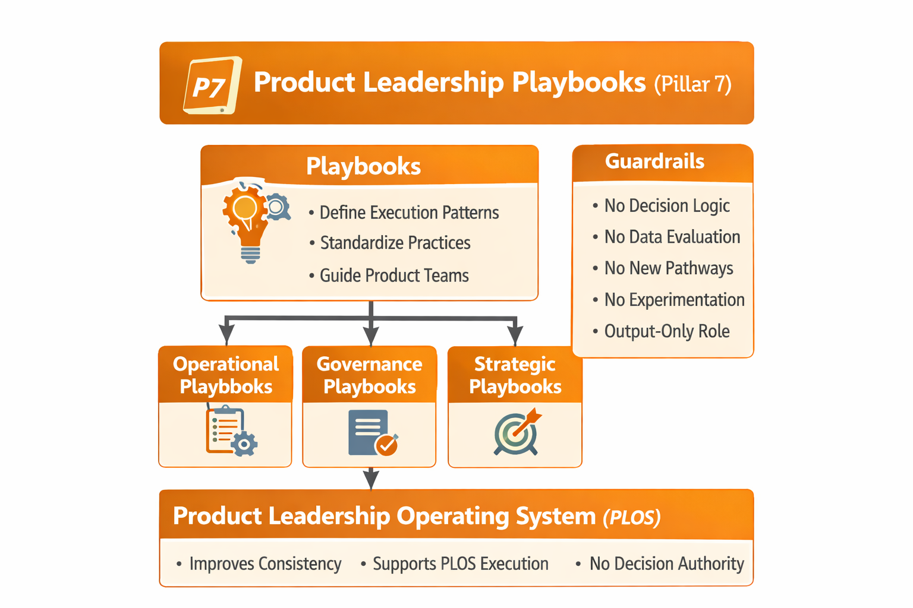

# Product Leadership Playbooks

## Purpose

This repository documents **Pillar 7** of the **Product Leadership Operating System (PLOS)** and defines the reusable execution patterns that standardize how recurring product leadership work is carried out.

---

## Diagram

---

## System Role in PLOS

The **Product Leadership Playbooks** pillar defines how recurring work is executed consistently.

It provides:

- execution sequences
- facilitation patterns
- standard operating guidance
- templates and handoff structures
- repeatable operating procedures

---

## What This Pillar Contains

This pillar contains:

- canonical playbook definitions
- recurring execution playbooks
- templates and facilitation standards
- operating standards for reusable leadership work
- supporting diagrams and reference assets

---

## Boundary Rules

Playbooks define **how to act**, not **what to decide**.

This pillar must not:

- make strategic decisions
- make governance decisions
- interpret Decision Intelligence signals
- evaluate customer outcomes
- create new system pathways
- contain experimentation as a canonical operating function

All controlled experimentation belongs in **Pillar 8 — Product Leadership Labs**.

---

## Relationship to Other Pillars

- **Pillar 1** defines the architecture within which playbooks operate
- **Pillar 2** defines the operating model that playbooks help execute
- **Pillar 3** may use governance playbooks without delegating governance authority
- **Pillar 4** may use delivery playbooks without changing delivery ownership
- **Pillar 5** may use outcome playbooks without delegating evaluation ownership
- **Pillar 6** may provide visibility inputs used by playbooks without transferring interpretation authority
- **Pillar 8** owns experimentation and promotion pathways, not Pillar 7

---

## Repository Structure

- `/architecture` → canonical playbook system definitions
- `/playbooks` → reusable execution playbooks
- `/standards` → playbook standards and boundary controls
- `/assets/diagrams` → pillar diagrams and supporting rendered assets

---

## Key Artifacts

- `README.md`
- `playbooks/`
- `standards/`
- `assets/diagrams/`

---

## License

This project is licensed under the MIT License.

See the [LICENSE](../../LICENSE) file for details.
