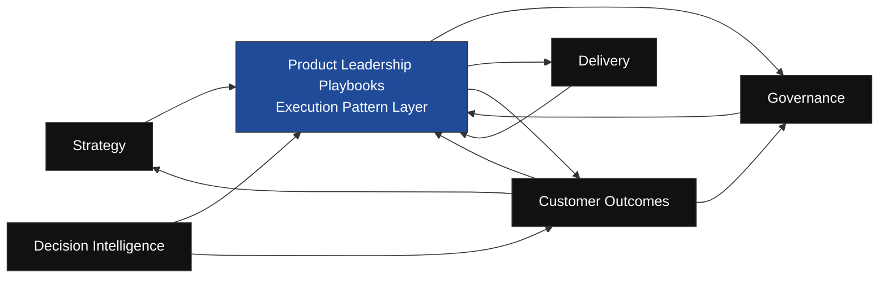

# Product Leadership Playbooks Diagram

The **Product Leadership Playbooks Diagram** defines the canonical system-level visual representation of **Pillar 7 — Product Leadership Playbooks** within the **Product Leadership Operating System (PLOS)**.

Where the **Product Leadership Playbooks** artifact defines the pillar in prose, this diagram provides the primary visual representation of how playbooks operate as the **execution pattern layer** across the operating system.

It shows how playbooks interact with the major PLOS systems while preserving strict boundaries between:

- evidence  
- meaning  
- decisions  
- execution  

---

## Diagram

---

# Diagram Interpretation

This diagram shows that the **Product Leadership Playbooks** operate as a **cross-cutting execution layer** across the **Product Leadership Operating System (PLOS)**.

It illustrates five critical architectural truths:

## 1. Playbooks Are Not a Decision Layer
Playbooks may receive direction, decisions, signals, and insights as inputs, but they do not own decision-making.

## 2. Playbooks Are Not a Meaning Layer
Playbooks may consume outcome insights, but they do not interpret evidence or evaluate outcomes.

## 3. Playbooks Are Not an Analytics Layer
Playbooks may reference signals and dashboards from the **Decision Intelligence System**, but only as uninterpreted inputs.

## 4. Playbooks Operationalize Execution
Their role is to define how action is carried out consistently within and across systems.

## 5. Customer Outcomes Mediates Evidence into Decisions
The required architectural path remains:

> **Decision Intelligence → Customer Outcomes → Strategy / Governance**

This mediation path is preserved and must never be bypassed by playbooks.

---

# Operating Logic

The diagram reflects the following operating logic:

- **Strategy** provides direction that may be operationalized through playbooks  
- **Governance** provides decisions that may be prepared for or operationalized through playbooks  
- **Delivery** uses playbooks to structure coordination, readiness, and execution patterns  
- **Customer Outcomes** provides interpreted insights and learning that may inform playbook-driven execution  
- **Decision Intelligence** provides signals and visibility that may be referenced by playbooks but not interpreted  

Playbooks function as **execution structure**, not as ownership structure.

They help systems operate consistently without changing what each system owns.

---

# Boundary Rules Shown by the Diagram

The diagram enforces several non-negotiable rules:

## No Direct DI-to-Decision Playbook Path
Playbooks must never convert raw signals into strategy or governance decisions.

## No Playbook-Owned Meaning
Playbooks do not transform evidence into interpretation.

## No Playbook-Owned Decisions
Playbooks do not decide priorities, commitments, sequencing, or value.

## No Boundary Collapse
Playbooks must never combine evidence, meaning, and decision-making into one layer.

---

# How to Use This Diagram

Use this artifact to:

- explain the role of playbooks within PLOS  
- reinforce boundary integrity during authoring and review  
- validate that playbooks do not absorb other system responsibilities  
- align future playbook artifacts to the canonical execution model  

This diagram should be used alongside:

- `PRODUCT_LEADERSHIP_PLAYBOOKS.md`  
- `PLAYBOOK_TEMPLATE.md`  
- `PLAYBOOK_BOUNDARY_GUARDRAILS.md`  

---

# Supporting Diagram Notes

This diagram is intentionally **system-level**, not scenario-level.

It does not show individual playbooks.

Instead, it shows the canonical architectural role of the **Playbooks pillar as a whole**.

Detailed playbook behavior should be defined in individual playbook artifacts and governed by the template, guardrails, and review checklist.

---

# Why This Matters

Without a system-level diagram, the Playbooks pillar can be misread as:

- a decision support layer  
- a meta-governance layer  
- a hybrid coordination-and-interpretation layer  

This diagram prevents that confusion by showing that playbooks are strictly the **execution pattern layer** of the operating system.

It helps preserve the distinction between:

- **Decision Intelligence** as evidence  
- **Customer Outcomes** as meaning  
- **Strategy / Governance** as decisions  
- **Playbooks** as execution structure  

---

# Summary

The **Product Leadership Playbooks Diagram** provides the canonical visual representation of Pillar 7 within PLOS.

It shows that playbooks:

- operate across systems  
- support consistent execution  
- do not own evidence, meaning, or decisions  
- must preserve the canonical mediation path across the operating system  

## License

This repository is licensed under the MIT License. See the [LICENSE](LICENSE) file for details.
