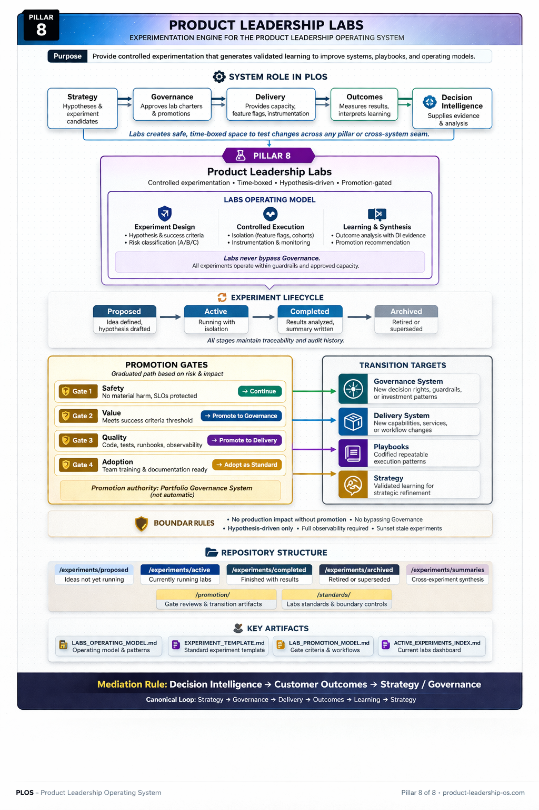

# Product Leadership Labs

## Purpose

This repository documents **Pillar 8** of the **Product Leadership Operating System (PLOS)** and defines how controlled experimentation is proposed, run, reviewed, and promoted without bypassing canonical operating system authority.

---

## Diagram

---

## System Role in PLOS

The **Product Leadership Labs** pillar defines the controlled experimentation layer of PLOS.

It is responsible for:

- experiment design
- controlled trials
- boundary-safe testing
- experiment review
- promotion preparation
- transition of validated learnings into the operating system through formal evaluation and governance

---

## What This Pillar Contains

This pillar contains:

- canonical labs definitions
- experiment structures and standards
- experiment lifecycle artifacts
- promotion review artifacts
- supporting diagrams and reference assets

---

## Boundary Rules

Labs enable controlled experimentation only.

They must not:

- make production decisions
- interpret evidence as canonical meaning
- bypass Customer Outcomes
- bypass Governance
- become canonical through informal adoption
- absorb playbook responsibilities as the default execution model

Promotion must follow:

> Labs → Outcomes → Governance

---

## Relationship to Other Pillars

- **Pillar 1** defines the architectural role of Labs in the full operating system
- **Pillar 2** defines the leadership operating context in which Labs are reviewed
- **Pillar 3** governs whether experiments are promoted into formal operating practice
- **Pillar 4** may receive promoted changes after governance approval
- **Pillar 5** evaluates experiment results and determines meaningful learning
- **Pillar 6** may observe experiment evidence through signals and dashboards
- **Pillar 7** defines repeatable execution patterns but does not own experimentation

---

## Repository Structure

- `/architecture` → canonical labs system definitions
- `/experiments/proposed` → proposed experiments not yet running
- `/experiments/active` → currently active experiments organized by domain
- `/experiments/completed` → completed experiments retained for reference
- `/experiments/archived` → retired or superseded experiments
- `/experiments/summaries` → synthesis artifacts across experiments
- `/promotion` → promotion review materials and transition artifacts
- `/standards` → labs standards and boundary controls
- `/assets/diagrams` → pillar diagrams and rendered assets

---

## Key Artifacts

- `README.md`
- `experiments/proposed/`
- `experiments/active/`
- `experiments/completed/`
- `experiments/archived/`
- `experiments/summaries/`
- `promotion/`
- `standards/`
- `assets/diagrams/`

---

## License

This project is licensed under the MIT License.

See the [LICENSE](../../LICENSE) file for details.
