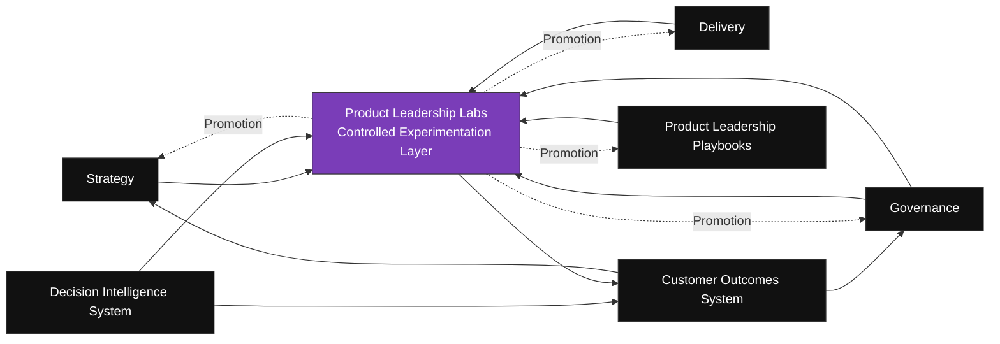

# Product Leadership Labs Diagram

The **Product Leadership Labs Diagram** defines the canonical visual representation of **Pillar 8 — Product Leadership Labs** within the **Product Leadership Operating System (PLOS)**.

Where **PRODUCT_LEADERSHIP_LABS.md** defines the pillar in prose, this diagram shows how Labs operates as a **controlled experimentation environment** that interacts with the canonical architecture without overriding it.

It illustrates how experimental work is isolated, evaluated, and promoted while preserving the separation between:

- evidence  
- meaning  
- decisions  
- execution  
- experimentation  

---

## Diagram

---

# Diagram Interpretation

This diagram shows that **Product Leadership Labs** operates as a **controlled experimentation layer** connected to the operating system but distinct from the canonical production pillars.

It illustrates five critical architectural truths:

## 1. Labs Is Not a Production Authority

Labs may explore changes to methods, operating patterns, and artifacts, but it does not own production authority.

## 2. Labs Does Not Replace Canonical Pillars

Labs may interact with **Strategy**, **Governance**, **Delivery**, **Decision Intelligence System**, and **Product Leadership Playbooks**, but it does not absorb their responsibilities.

## 3. Labs Does Not Interpret Evidence

Signals from the **Decision Intelligence System** remain evidence. Experimental results must still be evaluated through the **Customer Outcomes System**.

## 4. Labs Requires Formal Promotion

Experimental outputs do not become canonical by default. Promotion into a formal pillar must occur through structured validation and governance approval.

## 5. Boundary Integrity Still Applies

Even inside Labs, the canonical path remains:

> **Decision Intelligence System → Customer Outcomes System → Strategy / Governance**

Labs must never bypass that mediation path.

---

# Operating Logic

The diagram reflects the following operating logic:

- **Strategy** may identify areas for exploration  
- **Governance** may authorize, prioritize, continue, or discontinue experiments  
- **Delivery** may provide operating context for experiments affecting execution  
- **Decision Intelligence System** may provide signals and metrics as inputs  
- **Customer Outcomes System** evaluates experiment results and generates learning  
- **Product Leadership Playbooks** may receive promoted methods after validation  
- **Labs** provides the isolated environment in which experimental work is designed, run, and prepared for promotion review  

Labs functions as a **pre-canonical development layer**, not a production operating layer.

---

# Boundary Rules Shown by the Diagram

The diagram enforces several non-negotiable rules:

## No Direct Signal-to-Decision Experimentation Path

Labs must not use raw signals to justify direct governance or strategic decisions.

## No Lab-Owned Meaning

Labs does not interpret evidence or qualify value independently.

## No Automatic Promotion

Experimental work must not become canonical without structured review and approval.

## No Boundary Collapse

Labs must never merge experimentation with decision-making, evaluation, or system ownership.

---

# How to Use This Diagram

Use this artifact to:

- explain the role of Labs within PLOS  
- reinforce that Labs is exploratory, not canonical by default  
- validate that experiment design preserves core architectural boundaries  
- support promotion reviews for experimental artifacts  

This diagram should be used alongside:

- `PRODUCT_LEADERSHIP_LABS.md`
- `LAB_OPERATING_MODEL.md`
- `LAB_PROMOTION_MODEL.md`
- `LAB_BOUNDARY_GUARDRAILS.md`

---

# Supporting Diagram Notes

This is a **system-level diagram**, not an experiment-specific diagram.

It does not show the details of any one experiment.

Instead, it shows the canonical architectural role of the **Labs pillar as a whole**, including:

- where it receives inputs  
- how it routes evaluation  
- how promotion is governed  

Detailed experiment behavior should be defined in experiment artifacts using the standard Labs template.

---

# Why This Matters

Without a system-level diagram, Labs can easily be misunderstood as:

- an innovation sandbox with no controls  
- a shadow architecture process  
- a bypass around governance  
- an alternative evaluation layer  

This diagram prevents those interpretations by showing that Labs is a **controlled exploration environment** operating inside the discipline of PLOS.

It preserves the distinction between:

- **Decision Intelligence System** as evidence  
- **Customer Outcomes System** as meaning  
- **Strategy / Governance** as decisions  
- **Playbooks / Delivery** as production execution  
- **Labs** as controlled experimentation  

---

# Summary

The **Product Leadership Labs Diagram** provides the canonical visual representation of **Pillar 8** within PLOS.

It shows that Labs:

- supports controlled experimentation  
- does not own production authority  
- does not bypass canonical mediation paths  
- requires formal promotion before experimental work becomes part of the architecture  

## License

This repository is licensed under the MIT License. See the [LICENSE](LICENSE) file for details.
